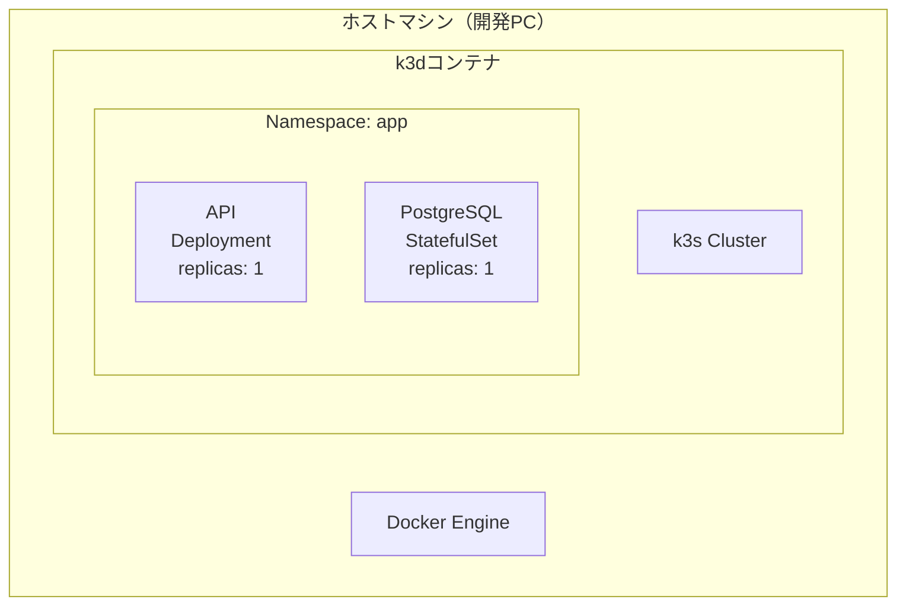
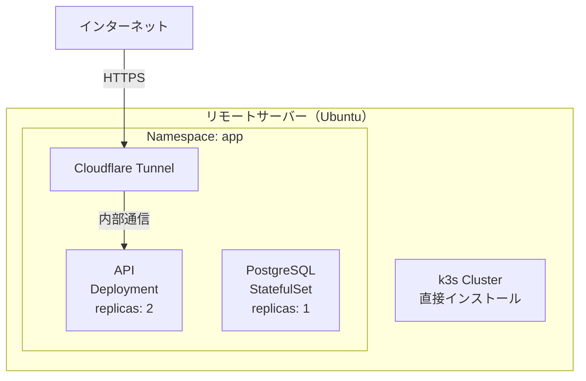
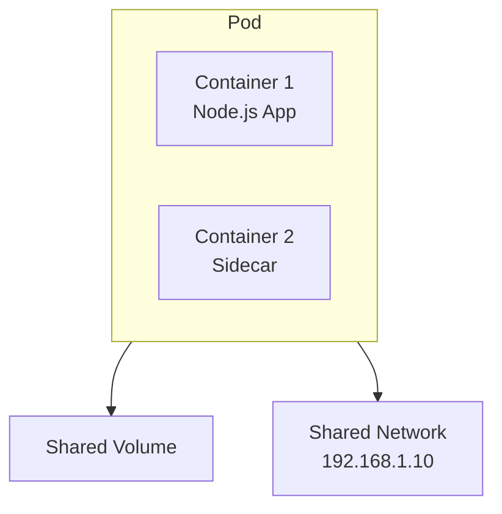
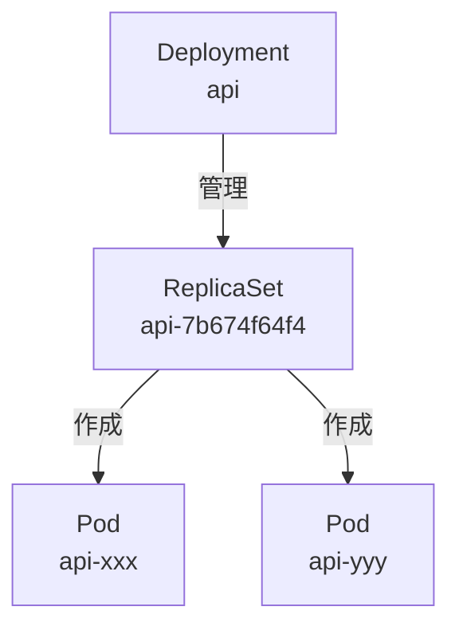
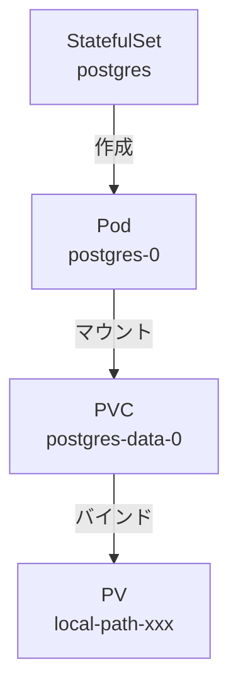
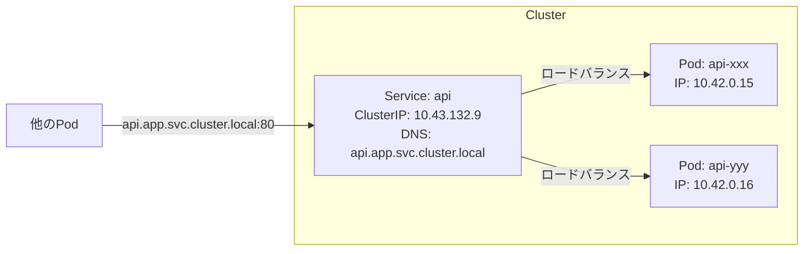
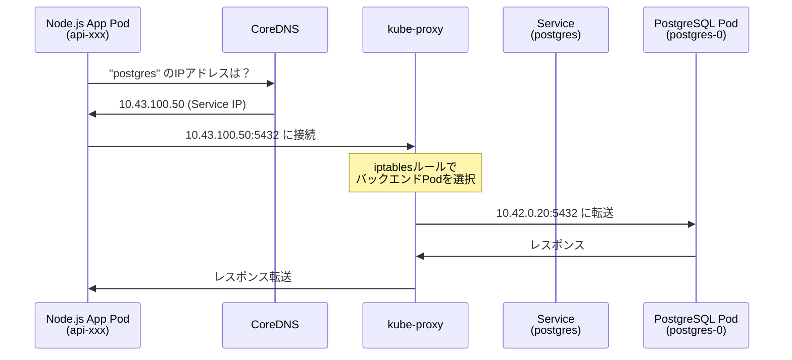
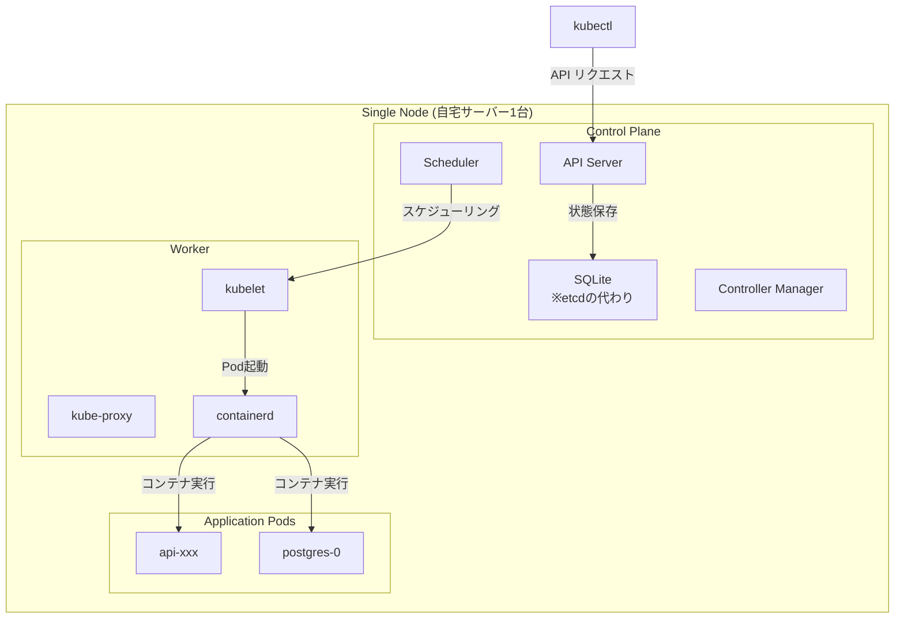

# なんちゃってお家Kubernetes DB + API編

## はじめに

### 対象読者

Docker/Kubernetesの基礎知識があり、実際に手を動かして学びたい開発者を対象としています。

### 前回までの進捗

前回の環境構築編では、Windows PCを購入してUbuntu OSをインストールし、自宅サーバーの物理環境をセットアップしました。

### 今回のゴール

TODOリストを管理するREST APIとPostgreSQLデータベースをKubernetes上に構築し、以下を実現します：
- CRUD機能を持つNode.js APIの動作確認
- PostgreSQLとの連携動作
- 自宅サーバーからcurlで疎通確認

### 前提条件チェックリスト

- Docker Desktopがインストール済み
- kubectlコマンドが使用可能
- GitHubアカウントがある
- Homebrew（Mac）またはパッケージマネージャーが利用可能

## 全体像

### 構築の流れ

1. **ローカル開発** (k3d使用)
   - Hono APIサーバー構築 → Dockerイメージ作成
   - Kubernetes YAMLファイル作成 → 動作確認

2. **自宅サーバーデプロイ** (k3s使用)
   - Githubからリソース取得 → Helmでデプロイ
   - 疎通確認

### 最終的に作成する環境

#### ローカル環境（k3d）の構成



#### リモート環境（k3s直接）の構成



### アプリケーション構成

#### Kubernetesコンポーネント

##### Pod
Kubernetesで最小のデプロイ単位です。



##### Deployment（ReplicaSet）
ステートレスなアプリケーションを管理します。



##### StatefulSet
ステートフルなアプリケーション（データベースなど）を管理します。



### ネットワーク構成

#### Service（ClusterIP）
Pod群への安定したネットワークアクセスを提供します。



#### Pod間通信フロー



### Control PlaneとWorkerの関係

#### k3s Single Node構成



## ローカル開発

### 環境セットアップ

#### k3dインストール

```bash
brew install k3d
```

:::details インストールログを見る
```
==> Pouring k3d--5.8.3.arm64_sequoia.bottle.tar.gz
🍺  /opt/homebrew/Cellar/k3d/5.8.3: 10 files, 24.1MB
```
:::

#### Helmインストール

```bash
brew install helm
```

:::details インストールログを見る
```
Warning: helm 3.19.0 is already installed and up-to-date.
To reinstall 3.19.0, run:
  brew reinstall helm
```
:::

#### クラスター作成

```bash
k3d cluster create todo-local \
    --api-port 6443 \
    --port 8080:80@loadbalancer \
    --port 8443:443@loadbalancer \
    --servers 1 \
    --agents 2
```

:::details クラスター作成ログを見る
```
INFO[0000] portmapping '8443:443' targets the loadbalancer: defaulting to [servers:*:proxy agents:*:proxy]
INFO[0000] portmapping '8080:80' targets the loadbalancer: defaulting to [servers:*:proxy agents:*:proxy]
INFO[0000] Prep: Network
INFO[0000] Created network 'k3d-todo-local'
INFO[0000] Created image volume k3d-todo-local-images
INFO[0000] Starting new tools node...
INFO[0001] Creating node 'k3d-todo-local-server-0'
INFO[0001] Creating node 'k3d-todo-local-agent-0'
INFO[0001] Creating node 'k3d-todo-local-agent-1'
INFO[0001] Creating LoadBalancer 'k3d-todo-local-serverlb'
INFO[0007] Starting agents...
INFO[0007] Starting node 'k3d-todo-local-agent-1'
INFO[0007] Starting node 'k3d-todo-local-agent-0'
INFO[0016] Starting helpers...
INFO[0017] Starting node 'k3d-todo-local-serverlb'
INFO[0025] Cluster 'todo-local' created successfully!
```
:::

#### 初期確認

```bash
kubectl config current-context
```

:::details 出力結果
```
k3d-todo-local
```
:::

```bash
kubectl get nodes
```

:::details ノード一覧
```
NAME                      STATUS   ROLES                  AGE     VERSION
k3d-todo-local-agent-0    Ready    <none>                 3m43s   v1.31.5+k3s1
k3d-todo-local-agent-1    Ready    <none>                 3m44s   v1.31.5+k3s1
k3d-todo-local-server-0   Ready    control-plane,master   3m53s   v1.31.5+k3s1
```
:::

```bash
kubectl get storageclass
```

:::details StorageClass一覧
```
NAME                   PROVISIONER             RECLAIMPOLICY   VOLUMEBINDINGMODE      ALLOWVOLUMEEXPANSION   AGE
local-path (default)   rancher.io/local-path   Delete          WaitForFirstConsumer   false                  4m5s
```
:::

#### Namespace作成

```bash
kubectl create namespace app
```

:::details 実行結果
```
namespace/app created
```
:::

### API作成

#### Dockerビルド

TODOリストを作成・参照・更新・削除できるAPIです。HonoフレームワークとTypeORMを使用しています。
詳細の実装は[リポジトリ](https://github.com/subaru-hello/todo-k3s/tree/main/packages/api)を参照してください。

```bash
cd packages/api
docker build -t docker.io/yourusername/todo-api:sha-e432059 --target production .
```

:::details ビルドログを見る
```
[+] Building 8.5s (15/15) FINISHED
 => [internal] load build definition from Dockerfile
 => [builder 1/6] FROM docker.io/library/node:24-alpine
 => [stage-2 1/3] FROM gcr.io/distroless/nodejs20-debian12
 => [builder 2/6] WORKDIR /app
 => [builder 3/6] RUN npm install -g pnpm
 => [builder 4/6] COPY package.json pnpm-lock.yaml ./
 => [builder 5/6] RUN pnpm install --frozen-lockfile
 => [builder 6/6] RUN pnpm build
 => [stage-2 2/3] COPY --from=builder /app/dist /app/dist
 => [stage-2 3/3] COPY --from=builder /app/node_modules /app/node_modules
 => exporting to image
 => => writing image sha256:...
 => => naming to docker.io/yourusername/todo-api:sha-e432059
```
:::

#### イメージインポート

```bash
k3d image import docker.io/subaru88/todo-api:sha-e432059 -c todo-local
```

:::details インポートログを見る
```
INFO[0000] Importing image(s) into cluster 'todo-local'
INFO[0000] Saving 1 image(s) from runtime...
INFO[0001] Importing images into nodes...
INFO[0001] Importing images from tarball '/k3d/images/k3d-todo-local-images-20251109224958.tar' into node 'k3d-todo-local-server-0'...
INFO[0001] Importing images from tarball '/k3d/images/k3d-todo-local-images-20251109224958.tar' into node 'k3d-todo-local-agent-1'...
INFO[0001] Importing images from tarball '/k3d/images/k3d-todo-local-images-20251109224958.tar' into node 'k3d-todo-local-agent-0'...
INFO[0004] Removing the tarball(s) from image volume...
INFO[0005] Successfully imported 1 image(s) into 1 cluster(s)
```
:::

### PostgreSQLデプロイ

#### StatefulSetを使う理由

データベースのようなステートフルなアプリケーションには**StatefulSet**を使います。

StatefulSetの特徴:
- **固定された識別子**: Podに永続的な名前が付く（例: postgres-0）
- **安定したストレージ**: Pod再作成時も同じストレージが割り当てられる
- **順序保証**: Podの起動・終了が順序通りに実行される

#### Secret作成

データベースの認証情報を`.env.secret`ファイルとして用意：

```bash
# deployment/environments/local/.env.secret
POSTGRES_USER=localuser
POSTGRES_PASSWORD=localpass
POSTGRES_DB=todos
```

Secretを作成：

```bash
kubectl create secret generic postgres-secret \
  --from-env-file=deployment/environments/local/.env.secret \
  --namespace=app --dry-run=client -o yaml | kubectl apply -f -
```

:::details 実行結果
```
secret/postgres-secret configured
```
:::

#### Helmデプロイ

```bash
helm upgrade --install postgres ./deployment/charts/postgres \
  -n app \
  -f ./deployment/environments/local/postgres-values.yaml \
  --set createSecret=false
```

:::details デプロイ結果
```
Release "postgres" does not exist. Installing it now.
NAME: postgres
LAST DEPLOYED: Sun Nov  9 23:25:31 2025
NAMESPACE: app
STATUS: deployed
REVISION: 1
TEST SUITE: None
```
:::

#### 動作確認

```bash
kubectl -n app get statefulset
```

:::details StatefulSet状態
```
NAME       READY   AGE
postgres   1/1     20s
```
:::

```bash
kubectl -n app get pods
```

:::details Pod状態
```
NAME         READY   STATUS    RESTARTS   AGE
postgres-0   1/1     Running   0          49s
```
:::

```bash
kubectl -n app get pvc
```

:::details PVC状態
```
NAME                STATUS   VOLUME                                     CAPACITY   ACCESS MODES   STORAGECLASS   VOLUMEATTRIBUTESCLASS   AGE
pgdata-postgres-0   Bound    pvc-935c59d8-0060-4e19-b4f3-f52c5e23e875   1Gi        RWO            local-path     <unset>                 21s
```
:::

```bash
kubectl -n app logs postgres-0
```

:::details PostgreSQL初期化ログ
```
The files belonging to this database system will be owned by user "postgres".
The database cluster will be initialized with locale "en_US.utf8".
Data page checksums are disabled.
creating configuration files ... ok
running bootstrap script ... ok
performing post-bootstrap initialization ... ok

PostgreSQL init process complete; ready for start up.

2025-11-07 00:21:14.820 UTC [1] LOG:  starting PostgreSQL 16.10
2025-11-07 00:21:14.825 UTC [1] LOG:  database system is ready to accept connections
```
:::

```bash
kubectl -n app exec postgres-0 -- psql -U localuser -d todos -c '\dt'
```

:::details テーブル確認結果
```
         List of relations
 Schema | Name  | Type  |   Owner
--------+-------+-------+-----------
 public | todos | table | localuser
(1 row)
```
:::

### APIデプロイ

#### Deploymentを使う理由

Node.js APIには**Deployment**を使います。

Deploymentの特徴:
- **レプリカ管理**: 指定した数のPodを常に稼働させる
- **ローリングアップデート**: ダウンタイムなしでアプリケーションを更新
- **ロールバック**: 問題が発生した場合、以前のバージョンに戻す

#### イメージインポート

```bash
k3d image import subaru88/home-kube:sha-e432059 -c todo-local
```

:::details インポートログ
```
INFO[0000] Importing image(s) into cluster 'todo-local'
INFO[0000] Starting new tools node...
INFO[0000] Starting node 'k3d-todo-local-tools'
INFO[0000] Saving 1 image(s) from runtime...
INFO[0001] Importing images into nodes...
INFO[0002] Removing the tarball(s) from image volume...
INFO[0003] Successfully imported 1 image(s) into 1 cluster(s)
```
:::

#### Helmデプロイ

```bash
helm upgrade --install api ./deployment/charts/api \
  -n app \
  -f ./deployment/environments/local/api-values.yaml \
  --set image.tag=sha-e432059
```

:::details デプロイ結果
```
Release "api" does not exist. Installing it now.
NAME: api
LAST DEPLOYED: Sun Nov  9 23:27:38 2025
NAMESPACE: app
STATUS: deployed
REVISION: 1
TEST SUITE: None
```
:::

#### 動作確認

```bash
kubectl -n app get deployments
```

:::details Deployment状態
```
NAME   READY   UP-TO-DATE   AVAILABLE   AGE
api    1/1     1            1           15s
```
:::

```bash
kubectl -n app get pods
```

:::details Pod一覧
```
NAME                   READY   STATUS    RESTARTS   AGE
api-56bbd6b8bb-5jkmx   1/1     Running   0          14s
postgres-0             1/1     Running   0          44s
```
:::

### Pod間通信の仕組み

#### DNS命名規則

KubernetesのServiceには、以下の形式で自動的にDNS名が割り当てられます：

```
<service-name>.<namespace>.svc.cluster.local
```

例:
- `postgres.app.svc.cluster.local` → PostgreSQL Service
- `api.app.svc.cluster.local` → API Service

同じNamespace内では、Service名だけで接続できます：
- `postgres` → `postgres.app.svc.cluster.local`

### 動作確認（CRUD操作）

#### Port Forward設定

```bash
kubectl -n app port-forward svc/api 3000:3000 &
```

:::details Port Forward出力
```
Forwarding from 127.0.0.1:3000 -> 3000
Forwarding from [::1]:3000 -> 3000
```
:::

#### ヘルスチェック

```bash
curl http://localhost:3000/healthz
```

:::details レスポンス
```json
{"status":"healthy"}
```
:::

```bash
curl http://localhost:3000/dbcheck
```

:::details レスポンス
```json
{"status":"ok","db":"connected"}
```
:::

#### CRUD操作テスト

##### Todo一覧取得（空のリスト）

```bash
curl -s http://localhost:3000/api/todos
```

:::details レスポンス
```json
[]
```
:::

##### Todo作成

```bash
curl -s -X POST http://localhost:3000/api/todos \
  -H "Content-Type: application/json" \
  -d '{"title":"Test Todo","completed":false}'
```

:::details 作成結果
```json
{
  "title":"Test Todo",
  "completed":false,
  "description":null,
  "id":1,
  "createdAt":"2025-11-09T14:30:11.046Z",
  "updatedAt":"2025-11-09T14:30:11.046Z"
}
```
:::

##### Todo一覧取得（作成後）

```bash
curl -s http://localhost:3000/api/todos
```

:::details レスポンス
```json
[{
  "id":1,
  "title":"Test Todo",
  "description":null,
  "completed":false,
  "createdAt":"2025-11-09T14:30:11.046Z",
  "updatedAt":"2025-11-09T14:30:11.046Z"
}]
```
:::

##### Todo更新

```bash
curl -X PUT http://localhost:3000/api/todos/1 \
  -H "Content-Type: application/json" \
  -d '{
    "title": "k3dデプロイテスト",
    "description": "更新済み",
    "completed": true
  }'
```

:::details 更新結果
```json
{
  "id":1,
  "title":"k3dデプロイテスト",
  "description":"更新済み",
  "completed":true,
  "createdAt":"2025-11-09T14:30:11.046Z",
  "updatedAt":"2025-11-09T14:35:22.123Z"
}
```
:::

##### Todo削除

```bash
curl -X DELETE http://localhost:3000/api/todos/1
```

:::details 削除結果
```json
{"message":"Todo deleted successfully"}
```
:::

## リモートデプロイ

### 環境準備

#### k3sインストール

リモートサーバーでは、k3sを直接インストールして使用します。

```bash
curl -sfL https://get.k3s.io | sh -
```

:::details インストールログ
```
[INFO]  Finding release for channel stable
[INFO]  Using v1.31.5+k3s1 as release
[INFO]  Downloading hash https://github.com/k3s-io/k3s/releases/download/v1.31.5+k3s1/sha256sum-amd64.txt
[INFO]  Downloading binary https://github.com/k3s-io/k3s/releases/download/v1.31.5+k3s1/k3s
[INFO]  Installing k3s to /usr/local/bin/k3s
[INFO]  Creating /usr/local/bin/kubectl symlink to k3s
[INFO]  Creating /usr/local/bin/crictl symlink to k3s
[INFO]  Creating /usr/local/bin/ctr symlink to k3s
[INFO]  Creating systemd service file /etc/systemd/system/k3s.service
[INFO]  systemd: Starting k3s
```
:::

#### k3sの自動構成について

**重要な特徴**: k3sでは、上記のインストールコマンド実行時に**自動的にControl PlaneとWorker Nodeの機能が同じノードで起動**します。

```bash
# このコマンド1つで以下が全て自動構成される
curl -sfL https://get.k3s.io | sh -
```

自動的に作成されるコンポーネント：
- **Control Plane機能**
  - API Server
  - Scheduler
  - Controller Manager
  - etcd（SQLiteで代替）
- **Worker Node機能**
  - kubelet
  - kube-proxy
  - Container Runtime (containerd)

:::details kubeadmとの違い
k3sは全てを自動構成しますが、個別のコンポーネントがどのように動いているかを理解したい場合は、別の機会に**kubeadm**を使用することをおすすめします。

kubeadmでは以下のように手動で構成します：
```bash
# 1. Control Planeの初期化
kubeadm init

# 2. ネットワークプラグインのインストール
kubectl apply -f <CNI-plugin.yaml>

# 3. Worker Nodeの追加
kubeadm join <master-ip>:6443 --token <token>
```

この方法では、各コンポーネントがどのタイミングで作成され、どのように連携するかを詳しく確認できます。
:::

#### kubeconfig設定

```bash
export KUBECONFIG=/etc/rancher/k3s/k3s.yaml
```

#### 状態確認

```bash
sudo systemctl status k3s
```

:::details k3s状態（実際の出力例）
```
● k3s.service - Lightweight Kubernetes
     Loaded: loaded (/etc/systemd/system/k3s.service; enabled; vendor preset: enabled)
     Active: active (running) since Wed 2025-10-08 23:07:52 UTC; 1 month 8 days ago
       Docs: https://k3s.io
   Main PID: 888 (k3s-server)
      Tasks: 235
     Memory: 2.6G
        CPU: 5d 9h 54min 36.547s
     CGroup: /system.slice/k3s.service
             ├─    888 "/usr/local/bin/k3s server"
             ├─   1134 "containerd"
             ├─   2943 /var/lib/rancher/k3s/data/.../bin/containerd-shim-runc-v2
             ├─   3000 /var/lib/rancher/k3s/data/.../bin/containerd-shim-runc-v2
             └─ ... (その他のコンテナプロセス)
```

この出力から以下が確認できます：
- **長期安定稼働**: 1ヶ月以上継続して稼働
- **リソース使用**: メモリ2.6GB、適度なCPU使用
- **アクティブなコンテナ**: 複数のcontainerd-shimプロセスが稼働中
:::

### デプロイ実行

#### GitHubからリソース取得

通常のクローン：

```bash
git clone https://github.com/subaru-hello/todo-k3s.git
cd todo-k3s
```

効率的なクローン（sparse checkout使用）：

```bash
git clone --filter=blob:none --sparse https://github.com/subaru-hello/todo-k3s.git
cd todo-k3s
```

:::details sparse checkoutの利点
`--filter=blob:none --sparse`オプションを使うことで：
- **初期ダウンロードサイズの削減**: 必要なファイルのみ取得
- **クローン時間の短縮**: 大規模リポジトリでも高速
- **帯域幅の節約**: サーバー環境で特に有効
:::

#### イメージのpull

```bash
sudo crictl pull docker.io/subaru88/home-kube:sha-xxx
```

:::details Pull結果
```
Image is up to date for docker.io/subaru88/home-kube:sha-xxx
```
:::

#### プライベートレジストリの設定（必要な場合）

Docker Hubのプライベートイメージを使用する場合は、認証用のSecretを作成します：

```bash
kubectl create secret docker-registry dockerhub-secret \
  --docker-server=https://index.docker.io/v1/ \
  --docker-username=your-username \
  --docker-password=your-access-token \
  -n todo-app
```

:::details Docker Hub Personal Access Token (PAT)の作成方法
1. Docker Hubにログイン
2. Account Settings → Security → New Access Token
3. 適切な権限を設定してトークンを生成
4. トークンを安全に保管（再表示不可）

**重要**: パスワードではなくPATを使用することを推奨
:::

確認：

```bash
kubectl -n todo-app get secret dockerhub-secret
```

#### Helmデプロイ

Namespace作成：

```bash
kubectl create namespace todo-app
```

PostgreSQL用Secret作成：

```bash
kubectl create secret generic postgres-secret \
  --from-env-file=deployment/environments/production/.env.secret \
  --namespace=todo-app
```

PostgreSQLデプロイ：

```bash
helm upgrade --install postgres ./deployment/charts/postgres \
  -n todo-app \
  -f ./deployment/environments/production/postgres-values.yaml
```

APIデプロイ：

```bash
helm upgrade --install todo-api ./deployment/charts/api \
  -n todo-app \
  -f ./deployment/environments/production/api-values.yaml \
  --set image.tag=sha-xxx
```

### 動作確認

#### クラスター情報の確認

ノードとクラスターの状態確認：

```bash
# クラスター情報
kubectl cluster-info

# ノード一覧（Control PlaneとWorkerの役割を確認）
kubectl get nodes -o wide
```

:::details ノード情報の出力例
```
NAME          STATUS   ROLES                  AGE   VERSION        INTERNAL-IP    EXTERNAL-IP   OS-IMAGE           KERNEL-VERSION
your-server   Ready    control-plane,master   60d   v1.31.5+k3s1   192.168.1.10   <none>        Ubuntu 22.04 LTS   5.15.0-91-generic
```
ROLESに`control-plane,master`と表示される = Control PlaneとWorker機能を兼ねている
:::

Control Planeコンポーネントの確認：

```bash
# kube-systemネームスペースのPod（Control Planeコンポーネント）
kubectl get pods -n kube-system
```

:::details Control Planeコンポーネント一覧
```
NAME                                      READY   STATUS    RESTARTS   AGE
coredns-7b98449c4-xxxxx                   1/1     Running   0          60d
local-path-provisioner-6f8956fb48-xxxxx   1/1     Running   0          60d
metrics-server-54fd9b65b-xxxxx            1/1     Running   0          60d
traefik-7d5f6474df-xxxxx                  1/1     Running   0          60d
```
:::

#### Pod監視とログ確認

デプロイ済みのPod状態を確認：

```bash
kubectl -n todo-app get pods
```

:::details 実際の稼働状況例
```
NAME                        READY   STATUS    RESTARTS      AGE
postgres-5b689f85f9-4bx5r   1/1     Running   1 (38d ago)   63d
todo-api-7b674f64f4-r588x   1/1     Running   0             9d
```
- PostgreSQL: 63日間稼働（38日前に1回再起動）
- Todo API: 9日間安定稼働
:::

リアルタイム監視（新規デプロイ時）：

```bash
kubectl -n todo-app get pods -w
```

:::details Pod監視の出力例
```
NAME                         READY   STATUS              RESTARTS   AGE
postgres-0                   0/1     ContainerCreating   0          0s
todo-api-7b674f64f4-r588x   0/1     ContainerCreating   0          0s
postgres-0                   1/1     Running            0          15s
todo-api-7b674f64f4-r588x   0/1     Running            0          20s
todo-api-7b674f64f4-r588x   1/1     Running            0          25s
```
:::

Podのログ確認：

```bash
kubectl -n todo-app logs todo-api-7b674f64f4-r588x
```

:::details APIログ出力例
```
Server running on port 3000
Connected to PostgreSQL database
Health check endpoint ready at /healthz
```
:::

PostgreSQLのログ確認：

```bash
kubectl -n todo-app logs postgres-0
```

#### APIへのアクセス方法

##### 1. Port Forwardを使用（最も簡単）

```bash
# ServiceへのPort Forward
kubectl port-forward -n todo-app svc/todo-api 3000:3000

# 別ターミナルから動作確認
curl http://localhost:3000/healthz
curl http://localhost:3000/api/todos
```

Serviceが存在しない場合は直接Podへ：

```bash
kubectl port-forward -n todo-app pod/todo-api-7b674f64f4-r588x 3000:3000
```

:::details Port Forward成功時の出力
```
Forwarding from 127.0.0.1:3000 -> 3000
Forwarding from [::1]:3000 -> 3000
Handling connection for 3000
```
:::

##### 2. Pod内からの確認

```bash
# API Podに入る
kubectl exec -it -n todo-app todo-api-7b674f64f4-r588x -- /bin/sh

# Pod内でAPI確認
curl http://localhost:3000/healthz
exit
```

##### 3. テストPodを作成して確認

```bash
# curlが使えるテストPodを起動
kubectl run test-curl --image=curlimages/curl:latest -n todo-app -it --rm -- sh

# テストPod内から各Serviceにアクセス
curl http://todo-api:3000/healthz
curl http://todo-api:3000/api/todos

# PostgreSQL接続確認
nc -zv postgres 5432
exit
```

:::details Service経由のアクセスについて
Kubernetes内部では、ServiceのDNS名で直接アクセスできます：
- `todo-api:3000` → APIサービス
- `postgres:5432` → PostgreSQLサービス

これはCoreDNSが名前解決を行っているためです。
:::

##### 4. 外部公開（Cloudflare Tunnel使用時）

```bash
curl https://api.yourdomain.com/healthz
curl https://api.yourdomain.com/api/todos
```

## まとめ

### 学習した内容

今回の実装を通じて、以下のKubernetesの概念と実践的な知識を習得しました：

#### Kubernetesリソースの使い分け
- **StatefulSet（PostgreSQL）**: 永続的なストレージとPod識別子が必要なステートフルアプリケーション
- **Deployment（API）**: 複数レプリカによる負荷分散が可能なステートレスアプリケーション

#### ネットワーキング
- **Service**: Podへの安定したアクセスポイントの提供
- **DNS**: クラスター内部での名前解決（`<service>.<namespace>.svc.cluster.local`）
- **kube-proxy**: Service IPから実際のPod IPへのトラフィック転送

#### ストレージ
- **PersistentVolumeClaim (PVC)**: アプリケーションからのストレージ要求
- **StorageClass**: 動的なボリュームプロビジョニング

#### 環境の使い分け
- **k3d（ローカル）**: Docker内で隔離された開発環境
- **k3s（本番）**: 軽量で本番運用に適したKubernetesディストリビューション

#### k3sの自動構成の理解
- **1コマンドで完結**: `curl -sfL https://get.k3s.io | sh -`でControl PlaneとWorker機能が自動構成
- **Single Node構成**: 同一ノードでmaster/workerの両役割を実行
- **長期安定稼働**: 実際に63日以上の連続稼働実績を確認

### 次回予告

次回は以下の内容を予定しています：
- Cloudflare Tunnelを使った外部公開の詳細
- PrometheusとGrafanaによるモニタリング
- GitHub ActionsによるCI/CDパイプラインの構築

## 参考資料

### Kubernetes公式ドキュメント
- [Kubernetes概要](https://kubernetes.io/ja/docs/concepts/)
- [Pod](https://kubernetes.io/ja/docs/concepts/workloads/pods/)
- [Deployment](https://kubernetes.io/ja/docs/concepts/workloads/controllers/deployment/)
- [StatefulSet](https://kubernetes.io/ja/docs/concepts/workloads/controllers/statefulset/)
- [Service](https://kubernetes.io/ja/docs/concepts/services-networking/service/)
- [PersistentVolume](https://kubernetes.io/ja/docs/concepts/storage/persistent-volumes/)
- [Secret](https://kubernetes.io/ja/docs/concepts/configuration/secret/)
- [Namespace](https://kubernetes.io/ja/docs/concepts/overview/working-with-objects/namespaces/)

### k3s/k3d
- [k3s Documentation](https://docs.k3s.io/)
- [k3d公式サイト](https://k3d.io/)

### Helm
- [Helm公式サイト](https://helm.sh/)
- [Helmドキュメント](https://helm.sh/docs/)

### リポジトリ
- [実装コード](https://github.com/subaru-hello/todo-k3s)