# KubernetesでPostgreSQLとNode.js APIをホスティングする

## はじめに

このブログでは、Kubernetesを使ってPostgreSQLデータベースとNode.js APIアプリケーションをデプロイする方法を解説します。

Kubernetesは本番環境で広く使われているコンテナオーケストレーションプラットフォームですが、学習や開発目的で自宅環境にも導入できます。今回は、軽量なKubernetesディストリビューションである**k3s**を使って、実際に動作する環境を構築しながら、Kubernetesの基本概念を学んでいきます。

### この記事で学べること

- Kubernetesの基本コンポーネント（Pod、Deployment、Service、StatefulSetなど）
- Kubernetes内部のネットワーキング（DNS、プロキシ、Pod間通信）
- クラスターアーキテクチャ（コントロールプレーンとワーカーノード）
- 実践的なデプロイ方法（PostgreSQL + Node.js API）
- トラブルシューティング

### 対象読者

- Dockerの基本を理解している方
- Kubernetesを初めて触る、または基礎を固めたい方
- 自宅や開発環境でKubernetesを試してみたい方

---

## 第1部: Kubernetes基礎知識

この部では、Kubernetesの基本的なコンポーネントとアーキテクチャについて解説します。

### 1.1 Kubernetesの基本コンポーネント

#### Pod（ポッド）

**Pod**は、Kubernetesにおける最小のデプロイ単位です。1つまたは複数のコンテナをまとめたグループで、同じPod内のコンテナは以下を共有します：

- ネットワーク（同じIPアドレス）
- ストレージボリューム
- 設定情報

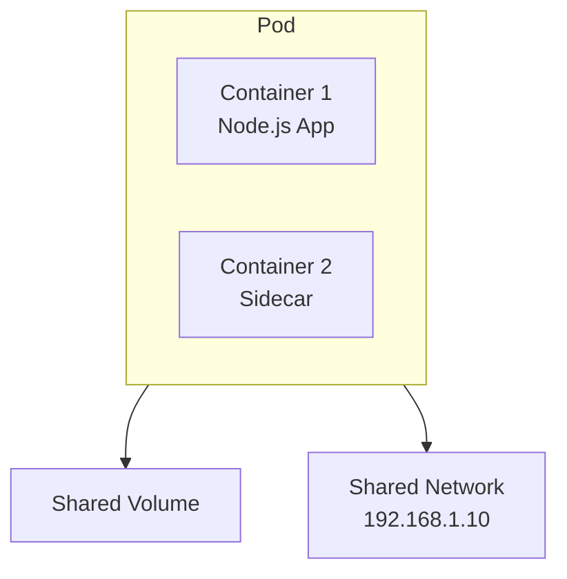

**特徴**:
- Podは一時的（ephemeral）で、再起動時にIPアドレスが変わる
- 通常、1 Pod = 1コンテナで運用することが多い
- PodはNode（物理/仮想サーバー）上で実行される

#### Deployment（デプロイメント）とReplicaSet

**Deployment**は、Podのライフサイクルを管理するコントローラーです。以下の機能を提供します：

- **レプリカ管理**: 指定した数のPodを常に稼働させる
- **ローリングアップデート**: ダウンタイムなしでアプリケーションを更新
- **ロールバック**: 問題が発生した場合、以前のバージョンに戻す

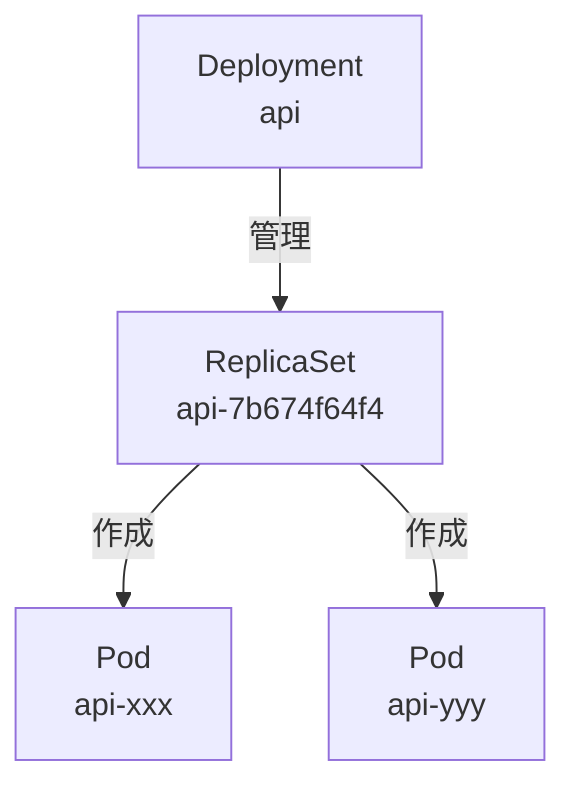

**ReplicaSet**は、指定した数のPodレプリカが常に稼働していることを保証します。Deploymentが自動的にReplicaSetを作成・管理するため、通常ユーザーが直接操作することは少ないです。

#### StatefulSet（ステートフルセット）

**StatefulSet**は、ステートフルなアプリケーション向けのコントローラーです。Deploymentと異なり、以下の特徴があります：

- **固定された識別子**: Podに永続的な名前が付く（例: postgres-0, postgres-1）
- **順序保証**: Podの起動・終了が順序通りに実行される
- **安定したストレージ**: Pod再作成時も同じストレージが割り当てられる

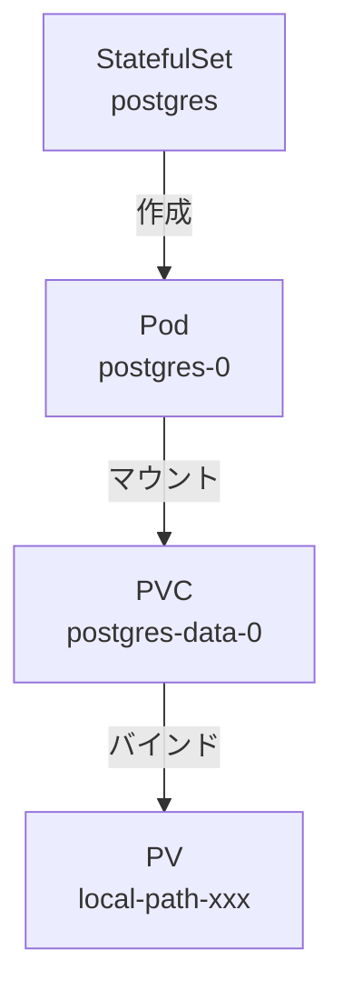

**使用例**: データベース（PostgreSQL、MySQL、MongoDB）、分散システム（ZooKeeper、etcd、Kafka）

#### Service（サービス）

**Service**は、Podへの安定したネットワークアクセスを提供します。Podは再起動時にIPアドレスが変わるため、Serviceを使って固定のエンドポイントを作成します。

**ClusterIP（クラスター内部アクセス）**:

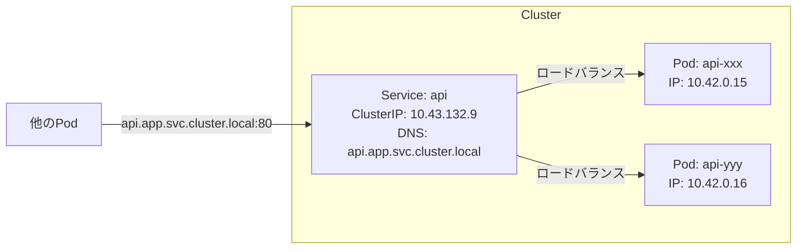

**NodePort（ノード外部アクセス）**:

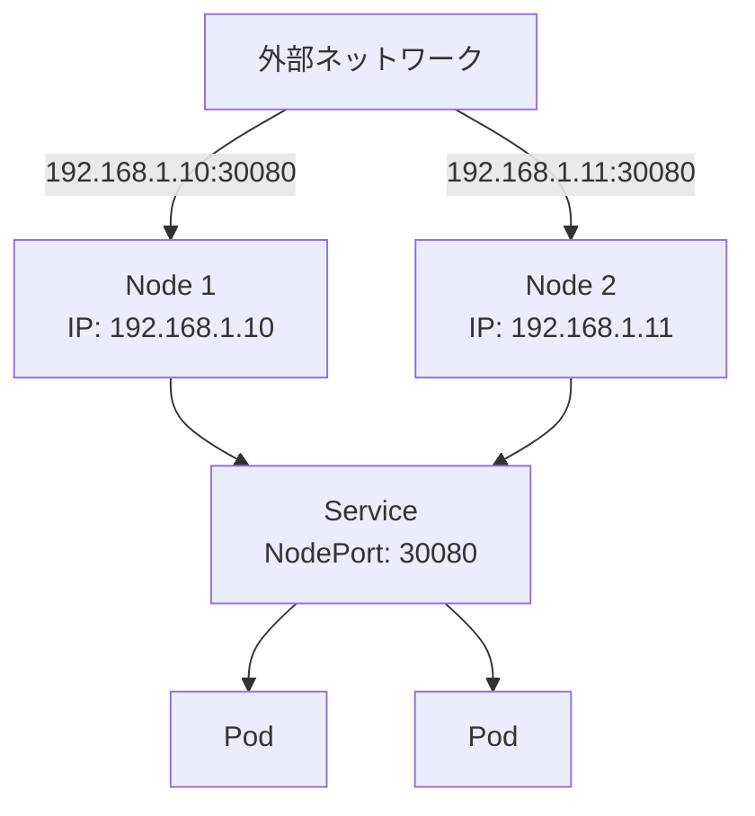

#### PersistentVolumeClaim（PVC）

**PVC（PersistentVolumeClaim）**は、永続的なストレージを要求するためのリソースです。

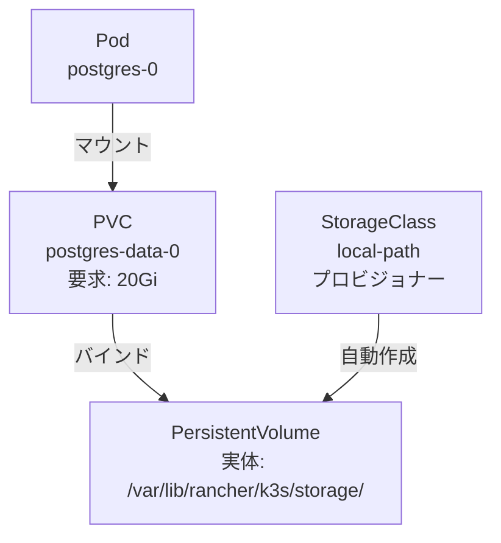

**仕組み**:
1. PVC作成: アプリケーションが「20Giのストレージが欲しい」と要求
2. PVの検索または作成: StorageClassが自動的にPersistentVolume（PV）を作成
3. バインド: PVCとPVが紐付けられる
4. マウント: PodがPVCをマウントしてデータを保存

### 1.2 コンポーネントの関係図

以下は、今回デプロイするアプリケーションの全体像です。

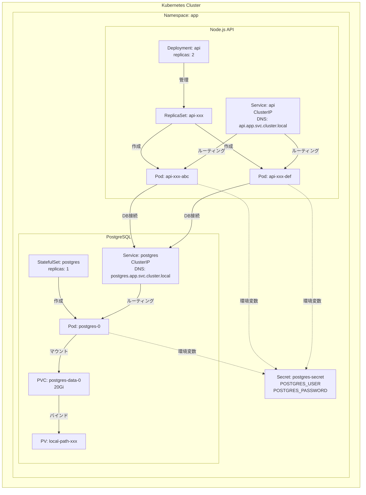

### 1.3 Kubernetesのネットワーキング

Kubernetes内部では、Podが他のPodやServiceと通信するために、いくつかのコンポーネントが連携しています。

#### CoreDNS（DNS解決）

**CoreDNS**は、Kubernetes内部のDNSサーバーです。Serviceに対して自動的にDNS名を割り当て、名前解決を行います。

**DNS命名規則**:
```
<service-name>.<namespace>.svc.cluster.local
```

**例**:
- `postgres.app.svc.cluster.local` → PostgreSQL Service
- `api.app.svc.cluster.local` → API Service

#### kube-proxy（ネットワークプロキシ）

**kube-proxy**は、各ノード上で動作するネットワークプロキシです。ServiceへのトラフィックをバックエンドのPodに転送します。

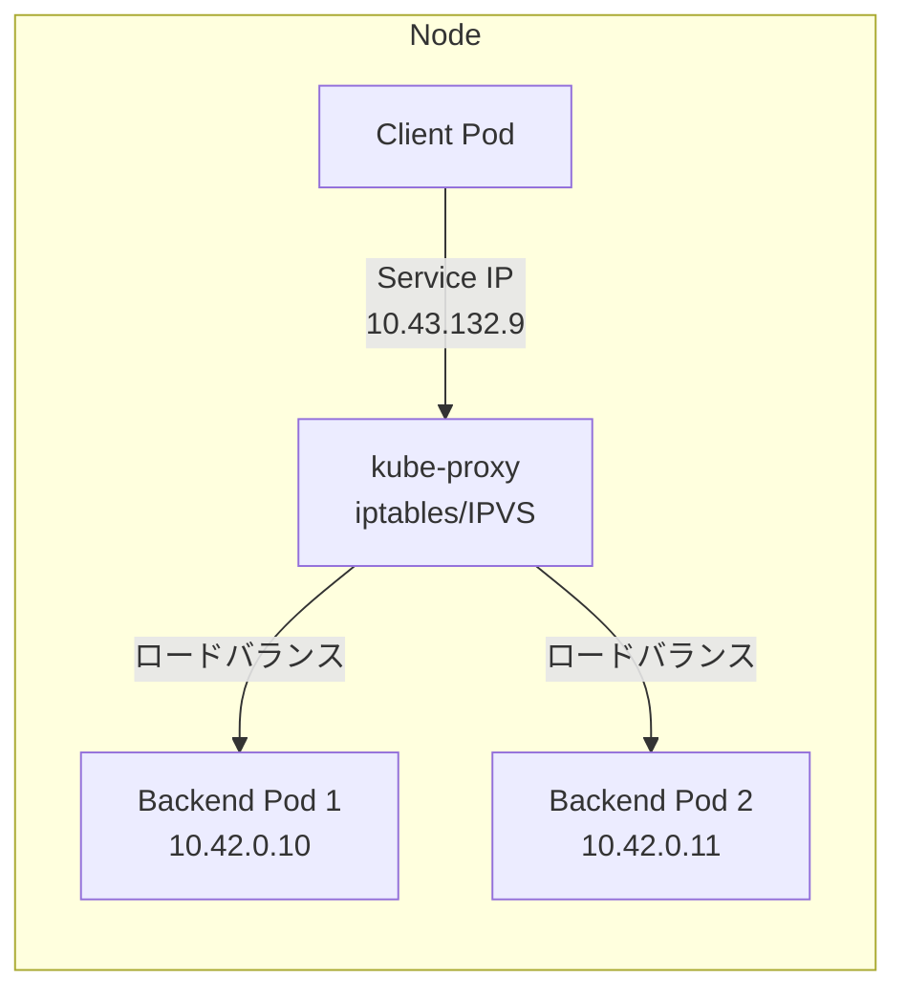

#### Pod-to-Pod通信フロー

実際に、Node.js APIからPostgreSQLに接続する際のネットワークフローを見てみましょう。

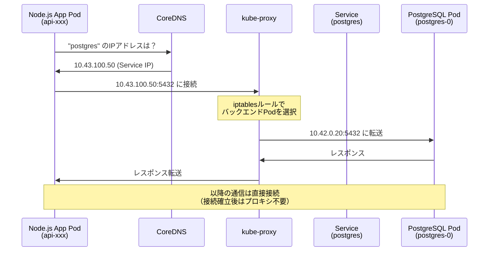

**重要ポイント**:
- ServiceのIPアドレスは仮想的（どのPodにも割り当てられていない）
- kube-proxyが実際のPod IPに変換
- Podが再起動してIPが変わっても、ServiceのIPは変わらないため、アプリケーション側は再起動不要

### 1.4 Kubernetesクラスターアーキテクチャ

#### 標準的なKubernetesクラスター（本番環境）

本番環境のKubernetesは、役割に応じて複数のノードで構成されます。

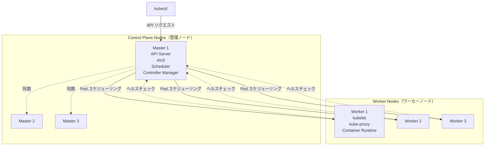

**Control Plane（コントロールプレーン）**: クラスター全体を管理する「頭脳」部分
**Worker Node（ワーカーノード）**: 実際にアプリケーション（Pod）が動作するノード

#### 自宅Kubernetes（k3s）のアーキテクチャ

自宅環境や開発環境では、1台のマシンでControl PlaneとWorker Nodeの両方を稼働させることができます。

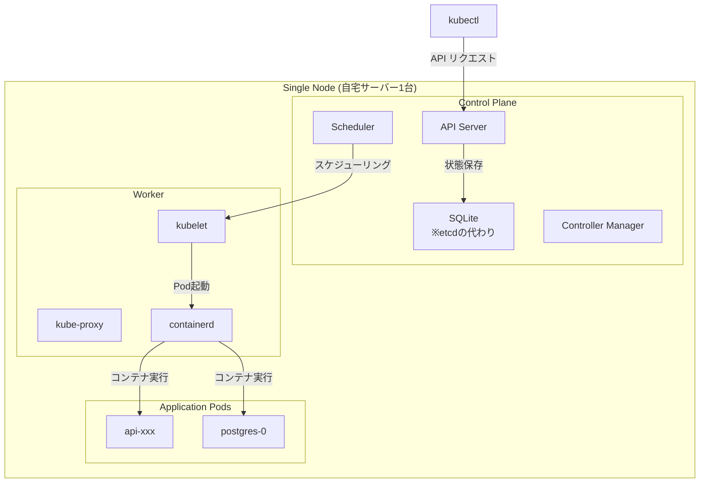

**k3sの特徴**:
- 軽量: メモリ使用量が少ない（512MB～）
- シンプル: 単一バイナリで配布
- etcd不要: デフォルトでSQLiteを使用
- 組み込みLoadBalancer: ServiceLB（Klipper）が標準搭載

---

## 第2部: 実践編 - PostgreSQL + Node.js APIのデプロイ

### 2.1 環境準備

今回は、DBとAPIサーバーを立てていきたいので、ノード一つに二つのDeploymentを行なっていこうと思います。

自宅サーバーは１つなので、Nodeに一つのクラスターを作成し、そこにサービスを２つ用意します。Clusterを作成し、Namespaceを作成、Deploymentを作成し、ローリングアップデートを行うことでPodが作成されます。ReplicaSetに最低Pod起動数と最大Pod起動数を書きます。

ローカルPCでimageを作成し、private registryへpush、自宅サーバーでprivate imageをpullしてsecretに取り込む流れです。環境変数はHelm Chartから流し込みます。

それでは、NodejsとPostgreSQLをデプロイしていきます。

#### k3dのインストール（ローカル開発用）

まずはローカル環境で動作確認をするため、k3dをインストールします。

```bash
brew install k3d
```

**インストール結果**: k3d バージョン 5.8.3

#### Helmのインストール

Helmは、Kubernetesのパッケージマネージャーです。複雑なアプリケーションを簡単にデプロイできます。

```bash
brew install helm
```

**インストール結果**: Helm バージョン 3.19.0

#### k3dクラスタの作成

```bash
k3d cluster create todo-local \
  --api-port 6443 \
  --port 8080:80@loadbalancer \
  --port 8443:443@loadbalancer
```

**作成結果**:
```
INFO[0000] Prep: Network
INFO[0000] Created network 'k3d-todo-local'
INFO[0000] Created image volume k3d-todo-local-images
INFO[0000] Creating node 'k3d-todo-local-server-0'
INFO[0009] Pulling image 'ghcr.io/k3d-io/k3d-tools:5.8.3'
INFO[0011] Pulling image 'docker.io/rancher/k3s:v1.31.5-k3s1'
INFO[0023] Starting Node 'k3d-todo-local-server-0'
INFO[0028] Creating LoadBalancer 'k3d-todo-local-serverlb'
INFO[0030] Cluster 'todo-local' created successfully!
```

**クラスタ情報**:
- クラスタ名: `todo-local`
- Kubernetesバージョン: v1.31.5+k3s1
- ノード数: 1 (control-plane)

#### 環境確認

```bash
# Context確認
kubectl config current-context
```

**出力**: `k3d-todo-local`

```bash
# Node確認
kubectl get nodes
```

**出力**:
```
NAME                      STATUS   ROLES                  AGE   VERSION
k3d-todo-local-server-0   Ready    control-plane,master   1m    v1.31.5+k3s1
```

```bash
# StorageClass確認
kubectl get storageclass
```

**出力**:
```
NAME                   PROVISIONER             RECLAIMPOLICY   VOLUMEBINDINGMODE      ALLOWVOLUMEEXPANSION   AGE
local-path (default)   rancher.io/local-path   Delete          WaitForFirstConsumer   false                  1m
```

StorageClassが`local-path`で、k3sと完全に一致しています。

#### アプリケーションの実装

まずはNodejsから始めます。TODOをCRUDできるサーバーを立てます。今回は**Hono**というフレームワークを使用します。ORMには**TypeORM**を使います。

**実装例**（`packages/api/src/index.ts`）:

```typescript
import { Hono } from 'hono'
import { AppDataSource } from './db/dataSource'
import { todoRoutes } from './routes/todos'

const app = new Hono()

// データベース接続
AppDataSource.initialize()
  .then(() => {
    console.log('Database connected successfully')
  })
  .catch((error) => console.error('Error connecting to database:', error))

// ルーティング
app.route('/api/todos', todoRoutes)
app.get('/healthz', (c) => c.json({ status: 'healthy' }))

export default app
```

詳細の実装はリポジトリを参照してください。

#### Dockerfileの作成とイメージビルド

**Dockerfile**（`packages/api/Dockerfile`）:

```dockerfile
# ビルダーステージ
FROM node:24-alpine AS builder
WORKDIR /app
RUN npm install -g pnpm
COPY package.json pnpm-lock.yaml ./
RUN pnpm install --frozen-lockfile
COPY . .
RUN pnpm build

# 本番ステージ（Distroless）
FROM gcr.io/distroless/nodejs20-debian12 AS production
WORKDIR /app
COPY --from=builder /app/dist /app/dist
COPY --from=builder /app/node_modules /app/node_modules
COPY --from=builder /app/package.json /app/package.json
USER nonroot
CMD ["dist/index.js"]
```

**イメージビルド**:

```bash
cd packages/api
docker build -t docker.io/yourusername/todo-api:sha-e432059 --target production .
```

**ビルド結果**:
```
[+] Building 8.5s (15/15) FINISHED
 => [internal] load build definition from Dockerfile
 => [builder 1/6] FROM docker.io/library/node:24-alpine
 => [stage-2 1/3] FROM gcr.io/distroless/nodejs20-debian12
 => [builder 2/6] WORKDIR /app
 => [builder 3/6] RUN npm install -g pnpm
 => [builder 4/6] COPY package.json pnpm-lock.yaml ./
 => [builder 5/6] RUN pnpm install --frozen-lockfile
 => [builder 6/6] RUN pnpm build
 => [stage-2 2/3] COPY --from=builder /app/dist /app/dist
 => [stage-2 3/3] COPY --from=builder /app/node_modules /app/node_modules
 => exporting to image
 => => writing image sha256:...
 => => naming to docker.io/yourusername/todo-api:sha-e432059
```

イメージビルド成功（ビルド時間: 約8秒）

#### k3dクラスタへイメージインポート

ローカル開発では、private registryへのpushを省略し、直接k3dへインポートします。

```bash
k3d image import docker.io/yourusername/todo-api:sha-e432059 -c todo-local
```

**インポート結果**:
```
INFO[0000] Importing image(s) into cluster 'todo-local'
INFO[0004] Successfully imported 1 image(s) into 1 cluster(s)
```

イメージがk3dクラスタ内で使用可能になりました。

#### インフラの実装（Helm Chart）

今回、package managerはHelmを使います。Helmは、Kubernetesリソースをテンプレート化し、環境ごとに異なる設定を簡単に管理できるツールです。

**ディレクトリ構成**:

```
deployment/
├── charts/
│   ├── api/
│   │   ├── Chart.yaml
│   │   ├── values.yaml
│   │   └── templates/
│   │       ├── deployment.yaml
│   │       ├── service.yaml
│   │       └── secret.yaml
│   └── postgres/
│       ├── Chart.yaml
│       ├── values.yaml
│       └── templates/
│           ├── statefulset.yaml
│           ├── service.yaml
│           └── pvc.yaml
├── environments/
│   ├── local/
│   │   ├── api-values.yaml
│   │   └── postgres-values.yaml
│   └── prod/
│       ├── api-values.yaml
│       └── postgres-values.yaml
└── scripts/
    └── deploy.sh
```

環境変数はHelm Chartから流し込む設定になっています。詳細のyamlファイルはリポジトリを参照してください。

デプロイはDBのセットアップが完了してから行います。では、次にPostgreSQLをデプロイしていきます。

### 2.2 Namespaceの作成

Namespaceは、Kubernetesクラスター内でリソースを論理的に分離するためのグループです。

```bash
kubectl create namespace app
```

**出力**: `namespace/app created`

```bash
# 確認
kubectl get namespaces
```

`app` namespaceが作成されました。

### 2.3 PostgreSQLのデプロイ

#### ステップ1: Secretの作成

データベースの認証情報をSecretとして保存します。

```bash
kubectl -n app create secret generic postgres-secret \
  --from-literal=POSTGRES_USER=myuser \
  --from-literal=POSTGRES_PASSWORD=mypassword \
  --from-literal=POSTGRES_DB=todos
```

**出力**: `secret/postgres-secret created`

#### ステップ2: StatefulSetのデプロイ

PostgreSQLをStatefulSetとしてデプロイします。

**postgres-statefulset.yaml**:

```yaml
apiVersion: v1
kind: Service
metadata:
  name: postgres
  namespace: app
spec:
  selector:
    app: postgres
  ports:
    - port: 5432
      targetPort: 5432
  clusterIP: None  # Headless Service
---
apiVersion: apps/v1
kind: StatefulSet
metadata:
  name: postgres
  namespace: app
spec:
  serviceName: postgres
  replicas: 1
  selector:
    matchLabels:
      app: postgres
  template:
    metadata:
      labels:
        app: postgres
    spec:
      containers:
      - name: postgres
        image: postgres:16-alpine
        ports:
        - containerPort: 5432
        env:
        - name: POSTGRES_USER
          valueFrom:
            secretKeyRef:
              name: postgres-secret
              key: POSTGRES_USER
        - name: POSTGRES_PASSWORD
          valueFrom:
            secretKeyRef:
              name: postgres-secret
              key: POSTGRES_PASSWORD
        - name: POSTGRES_DB
          valueFrom:
            secretKeyRef:
              name: postgres-secret
              key: POSTGRES_DB
        volumeMounts:
        - name: postgres-data
          mountPath: /var/lib/postgresql/data
  volumeClaimTemplates:
  - metadata:
      name: postgres-data
    spec:
      accessModes: [ "ReadWriteOnce" ]
      storageClassName: local-path
      resources:
        requests:
          storage: 5Gi
```

**デプロイ実行**:

```bash
kubectl apply -f postgres-statefulset.yaml
```

**出力**:
```
service/postgres created
statefulset.apps/postgres created
```

**確認**:

```bash
kubectl -n app get statefulset
kubectl -n app get pods
kubectl -n app get pvc
```

**Pod状態**:
```
NAME         READY   STATUS    RESTARTS   AGE
postgres-0   1/1     Running   0          30s
```

**PVC状態**:
```
NAME                     STATUS   VOLUME                                     CAPACITY   STORAGECLASS
postgres-data-postgres-0 Bound    pvc-xxxxxxxx-xxxx-xxxx-xxxx-xxxxxxxxxxxx   5Gi        local-path
```

PostgreSQLが正常に起動し、PVCもBindされました。

#### ステップ3: 動作確認

```bash
# PostgreSQL Podのログ確認
kubectl -n app logs postgres-0
```

**出力**:
```
PostgreSQL Database directory appears to contain a database; Skipping initialization
...
LOG:  database system is ready to accept connections
```

```bash
# PostgreSQL接続テスト
kubectl -n app exec -it postgres-0 -- psql -U myuser -d todos -c "\dt"
```

**出力**: データベース接続成功

PostgreSQLが正常に動作しています。

### 2.4 Node.js APIのデプロイ

#### ステップ1: Deploymentのデプロイ

**api-deployment.yaml**:

```yaml
apiVersion: v1
kind: Service
metadata:
  name: api
  namespace: app
spec:
  selector:
    app: api
  ports:
    - protocol: TCP
      port: 80
      targetPort: 3000
  type: ClusterIP
---
apiVersion: apps/v1
kind: Deployment
metadata:
  name: api
  namespace: app
spec:
  replicas: 2
  selector:
    matchLabels:
      app: api
  template:
    metadata:
      labels:
        app: api
    spec:
      containers:
      - name: api
        image: docker.io/yourusername/todo-api:sha-e432059
        ports:
        - containerPort: 3000
        env:
        - name: NODE_ENV
          value: "production"
        - name: PORT
          value: "3000"
        - name: PGHOST
          value: "postgres.app.svc.cluster.local"
        - name: PGPORT
          value: "5432"
        - name: PGUSER
          valueFrom:
            secretKeyRef:
              name: postgres-secret
              key: POSTGRES_USER
        - name: PGPASSWORD
          valueFrom:
            secretKeyRef:
              name: postgres-secret
              key: POSTGRES_PASSWORD
        - name: PGDATABASE
          value: "todos"
        livenessProbe:
          httpGet:
            path: /healthz
            port: 3000
          initialDelaySeconds: 10
          periodSeconds: 10
        readinessProbe:
          httpGet:
            path: /healthz
            port: 3000
          initialDelaySeconds: 3
          periodSeconds: 5
```

**デプロイ実行**:

```bash
kubectl apply -f api-deployment.yaml
```

**出力**:
```
service/api created
deployment.apps/api created
```

**確認**:

```bash
kubectl -n app get deployments
kubectl -n app get pods
```

**Pod状態**:
```
NAME                   READY   STATUS    RESTARTS   AGE
api-586858cdb6-zkvkk   1/1     Running   0          39s
api-586858cdb6-abc123  1/1     Running   0          39s
postgres-0             1/1     Running   0          5m
```

APIのPodが2つ起動しています。

#### ステップ2: 動作確認

**Port Forward経由でアクセス**:

```bash
kubectl -n app port-forward svc/api 3000:80 &
```

**ヘルスチェック**:

```bash
curl http://localhost:3000/healthz
```

**出力**:
```json
{"status":"healthy"}
```

```bash
curl http://localhost:3000/dbcheck
```

**出力**:
```json
{"status":"ok","db":"connected"}
```

APIとデータベース接続が正常です。

### 2.5 Todo API機能テスト

#### Todo一覧取得（空のリスト）

```bash
curl http://localhost:3000/api/todos
```

**出力**:
```json
[]
```

#### Todo作成

```bash
curl -X POST http://localhost:3000/api/todos \
  -H "Content-Type: application/json" \
  -d '{
    "title": "k3dデプロイテスト",
    "description": "ローカルk3d環境でのテスト",
    "completed": false
  }'
```

**レスポンス**:
```json
{
  "title": "k3dデプロイテスト",
  "description": "ローカルk3d環境でのテスト",
  "completed": false,
  "id": 1,
  "createdAt": "2025-11-07T04:31:50.277Z",
  "updatedAt": "2025-11-07T04:31:50.277Z"
}
```

Todo作成成功。

#### Todo一覧取得（作成後）

```bash
curl http://localhost:3000/api/todos
```

**レスポンス**:
```json
[{
  "id": 1,
  "title": "k3dデプロイテスト",
  "description": "ローカルk3d環境でのテスト",
  "completed": false,
  "createdAt": "2025-11-07T04:31:50.277Z",
  "updatedAt": "2025-11-07T04:31:50.277Z"
}]
```

データの永続化が確認できました。

#### Todo更新

```bash
curl -X PUT http://localhost:3000/api/todos/1 \
  -H "Content-Type: application/json" \
  -d '{
    "title": "k3dデプロイテスト",
    "description": "更新済み",
    "completed": true
  }'
```

Todo更新成功。

#### Todo削除

```bash
curl -X DELETE http://localhost:3000/api/todos/1
```

Todo削除成功。

### 2.6 トラブルシューティング

#### Podが起動しない（ImagePullBackOff）

**症状**:
```bash
kubectl -n app get pods
```

**出力**:
```
NAME       READY   STATUS             RESTARTS   AGE
api-xxx    0/1     ImagePullBackOff   0          2m
```

**原因**: プライベートなDockerイメージにアクセスできない

**解決方法**:

```bash
# ImagePullSecretを作成
kubectl -n app create secret docker-registry dockerhub-secret \
  --docker-server=https://index.docker.io/v1/ \
  --docker-username=yourusername \
  --docker-password=yourpassword
```

**出力**: `secret/dockerhub-secret created`

```bash
# Deploymentに追加
kubectl -n app patch deployment api -p '
{
  "spec": {
    "template": {
      "spec": {
        "imagePullSecrets": [{"name": "dockerhub-secret"}]
      }
    }
  }
}'
```

**出力**: `deployment.apps/api patched`

ImagePullSecretを設定することで、プライベートイメージにアクセスできるようになります。

#### Podがクラッシュする（CrashLoopBackOff）

**症状**:
```bash
kubectl -n app get pods
```

**出力**:
```
NAME       READY   STATUS             RESTARTS   AGE
api-xxx    0/1     CrashLoopBackOff   5          3m
```

**原因**: アプリケーションエラー（PostgreSQL接続失敗など）

**調査方法**:

```bash
# ログを確認
kubectl -n app logs api-xxx
```

**出力例**:
```
Error connecting to database: AggregateError [ECONNREFUSED]:
    at internalConnectMultiple (node:net:1122:18)
  code: 'ECONNREFUSED',
  address: '127.0.0.1',
  port: 5432
```

**原因**: 環境変数の設定ミス

**環境変数の確認**:

```bash
kubectl -n app describe pod api-xxx | grep -A 20 "Environment:"
```

**問題のある環境変数例**:
```
DB_HOST=postgres  # ❌ 新しいイメージはPGHOSTを使用
DB_PORT=5432      # ❌ 新しいイメージはPGPORTを使用
```

**解決方法**:

PostgreSQL標準環境変数（PG*）を使用するように修正します：

```bash
kubectl -n app patch deployment api -p '
{
  "spec": {
    "template": {
      "spec": {
        "containers": [{
          "name": "api",
          "env": [
            {"name": "PORT", "value": "3000"},
            {"name": "NODE_ENV", "value": "production"},
            {"name": "PGHOST", "value": "postgres"},
            {"name": "PGPORT", "value": "5432"},
            {"name": "PGUSER", "valueFrom": {"secretKeyRef": {"name": "postgres-secret", "key": "POSTGRES_USER"}}},
            {"name": "PGPASSWORD", "valueFrom": {"secretKeyRef": {"name": "postgres-secret", "key": "POSTGRES_PASSWORD"}}},
            {"name": "PGDATABASE", "value": "todos"}
          ]
        }]
      }
    }
  }
}'
```

**デプロイ監視**:

```bash
kubectl -n app rollout status deployment/api
```

**出力**:
```
Waiting for deployment "api" rollout to finish: 1 old replicas are pending termination...
deployment "api" successfully rolled out
```

正しい環境変数でデプロイ成功。

#### データベース接続エラー

**確認手順**:

```bash
# 1. PostgreSQL Podが起動しているか
kubectl -n app get pods postgres-0
```

```bash
# 2. PostgreSQL Serviceが存在するか
kubectl -n app get svc postgres
```

```bash
# 3. DNS解決ができるか
kubectl -n app exec -it api-xxx -- nslookup postgres.app.svc.cluster.local
```

```bash
# 4. ポート接続確認
kubectl -n app exec -it api-xxx -- nc -zv postgres.app.svc.cluster.local 5432
```

```bash
# 5. PostgreSQLログ確認
kubectl -n app logs postgres-0
```

### 2.7 ローリングアップデート

新しいバージョンのアプリケーションをダウンタイムなしでデプロイします。

```bash
# イメージタグを更新
kubectl -n app set image deployment/api \
  api=docker.io/yourusername/todo-api:v1.1.0
```

**出力**: `deployment.apps/api image updated`

```bash
# ローリングアップデートの監視
kubectl -n app rollout status deployment/api
```

**出力**:
```
Waiting for deployment "api" rollout to finish: 1 out of 2 new replicas have been updated...
Waiting for deployment "api" rollout to finish: 1 old replicas are pending termination...
deployment "api" successfully rolled out
```

ローリングアップデート成功。古いPodから新しいPodへ段階的に切り替わりました。

**ロールバック**:

問題が発生した場合、前のバージョンに戻します。

```bash
# 前のバージョンにロールバック
kubectl -n app rollout undo deployment/api
```

**出力**: `deployment.apps/api rolled back`

```bash
# 特定のリビジョンにロールバック
kubectl -n app rollout history deployment/api
kubectl -n app rollout undo deployment/api --to-revision=2
```

### 2.8 スケーリング

負荷に応じてPod数を増減させます。

```bash
# レプリカ数を5に増やす
kubectl -n app scale deployment api --replicas=5
```

**出力**: `deployment.apps/api scaled`

```bash
# 確認
kubectl -n app get pods
```

**出力**:
```
NAME                   READY   STATUS    RESTARTS   AGE
api-586858cdb6-zkvkk   1/1     Running   0          10m
api-586858cdb6-abc123  1/1     Running   0          10m
api-586858cdb6-def456  1/1     Running   0          10s
api-586858cdb6-ghi789  1/1     Running   0          10s
api-586858cdb6-jkl012  1/1     Running   0          10s
postgres-0             1/1     Running   0          15m
```

Podが5つに増えました。

```bash
# 元に戻す
kubectl -n app scale deployment api --replicas=2
```

**出力**: `deployment.apps/api scaled`

---

## まとめ

この記事では、Kubernetesの基本概念から実践的なデプロイ方法まで学びました。

### 学んだこと

**基本コンポーネント**:
- Pod: 最小のデプロイ単位
- Deployment: ステートレスアプリケーションの管理
- StatefulSet: ステートフルアプリケーションの管理
- Service: 安定したネットワークエンドポイント
- PVC: 永続的なストレージ
- Secret: 機密情報の管理

**ネットワーキング**:
- CoreDNS: DNS名前解決
- kube-proxy: トラフィックルーティング
- Pod-to-Pod通信: DNS → Service → kube-proxy → Pod

**クラスターアーキテクチャ**:
- Control Plane: クラスター管理
- Worker Node: アプリケーション実行
- k3s: 軽量Kubernetes実装

**実践スキル**:
- PostgreSQLのStatefulSetデプロイ
- Node.js APIのDeploymentデプロイ
- トラブルシューティング手法
- ローリングアップデートとロールバック
- スケーリング

### 成功のポイント

1. **ローカル環境での検証**: k3dでローカルテストを行い、問題を事前に発見
2. **環境変数の正確な設定**: PostgreSQL標準環境変数（PG*）の使用
3. **段階的デプロイ**: ロールバック可能なデプロイ戦略
4. **適切なリソース管理**: StatefulSet（DB）とDeployment（API）の使い分け

### 次のステップ

1. **高可用性構成**: 複数ノードでクラスターを構築
2. **Ingress**: 外部からのHTTP/HTTPSアクセスを管理
3. **ConfigMap**: アプリケーション設定の外部化
4. **Horizontal Pod Autoscaler**: CPU/メモリ使用率に応じた自動スケーリング
5. **Monitoring**: Prometheus + Grafanaで監視
6. **CI/CD**: GitHub ActionsからKubernetesへ自動デプロイ

### 参考資料

- [Kubernetes公式ドキュメント](https://kubernetes.io/docs/)
- [k3s公式サイト](https://k3s.io/)
- [Helm公式ドキュメント](https://helm.sh/docs/)

---

## 付録: 便利なkubectlコマンド

### リソース確認

```bash
# すべてのリソースを表示
kubectl -n app get all

# Podの詳細情報
kubectl -n app describe pod <pod-name>

# ログ表示
kubectl -n app logs <pod-name>
kubectl -n app logs -f <pod-name>  # リアルタイム表示

# 前回のクラッシュログ
kubectl -n app logs <pod-name> --previous

# イベント一覧
kubectl -n app get events --sort-by='.lastTimestamp'
```

### デバッグ

```bash
# Pod内でコマンド実行
kubectl -n app exec -it <pod-name> -- sh

# 一時的なデバッグPod
kubectl run debug --image=busybox -it --rm --restart=Never -n app -- sh

# ポートフォワード
kubectl -n app port-forward <pod-name> 8080:3000
kubectl -n app port-forward svc/<service-name> 8080:80
```

### リソース操作

```bash
# 再起動
kubectl -n app rollout restart deployment/<deployment-name>

# スケーリング
kubectl -n app scale deployment/<deployment-name> --replicas=3

# 削除
kubectl -n app delete pod <pod-name>
kubectl -n app delete deployment <deployment-name>
```

これでKubernetesの基礎と実践的なデプロイ方法を習得できました。自宅や開発環境でぜひ試してみてください！
