# なんちゃってお家kubernetes DB + API編

前回の環境構築編では、WindowsPCを購入してUbuntuOSをインストールするまでを行いました。

今回はお家サーバーにkubernetesのをホストし、worker nodeとcontroll planeを立てていきたいと思います。
worker nodeには２つのコンテナを用意し、１つのpodにDBを、もう片方にAPIサーバーを立てていこうと思います。
なんちゃってお家kubernetesの目的は、いっぱい作っていっぱい壊しながらいっぱい学ぶことだと個人的に考えています。
なので、まずはCRUD機能を持ったAPIを作成し、DBとの疎通を確認することをこの記事のゴールに置きます。

controller plane, ノード、pod、コンテナ、サーバーなど、kubernetesには色々な入れ物に名前がついていてイメージが湧きづらいです。
この記事を書き終えた頃には全ての入れ物に対するメンタルモデルが出来上がっていると嬉しいな。

今回やること：
- 自宅サーバー（またはローカル環境）にk3s（軽量Kubernetes）をセットアップ
- PostgreSQLをStatefulSetとしてデプロイ
- Node.js APIをDeploymentとしてデプロイ
- Pod間通信の仕組みを理解
- Todo APIの動作確認

## 環境について

この記事では、2つの異なる環境でのデプロイ方法を説明します。

### ローカル開発環境（k3d）

ローカル開発では**k3d**を使用します。k3dは、Docker内でk3sクラスターを動かすツールです。

**k3dのメリット：**
- ホストOSを汚さず、Docker内で隔離された環境を作成
- `k3d cluster delete`で簡単に環境をリセット可能
- 複数のクラスターを同時に管理できる
- ローカルイメージのインポートが簡単

```bash
# k3dでクラスター作成
k3d cluster create todo-local --agents 1

# k3dでクラスター削除
k3d cluster delete todo-local
```

参考: [k3d公式ドキュメント](https://k3d.io/)

### リモートサーバー環境（k3s直接インストール）

リモートの本番サーバーでは、**k3sを直接インストール**して使用します。

```bash
# k3sを直接インストール
curl -sfL https://get.k3s.io | sh -

# k3sの状態確認
sudo systemctl status k3s
```

参考: [k3s公式ドキュメント](https://docs.k3s.io/)

### どちらを選ぶべきか

| 環境 | 推奨方法 | 理由 |
|------|---------|------|
| ローカル開発 | k3d | 環境のリセットが容易、複数クラスター管理 |
| リモートサーバー | k3s直接 | Dockerオーバーヘッドなし、本番運用向き |

**重要:** どちらもk3sベースなので、**Helmチャートやマニフェストファイルは全く同じものを使用できます**。環境の違いは、k3sの実行方法（Docker内 vs 直接）だけです。

## 実装予定のサーバー全体像

### ローカル環境（k3d）の構成

ローカル開発環境では、Docker内でk3dを使ってKubernetesクラスターを実行します。

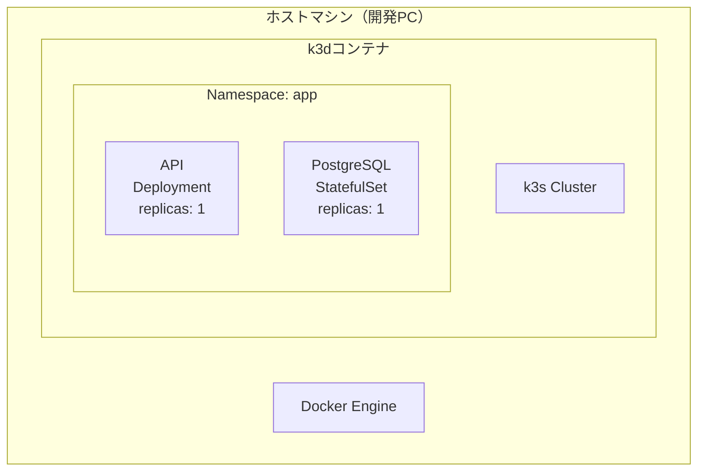

階層構造：

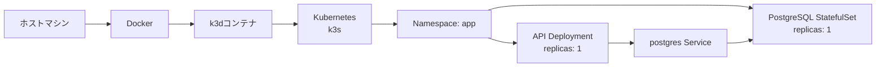

**ローカル環境の特徴：**
- Docker内で隔離された環境
- `kubectl port-forward`でアクセス
- 環境のリセットが容易

### リモート環境（k3s直接）の構成

リモートサーバーでは、ホストOS上にk3sを直接インストールして実行します。

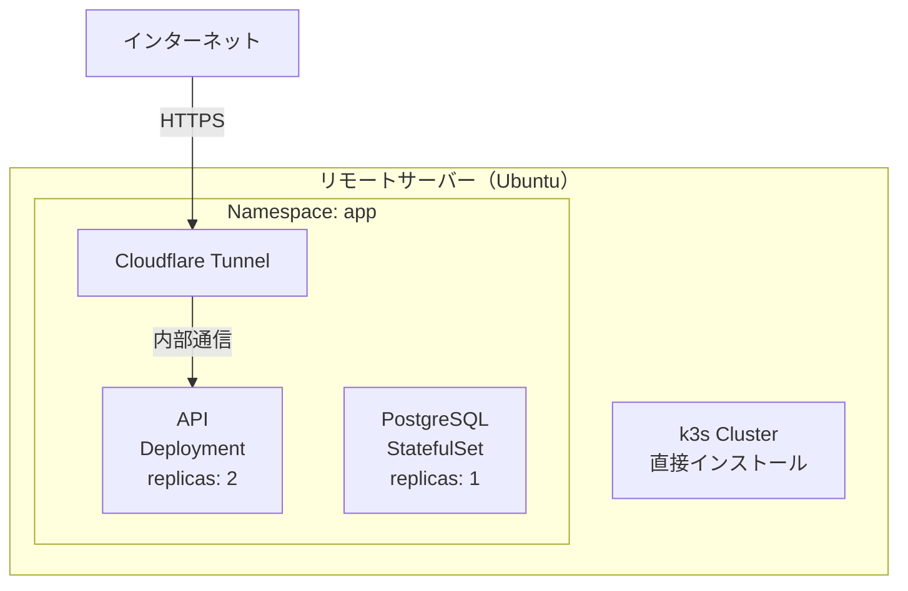

階層構造：

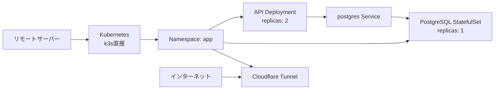

**リモート環境の特徴：**
- ホストOSに直接インストール
- Cloudflare Tunnelで外部公開
- 本番運用向けの高いレプリカ数

### Kubernetesコンポーネント

#### Pod

Podは、Kubernetesで最小のデプロイ単位です。1つ以上のコンテナをグループ化し、共有ストレージとネットワークを持ちます。

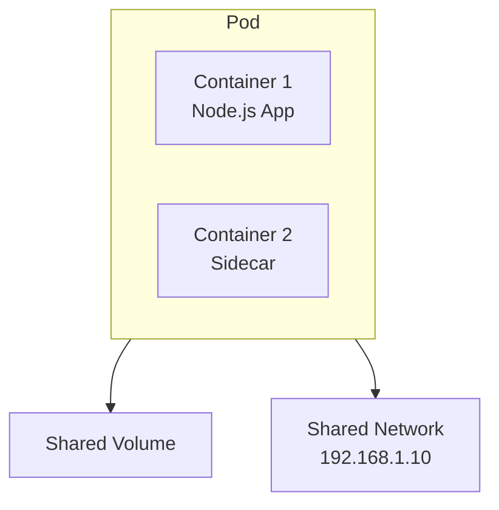

Pod内のコンテナは同じIPアドレスを共有し、localhostで通信できます。

参考: [Kubernetes Pod](https://kubernetes.io/ja/docs/concepts/workloads/pods/)

#### Deployment（ReplicaSet）

Deploymentは、ステートレスなアプリケーションを管理します。指定した数のPodレプリカを維持し、ローリングアップデートやロールバックをサポートします。

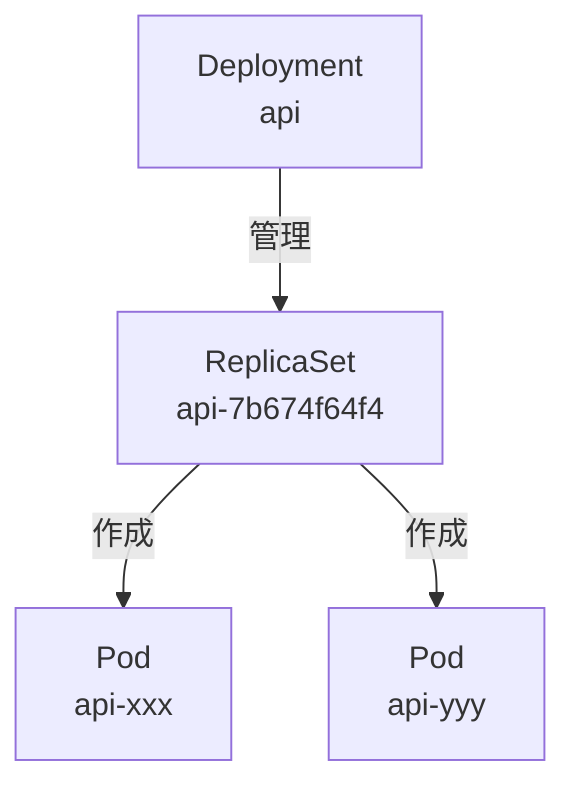

DeploymentはReplicaSetを管理し、ReplicaSetが実際のPodを作成・維持します。これにより、Pod障害時の自動復旧やスケーリングが可能になります。

参考: [Kubernetes Deployment](https://kubernetes.io/ja/docs/concepts/workloads/controllers/deployment/)

#### StatefulSet

StatefulSetは、ステートフルなアプリケーション（データベースなど）を管理します。各Podに固定された識別子と永続ストレージを提供します。

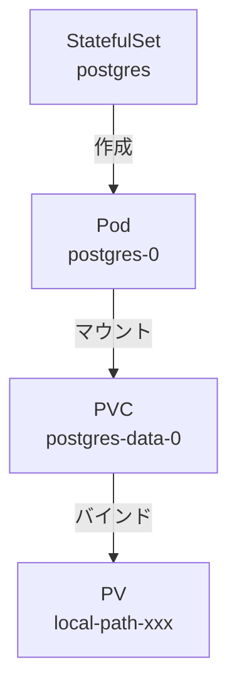

StatefulSetのPodは、`postgres-0`のように順序付けされた名前を持ち、再起動後も同じストレージに接続されます。

参考: [Kubernetes StatefulSet](https://kubernetes.io/ja/docs/concepts/workloads/controllers/statefulset/)

#### Service（ClusterIP）

Serviceは、Pod群への安定したネットワークアクセスを提供します。ClusterIPは、クラスター内部からのみアクセス可能なIPアドレスを割り当てます。

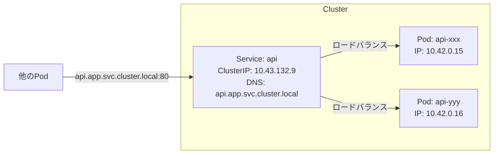

Serviceは、Pod IPが変わっても同じDNS名でアクセスできるようにし、複数のPodに対してロードバランシングを提供します。

参考: [Kubernetes Service](https://kubernetes.io/ja/docs/concepts/services-networking/service/)

#### Service（NodePort）

NodePortは、クラスター外部からのアクセスを可能にするServiceタイプです。各ノードの指定ポートで待ち受けます。

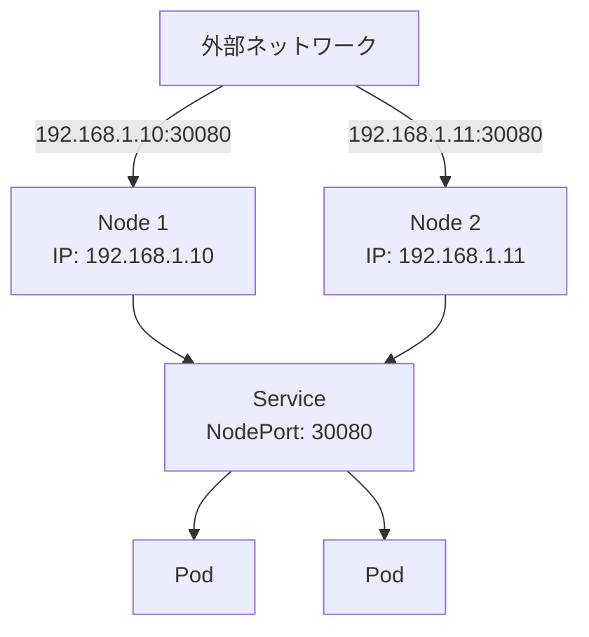

外部からは`<NodeIP>:<NodePort>`でアクセスでき、Serviceが適切なPodにトラフィックを転送します。

#### PersistentVolumeClaim

PVCは、永続的なストレージを要求するためのリソースです。PodがPVCをマウントすると、StorageClassが自動的にPersistentVolume（PV）を作成します。

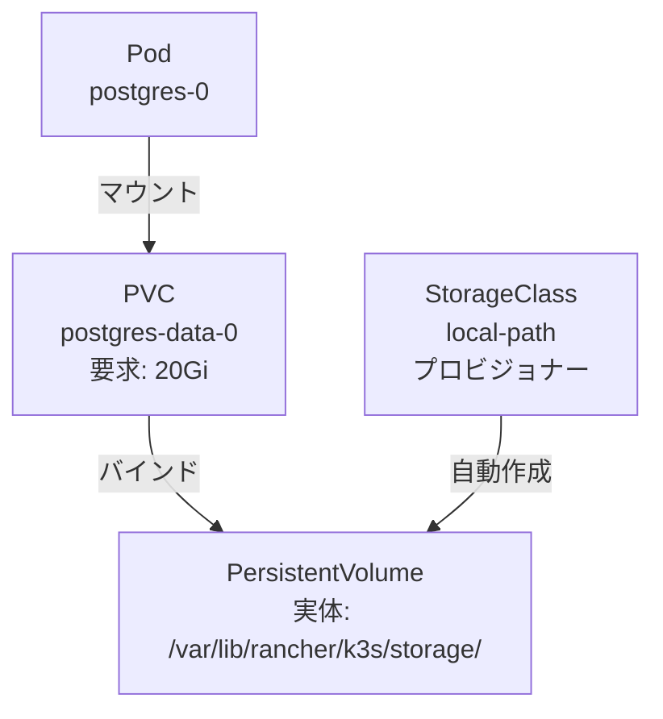

この仕組みにより、Pod再起動後もデータが永続化されます。

参考: [Kubernetes PersistentVolume](https://kubernetes.io/ja/docs/concepts/storage/persistent-volumes/)

### 今回のシステム構成

今回構築するシステム全体の関係を見てみましょう。

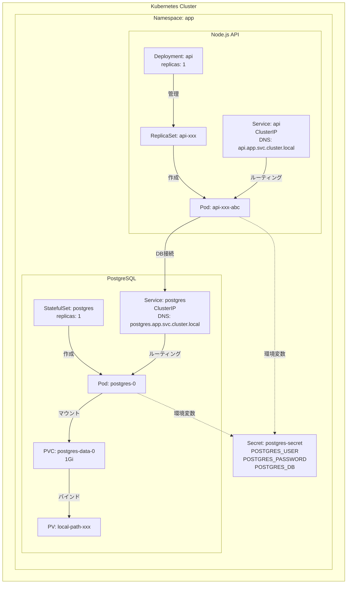

主要な構成要素：
- **API Deployment**: Node.js APIサーバー（ステートレス）
- **PostgreSQL StatefulSet**: データベース（ステートフル、永続ストレージ付き）
- **Service**: 各Podへの安定したネットワークアクセスを提供
- **Secret**: 認証情報を安全に管理
- **PVC/PV**: PostgreSQLのデータを永続化

### Kubernetesネットワーキング

#### DNS命名規則

Kubernetes内部では、ServiceにDNS名が自動的に割り当てられます。命名規則は以下の通りです：

```
<service-name>.<namespace>.svc.cluster.local
```

例：
- `postgres.app.svc.cluster.local` → PostgreSQL Service
- `api.app.svc.cluster.local` → API Service

同じNamespace内では、Service名だけで接続できます：
- `postgres` → `postgres.app.svc.cluster.local`

参考: [Kubernetes DNS](https://kubernetes.io/ja/docs/concepts/services-networking/dns-pod-service/)

#### kube-proxy

kube-proxyは、各ノード上で動作するネットワークプロキシです。Service IPへのトラフィックを実際のPod IPに転送します。

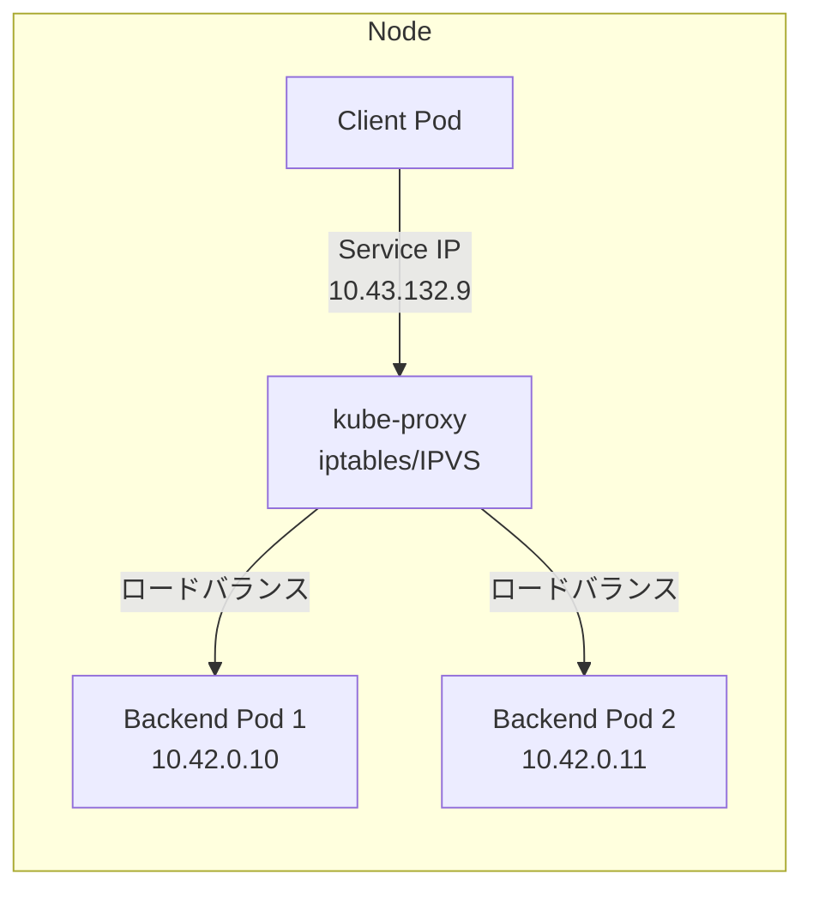

kube-proxyは、iptablesまたはIPVSを使用してトラフィックをルーティングし、複数のPodに負荷を分散します。

#### Pod間通信フロー

実際のPod間通信がどのように行われるか、シーケンス図で確認しましょう。

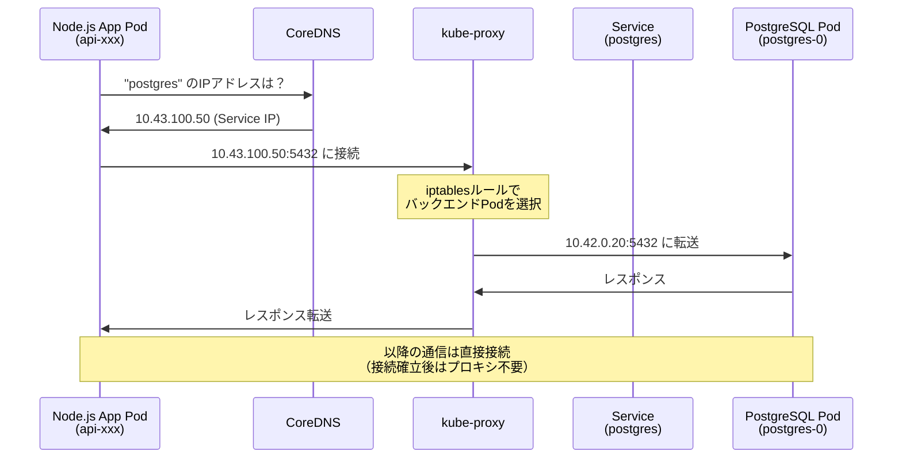

通信の流れ：
1. **DNS解決**: CoreDNSがService名をService IPに解決
2. **プロキシ経由**: kube-proxyがService IPを実際のPod IPに変換
3. **直接通信**: TCP接続確立後は、Pod間で直接通信

### クラスターアーキテクチャ

#### 標準的なKubernetesクラスター

通常のKubernetesクラスターは、Control Plane（管理ノード）とWorker Node（ワーカーノード）で構成されます。

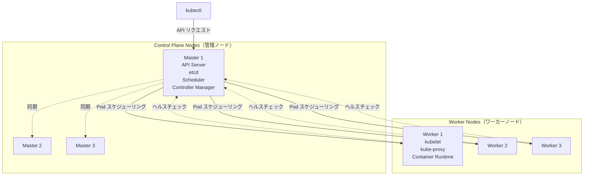

本番環境では、高可用性のために複数のControl Planeノードを配置します。

参考: [Kubernetes Architecture](https://kubernetes.io/ja/docs/concepts/architecture/)

#### 自宅サーバー（Single Node）構成

今回構築するk3s環境は、1台のサーバーにControl PlaneとWorkerの両方の機能を持たせたSingle Node構成です。

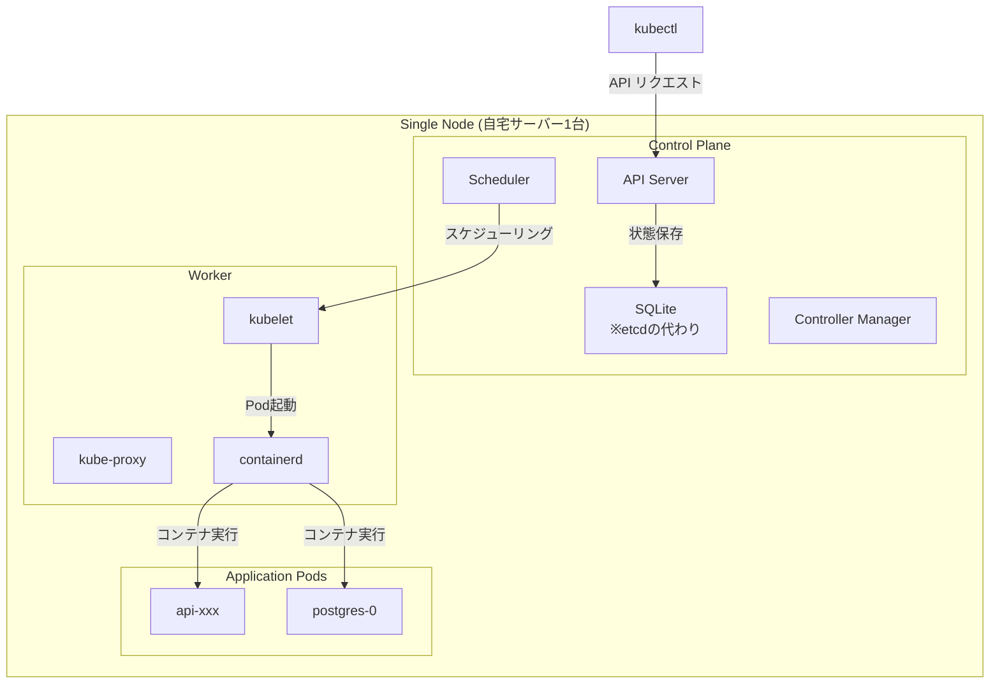

k3sの特徴：
- **軽量**: 通常のKubernetesより小さいバイナリサイズ
- **SQLite**: etcdの代わりにSQLiteを使用（シングルノード構成の場合）
- **All-in-One**: Control PlaneとWorkerが同居可能
- **自宅ラボに最適**: リソース消費が少なく、学習に適している

参考: [k3s Documentation](https://docs.k3s.io/)

---

## 環境準備

今回は、DBとAPIサーバーを立てていきます。お家サーバーは物理的に1つしか存在しないので、1ノードに１つのクラスターを作成し、そこにサービスを2つ用意していきます。
そして、負荷分散をしてみたいので、APIサーバーは２つ立ててみようと思います。

> **📝 環境による違い**
>
> この記事では**ローカル開発環境（k3d）**での手順を中心に説明します。
>
> **リモートサーバーの場合**は、以下のコマンドでk3sを直接インストールしてください：
> ```bash
> curl -sfL https://get.k3s.io | sh -
>
> # kubectlの設定
> export KUBECONFIG=/etc/rancher/k3s/k3s.yaml
> ```
>
> **以降のHelmコマンドやマニフェスト適用は、ローカル/リモートで全く同じです。**

まずはローカル環境で動作確認をするため、**k3d**を使います。k3dは、Docker内でk3s（軽量Kubernetes）を実行できるツールです。k3sを直接インストールするとホストOSに影響を与えるため、Docker内で仮想的に動かすk3dを使用します。

参考: [k3d](https://k3d.io/)

### k3dのインストール

> **📝 Note:** リモートサーバーでk3sを直接使用する場合、このセクションはスキップしてください。

```bash
✗ brew install k3d

==> Pouring k3d--5.8.3.arm64_sequoia.bottle.tar.gz
🍺  /opt/homebrew/Cellar/k3d/5.8.3: 10 files, 24.1MB
```

### Helmのインストール

今回KubernetesのパッケージマネージャーにはHelmを使うので、インストールしていきます。

参考: [Helm](https://helm.sh/)

```bash
✗ brew install helm
Warning: helm 3.19.0 is already installed and up-to-date.
To reinstall 3.19.0, run:
  brew reinstall helm
```

### k3dクラスタの作成

> **📝 Note:** リモートサーバーでk3sを直接使用する場合、このセクションはスキップしてください。k3sインストール後、すぐに「Namespaceの作成」に進めます。

```bash
k3d cluster create todo-local \
    --api-port 6443 \
    --port 8080:80@loadbalancer \
    --port 8443:443@loadbalancer \
    --servers 1 \
    --agents 2

INFO[0000] Created network 'k3d-todo-local'
INFO[0000] Created image volume k3d-todo-local-images
INFO[0001] Creating node 'k3d-todo-local-server-0'
INFO[0001] Creating node 'k3d-todo-local-agent-0'
INFO[0001] Creating node 'k3d-todo-local-agent-1'
INFO[0025] Cluster 'todo-local' created successfully!
```

<details>
<summary>📋 完全なクラスター作成ログを表示</summary>

```bash
k3d cluster create todo-local \
    --api-port 6443 \
    --port 8080:80@loadbalancer \
    --port 8443:443@loadbalancer \
    --servers 1 \
    --agents 2
INFO[0000] portmapping '8443:443' targets the loadbalancer: defaulting to [servers:*:proxy agents:*:proxy]
INFO[0000] portmapping '8080:80' targets the loadbalancer: defaulting to [servers:*:proxy agents:*:proxy]
INFO[0000] Prep: Network
INFO[0000] Created network 'k3d-todo-local'
INFO[0000] Created image volume k3d-todo-local-images
INFO[0000] Starting new tools node...
INFO[0000] Starting node 'k3d-todo-local-tools'
INFO[0001] Creating node 'k3d-todo-local-server-0'
INFO[0001] Creating node 'k3d-todo-local-agent-0'
INFO[0001] Creating node 'k3d-todo-local-agent-1'
INFO[0001] Creating LoadBalancer 'k3d-todo-local-serverlb'
INFO[0001] Using the k3d-tools node to gather environment information
INFO[0001] Starting new tools node...
INFO[0002] Starting node 'k3d-todo-local-tools'
INFO[0003] Starting cluster 'todo-local'
INFO[0003] Starting servers...
INFO[0003] Starting node 'k3d-todo-local-server-0'
INFO[0007] Starting agents...
INFO[0007] Starting node 'k3d-todo-local-agent-1'
INFO[0007] Starting node 'k3d-todo-local-agent-0'
INFO[0016] Starting helpers...
INFO[0017] Starting node 'k3d-todo-local-serverlb'
INFO[0023] Injecting records for hostAliases (incl. host.k3d.internal) and for 5 network members into CoreDNS configmap...
INFO[0025] Cluster 'todo-local' created successfully!
INFO[0025] You can now use it like this:
```

</details>
このコマンドで、下記Dockerリソースが k3dコンテナの中にcluster内に作成されました。それぞれ何なのかはわかっていません。

- network
- image volume
- node
- load balancer
- cluster

> 調べてみた

- network
Docker内の仮想ネットワーク。k3sのServerノード、LoadBalancerノードなどの通信を行うための内部ネットワーク。
Dockerのリソースなので、以下のようなdockerコマンドで情報を取得できる。
```bash
 ✗ docker network ls
NETWORK ID     NAME                 DRIVER    SCOPE
0094f8670bc2   k3d-todo-local       bridge    local


```

ネットワークの主要設定：
- **サブネット**: 172.20.0.0/16
- **接続ノード**: server-0 (172.20.0.3), agent-0 (172.20.0.5), agent-1 (172.20.0.4), serverlb (172.20.0.6)

<details>
<summary>📋 完全なネットワーク設定を表示</summary>

```bash
✗ docker inspect k3d-todo-local
[
    {
        "Name": "k3d-todo-local",
        "Id": "c5c893731c87ce3c77864d8d0934750a391f27c26963309f26558dfcd6822f54",
        "Created": "2025-11-09T13:41:42.037066762Z",
        "Scope": "local",
        "Driver": "bridge",
        "EnableIPv4": true,
        "EnableIPv6": false,
        "IPAM": {
            "Driver": "default",
            "Options": null,
            "Config": [
                {
                    "Subnet": "172.20.0.0/16",
                    "Gateway": "172.20.0.1"
                }
            ]
        },
        "Internal": false,
        "Attachable": false,
        "Ingress": false,
        "ConfigFrom": {
            "Network": ""
        },
        "ConfigOnly": false,
        "Containers": {
            "0a47132a69ab4c0d620f641a14f42e0880b75b541927b3fcb126080434493b13": {
                "Name": "k3d-todo-local-tools",
                "EndpointID": "8a083d7ff82bbde807ddcd272d7ce19b023abe1321d22b0e3b02cc72256d8dd2",
                "MacAddress": "ae:de:58:b6:2a:68",
                "IPv4Address": "172.20.0.2/16",
                "IPv6Address": ""
            },
            "0e9f4f017934ca998e3776990f7527b3596de9ffc933c52129c450632fc73f4a": {
                "Name": "k3d-todo-local-agent-1",
                "EndpointID": "2dd420980901ab6967bfcfe059ddecb0e509a418a367d0d3bd36e2051646fedc",
                "MacAddress": "8a:3e:aa:11:82:d9",
                "IPv4Address": "172.20.0.4/16",
                "IPv6Address": ""
            },
            "39fa6e937c63741611090f5076277abc6ab1c744632d2b173de6e554b97d1fa7": {
                "Name": "k3d-todo-local-agent-0",
                "EndpointID": "9740bac3be57e5dda73a9037659964b08fbb68beb7132519e77fb34b250020bb",
                "MacAddress": "be:ec:7b:11:d4:e2",
                "IPv4Address": "172.20.0.5/16",
                "IPv6Address": ""
            },
            "a444ceaffa1ffc0559edb8af119622aa3d0114104cce0e574224d7eecb84ee00": {
                "Name": "k3d-todo-local-server-0",
                "EndpointID": "67d8f58e5bf1c6eb115f86fd3f2d6e685ac167343dfa5ea982ef7bd48cffc3b2",
                "MacAddress": "ea:5c:6e:21:a6:d6",
                "IPv4Address": "172.20.0.3/16",
                "IPv6Address": ""
            },
            "b2c8b1be1fde76697d3fcfccfb13e6ce9d752fb70548fc5c6d94e1c523b9362e": {
                "Name": "k3d-todo-local-serverlb",
                "EndpointID": "a65735f24fe706a16bd30d9dec730117079acdff8568cdd316416983817f395e",
                "MacAddress": "f2:19:85:61:08:01",
                "IPv4Address": "172.20.0.6/16",
                "IPv6Address": ""
            }
        },
        "Options": {
            "com.docker.network.bridge.enable_ip_masquerade": "true",
            "com.docker.network.enable_ipv4": "true",
            "com.docker.network.enable_ipv6": "false"
        },
        "Labels": {
            "app": "k3d"
        }
    }
]
```

</details>

- image volume

クラスタ内のノードが共通して使うイメージキャッシュ領域

https://docs.docker.jp/storage/volumes.html

helm install や kubectl apply でイメージをpullするたびに、
ここにキャッシュされ、他ノードでも再利用可能。

```bash
✗ docker volume ls
DRIVER    VOLUME NAME
local     k3d-todo-local-images
```

- node

kubernetesのノード。中でk3sが動くコンテナのこと。
https://docs.docker.jp/engine/reference/commandline/node.html

ここでは server-0 として、control-plane（マスター）ノードを作っている。

追加すれば agent-0, agent-1 といった worker ノードも増やせる。

```bash
✗ docker ps
CONTAINER ID   IMAGE                                          COMMAND                   CREATED       STATUS                   PORTS
0a47132a69ab   ghcr.io/k3d-io/k3d-tools:5.8.3                 "/app/k3d-tools noop"     2 minutes ago   Up 2 minutes           k3d-todo-local-tools
b2c8b1be1fde   ghcr.io/k3d-io/k3d-proxy:5.8.3                 "/bin/sh -c nginx-pr…"    2 minutes ago   Up 2 minutes             0.0.0.0:6443->6443/tcp, 0.0.0.0:8080->80/tcp, 0.0.0.0:8443->443/tcp                                                         k3d-todo-local-serverlb
0e9f4f017934   rancher/k3s:v1.31.5-k3s1                       "/bin/k3d-entrypoint…"    2 minutes ago   Up 2 minutes           k3d-todo-local-agent-1
39fa6e937c63   rancher/k3s:v1.31.5-k3s1                       "/bin/k3d-entrypoint…"    2 minutes ago   Up 2 minutes           k3d-todo-local-agent-0
a444ceaffa1f   rancher/k3s:v1.31.5-k3s1                       "/bin/k3d-entrypoint…"    2 minutes ago   Up 2 minutes           k3d-todo-local-server-0
```
- load balancer

ローカルマシンのポート（8080, 8443など）を、クラスタ内部のService（80, 443）へ転送するためのサービス。
外界とクラスタをつなぐ玄関口で、こんなふうなネットワークフローになっている。

```
(localhost:8080) → [k3d-serverlbコンテナ] → (k3d network) → [k3s APIやService]
```

- cluster

k3dが論理的にまとめた「k3sノード群」の集合。Dockerの中に作られたミニKubernetesクラスタ。
今まで出てきたnetwork, volume, nodes, loadbalancer をまとめた単位。
https://k3d.io/stable/usage/commands/k3d_cluster/

```bash
✗  k3d cluster list    
NAME         SERVERS   AGENTS   LOADBALANCER
todo-local   1/1       2/2      true
```


### 環境確認
現在kubectlがアクセスしているcontextが先ほど作成したclusterのcontextをポイントしているのかを確認しておきます。
ポイント先が違う場合、期待するリソースを作成できなくなってしまうのでポイント先のcontext確認は重要です。

```bash
✗ kubectl config current-context
k3d-todo-local

``
先ほど作成したclusterを指すことができています。

nodeも確認します。

```bash
✗ kubectl get nodes
NAME                      STATUS   ROLES                  AGE     VERSION
k3d-todo-local-agent-0    Ready    <none>                 3m43s   v1.31.5+k3s1
k3d-todo-local-agent-1    Ready    <none>                 3m44s   v1.31.5+k3s1
k3d-todo-local-server-0   Ready    control-plane,master   3m53s   v1.31.5+k3s1
```

storage classも確認しておきます。
```bash
✗ kubectl get storageclass
NAME                   PROVISIONER             RECLAIMPOLICY   VOLUMEBINDINGMODE      ALLOWVOLUMEEXPANSION   AGE
local-path (default)   rancher.io/local-path   Delete          WaitForFirstConsumer   false                  4m5s
```

StorageClassが`local-path`になっています。これはk3sのデフォルトで、後ほどPostgreSQLのデータを永続化するときに使用します。

### Namespaceの作成

Kubernetesでは、リソースを論理的に分離するためにNamespaceを使います。今回はアプリケーションレイヤーのリソースという意味で`app`という名前のNamespaceを作成することにします。

参考: [Kubernetes Namespace](https://kubernetes.io/ja/docs/concepts/overview/working-with-objects/namespaces/)

```bash
✗ kubectl create namespace app
namespace/app created
```

```bash
✗ kubectl get namespaces
NAME              STATUS   AGE
app               Active   7s
default           Active   4m36s
kube-node-lease   Active   4m36s
kube-public       Active   4m36s
kube-system       Active   4m36s
```

これで、アプリケーションをホストするインフラを構築することができました。
kubeadmを使う場合と違い、k3dはCNIやStorageClassをデフォルトで用意してくれるので、セットアップを楽に完了することができます。
kubernetesの用語に慣れてきたら、kubeadmも挑戦してみます。

参考：https://qiita.com/dyoshiha/items/0e5a4e9ed7369e97f190

## アプリケーションの準備
インフラは出来上がったので、kubernetes podにマウントするimageを作成していこうと思います。
自分の慣れている言語を使いたいので、言語はNode、imageにbuildしていきます。

TODOリストを作成・参照・更新・削除できるAPIです。入門で作成するような一般的な構成です。一般的なので、詳細の処理はここでは説明しませんが、リポジトリだけ置いておきます。
https://github.com/subaru-hello/todo-k3s/tree/main/packages/api


### Node.js APIの実装

まずはAPIサーバの構築始めます。TODOをCRUDできるサーバーを立てます。今回は**Hono**というフレームワークを使用します。ORMには**TypeORM**を使います。


詳細の実装はリポジトリを参照してください。

### Dockerfileのイメージビルド

では、実装したAPIからイメージをビルドしていきます。
```bash
✗ cd packages/api
✗ docker build -t docker.io/yourusername/todo-api:sha-e432059 --target production .

[+] Building 8.5s (15/15) FINISHED
 => [internal] load build definition from Dockerfile
 => [builder 1/6] FROM docker.io/library/node:24-alpine
 => [stage-2 1/3] FROM gcr.io/distroless/nodejs20-debian12
 => [builder 2/6] WORKDIR /app
 => [builder 3/6] RUN npm install -g pnpm
 => [builder 4/6] COPY package.json pnpm-lock.yaml ./
 => [builder 5/6] RUN pnpm install --frozen-lockfile
 => [builder 6/6] RUN pnpm build
 => [stage-2 2/3] COPY --from=builder /app/dist /app/dist
 => [stage-2 3/3] COPY --from=builder /app/node_modules /app/node_modules
 => exporting to image
 => => writing image sha256:...
 => => naming to docker.io/yourusername/todo-api:sha-e432059
```

### k3dクラスタへイメージインポート

> **📝 環境による違い**
>
> **ローカル（k3d）**: イメージをk3dクラスターに直接インポート
> ```bash
> k3d image import docker.io/subaru88/home-kube:sha-xxx -c todo-local
> ```
>
> **リモート（k3s直接）**: Docker Hubなどのレジストリからpull、またはnerdctlでインポート
> ```bash
> # レジストリからpull（推奨）
> sudo crictl pull docker.io/subaru88/home-kube:sha-xxx
>
> # またはローカルイメージをインポート
> sudo nerdctl -n k8s.io load -i image.tar
> ```

ローカル開発では、private registryへのpushを省略し、直接k3dへインポートします。

```bash
✗ k3d image import docker.io/subaru88/todo-api:sha-e432059 -c todo-local
INFO[0000] Importing image(s) into cluster 'todo-local'
INFO[0005] Successfully imported 1 image(s) into 1 cluster(s)
```

<details>
<summary>📋 完全なインポートログを表示</summary>

```bash
✗ k3d image import docker.io/subaru88/todo-api:sha-e432059 -c todo-local
INFO[0000] Importing image(s) into cluster 'todo-local'
INFO[0000] Saving 1 image(s) from runtime...
INFO[0001] Importing images into nodes...
INFO[0001] Importing images from tarball '/k3d/images/k3d-todo-local-images-20251109224958.tar' into node 'k3d-todo-local-server-0'...
INFO[0001] Importing images from tarball '/k3d/images/k3d-todo-local-images-20251109224958.tar' into node 'k3d-todo-local-agent-1'...
INFO[0001] Importing images from tarball '/k3d/images/k3d-todo-local-images-20251109224958.tar' into node 'k3d-todo-local-agent-0'...
INFO[0004] Removing the tarball(s) from image volume...
INFO[0005] Removing k3d-tools node...
INFO[0005] Successfully imported image(s)
INFO[0005] Successfully imported 1 image(s) into 1 cluster(s)
```

</details>

イメージがk3dクラスタ内で使用可能になりました。

---

## PostgreSQLのデプロイ

では、データベースからデプロイしていきます。

### なぜStatefulSetを使うのか？

KubernetesにはPodを管理する方法がいくつかありますが、データベースのような**ステートフルなアプリケーション**には**StatefulSet**を使います。

参考: [Kubernetes StatefulSet](https://kubernetes.io/ja/docs/concepts/workloads/controllers/statefulset/)

StatefulSetの特徴:
- **固定された識別子**: Podに永続的な名前が付く（例: postgres-0）
- **安定したストレージ**: Pod再作成時も同じストレージが割り当てられる
- **順序保証**: Podの起動・終了が順序通りに実行される


これに対して、後ほどデプロイするNode.js APIでは**Deployment**を使います。Deploymentはステートレスなアプリケーション向けで、Podが再起動しても状態を保持する必要がありません。

### Secretの作成

データベースの認証情報をSecretとして保存します。Secretは、パスワードやAPIキーなどの機密情報を安全に保存するためのKubernetesリソースです。

参考: [Kubernetes Secret](https://kubernetes.io/ja/docs/concepts/configuration/secret/)

まず、認証情報を`.env.secret`ファイルとして用意します：

```bash
# deployment/environments/local/.env.secret
POSTGRES_USER=localuser
POSTGRES_PASSWORD=localpass
POSTGRES_DB=todos
```

このファイルからSecretを作成します：

```bash
✗ kubectl create secret generic postgres-secret \
  --from-env-file=deployment/environments/local/.env.secret \
  --namespace=app --dry-run=client -o yaml | kubectl apply -f -

secret/postgres-secret configured
Warning: resource secrets/postgres-secret is missing the kubectl.kubernetes.io/last-applied-configuration annotation which is required by kubectl apply. kubectl apply should only be used on resources created declaratively by either kubectl create --save-config or kubectl apply. The missing annotation will be patched automatically.
```


### StatefulSetのデプロイ

postgres-statefulset.yaml:

```yaml
apiVersion: v1
kind: Service
metadata:
  name: postgres
  namespace: app
spec:
  selector:
    app: postgres
  ports:
    - port: 5432
      targetPort: 5432
  clusterIP: None  # Headless Service
---
apiVersion: apps/v1
kind: StatefulSet
metadata:
  name: postgres
  namespace: app
spec:
  serviceName: postgres
  replicas: 1
  selector:
    matchLabels:
      app: postgres
  template:
    metadata:
      labels:
        app: postgres
    spec:
      containers:
      - name: postgres
        image: postgres:16-alpine
        ports:
        - containerPort: 5432
        env:
        - name: POSTGRES_USER
          valueFrom:
            secretKeyRef:
              name: postgres-secret
              key: POSTGRES_USER
        - name: POSTGRES_PASSWORD
          valueFrom:
            secretKeyRef:
              name: postgres-secret
              key: POSTGRES_PASSWORD
        - name: POSTGRES_DB
          valueFrom:
            secretKeyRef:
              name: postgres-secret
              key: POSTGRES_DB
        volumeMounts:
        - name: postgres-data
          mountPath: /var/lib/postgresql/data
  volumeClaimTemplates:
  - metadata:
      name: postgres-data
    spec:
      accessModes: [ "ReadWriteOnce" ]
      storageClassName: local-path
      resources:
        requests:
          storage: 5Gi
```

ここで注目すべきポイント:

1. **volumeClaimTemplates**: StatefulSet専用の機能で、Podごとに永続ボリューム（PVC）を自動作成します
2. **storageClassName: local-path**: 先ほど確認したStorageClassを指定
3. **env**: 環境変数にSecretの値を注入

デプロイ実行:

今回はHelmを使ってデプロイします。Helmチャートが既に用意されている想定です。

```bash
✗ helm upgrade --install postgres ./deployment/charts/postgres \
  -n app \
  -f ./deployment/environments/local/postgres-values.yaml \
  --set createSecret=false

Release "postgres" does not exist. Installing it now.
NAME: postgres
LAST DEPLOYED: Sun Nov  9 23:25:31 2025
NAMESPACE: app
STATUS: deployed
REVISION: 1
TEST SUITE: None
```

確認:

```bash
✗ kubectl -n app get statefulset
NAME       READY   AGE
postgres   1/1     20s

✗ kubectl -n app get pods
NAME         READY   STATUS    RESTARTS   AGE
postgres-0   1/1     Running   0          49s

✗ kubectl -n app get pvc
NAME                STATUS   VOLUME                                     CAPACITY   ACCESS MODES   STORAGECLASS   VOLUMEATTRIBUTESCLASS   AGE
pgdata-postgres-0   Bound    pvc-935c59d8-0060-4e19-b4f3-f52c5e23e875   1Gi        RWO            local-path     <unset>                 21s
```

PostgreSQLが正常に起動し、PVCもBindされました。

### PVC（PersistentVolumeClaim）とは？

永続的なストレージを要求するためのリソースです。

参考:
- [Kubernetes PersistentVolume](https://kubernetes.io/ja/docs/concepts/storage/persistent-volumes/)
- [Kubernetes Volume](https://kubernetes.io/ja/docs/concepts/storage/volumes/)


仕組みをまとめると以下の通りになるようです。

仕組み:
1. **PVC作成**: アプリケーションが「5Giのストレージが欲しい」と要求
2. **PVの自動作成**: StorageClassが自動的にPersistentVolume（PV）を作成
3. **バインド**: PVCとPVが紐付けられる
4. **マウント**: PodがPVCをマウントしてデータを保存

これにより、Podが再起動してもデータが失われません。

### 動作確認

PostgreSQLが正常に起動したことを確認します：

```bash
# PostgreSQL Podのログ確認
✗ kubectl -n app logs postgres-0
The files belonging to this database system will be owned by user "postgres".
...
PostgreSQL init process complete; ready for start up.

2025-11-07 00:21:14.820 UTC [1] LOG:  starting PostgreSQL 16.10
2025-11-07 00:21:14.825 UTC [1] LOG:  database system is ready to accept connections
```

<details>
<summary>📋 完全な初期化ログを表示</summary>

```bash
✗ kubectl -n app logs postgres-0
The files belonging to this database system will be owned by user "postgres".
This user must also own the server process.

The database cluster will be initialized with locale "en_US.utf8".
The default database encoding has accordingly been set to "UTF8".
The default text search configuration will be set to "english".

Data page checksums are disabled.

fixing permissions on existing directory /var/lib/postgresql/data ... ok
creating subdirectories ... ok
selecting dynamic shared memory implementation ... posix
selecting default max_connections ... 100
selecting default shared_buffers ... 128MB
selecting default time zone ... UTC
creating configuration files ... ok
running bootstrap script ... ok
sh: locale: not found
2025-11-07 00:21:14.222 UTC [36] WARNING:  no usable system locales were found
performing post-bootstrap initialization ... ok
syncing data to disk ... ok


Success. You can now start the database server using:

    pg_ctl -D /var/lib/postgresql/data -l logfile start

initdb: warning: enabling "trust" authentication for local connections
initdb: hint: You can change this by editing pg_hba.conf or using the option -A, or --auth-local and --auth-host, the next time you run initdb.
waiting for server to start....2025-11-07 00:21:14.592 UTC [42] LOG:  starting PostgreSQL 16.10 on aarch64-unknown-linux-musl, compiled by gcc (Alpine 14.2.0) 14.2.0, 64-bit
2025-11-07 00:21:14.593 UTC [42] LOG:  listening on Unix socket "/var/run/postgresql/.s.PGSQL.5432"
2025-11-07 00:21:14.595 UTC [45] LOG:  database system was shut down at 2025-11-07 00:21:14 UTC
2025-11-07 00:21:14.597 UTC [42] LOG:  database system is ready to accept connections
 done
server started
CREATE DATABASE


/usr/local/bin/docker-entrypoint.sh: ignoring /docker-entrypoint-initdb.d/*

waiting for server to shut down....2025-11-07 00:21:14.710 UTC [42] LOG:  received fast shutdown request
2025-11-07 00:21:14.711 UTC [42] LOG:  aborting any active transactions
2025-11-07 00:21:14.712 UTC [42] LOG:  background worker "logical replication launcher" (PID 48) exited with exit code 1
2025-11-07 00:21:14.712 UTC [43] LOG:  shutting down
2025-11-07 00:21:14.712 UTC [43] LOG:  checkpoint starting: shutdown immediate
2025-11-07 00:21:14.730 UTC [43] LOG:  checkpoint complete: wrote 926 buffers (5.7%); 0 WAL file(s) added, 0 removed, 0 recycled; write=0.005 s, sync=0.013 s, total=0.019 s; sync files=301, longest=0.005 s, average=0.001 s; distance=4272 kB, estimate=4272 kB; lsn=0/191E8E0, redo lsn=0/191E8E0
2025-11-07 00:21:14.732 UTC [42] LOG:  database system is shut down
 done
server stopped

PostgreSQL init process complete; ready for start up.

2025-11-07 00:21:14.820 UTC [1] LOG:  starting PostgreSQL 16.10 on aarch64-unknown-linux-musl, compiled by gcc (Alpine 14.2.0) 14.2.0, 64-bit
2025-11-07 00:21:14.821 UTC [1] LOG:  listening on IPv4 address "0.0.0.0", port 5432
2025-11-07 00:21:14.821 UTC [1] LOG:  listening on IPv6 address "::", port 5432
2025-11-07 00:21:14.821 UTC [1] LOG:  listening on Unix socket "/var/run/postgresql/.s.PGSQL.5432"
2025-11-07 00:21:14.823 UTC [58] LOG:  database system was shut down at 2025-11-07 00:21:14 UTC
2025-11-07 00:21:14.825 UTC [1] LOG:  database system is ready to accept connections
2025-11-07 00:26:14.889 UTC [56] LOG:  checkpoint starting: time
2025-11-07 00:26:19.153 UTC [56] LOG:  checkpoint complete: wrote 45 buffers (0.3%); 0 WAL file(s) added, 0 removed, 0 recycled; write=4.258 s, sync=0.003 s, total=4.264 s; sync files=12, longest=0.003 s, average=0.001 s; distance=260 kB, estimate=260 kB; lsn=0/195FBC0, redo lsn=0/195FB88
2025-11-07 04:33:32.351 UTC [56] LOG:  checkpoint starting: time
2025-11-07 04:33:37.689 UTC [56] LOG:  checkpoint complete: wrote 53 buffers (0.3%); 0 WAL file(s) added, 0 removed, 0 recycled; write=5.326 s, sync=0.005 s, total=5.340 s; sync files=41, longest=0.002 s, average=0.001 s; distance=168 kB, estimate=251 kB; lsn=0/1989DE0, redo lsn=0/1989DA8
```

</details>
### PostgreSQL接続テスト

```bash
✗ kubectl -n app exec postgres-0 -- psql -U localuser -d todos -c '\dt'
         List of relations
 Schema | Name  | Type  |   Owner
--------+-------+-------+-----------
 public | todos | table | localuser
(1 row)
```

テーブルが正常に作成されています。

---

## Node.js APIのデプロイ

次に、APIサーバーをデプロイします。

### DeploymentとStatefulSetの違い

Node.js APIには**Deployment**を使います。

参考: [Kubernetes Deployment](https://kubernetes.io/ja/docs/concepts/workloads/controllers/deployment/)

Deploymentの特徴:

- **レプリカ管理**: 指定した数のPodを常に稼働させる
- **ローリングアップデート**: ダウンタイムなしでアプリケーションを更新
- **ロールバック**: 問題が発生した場合、以前のバージョンに戻す

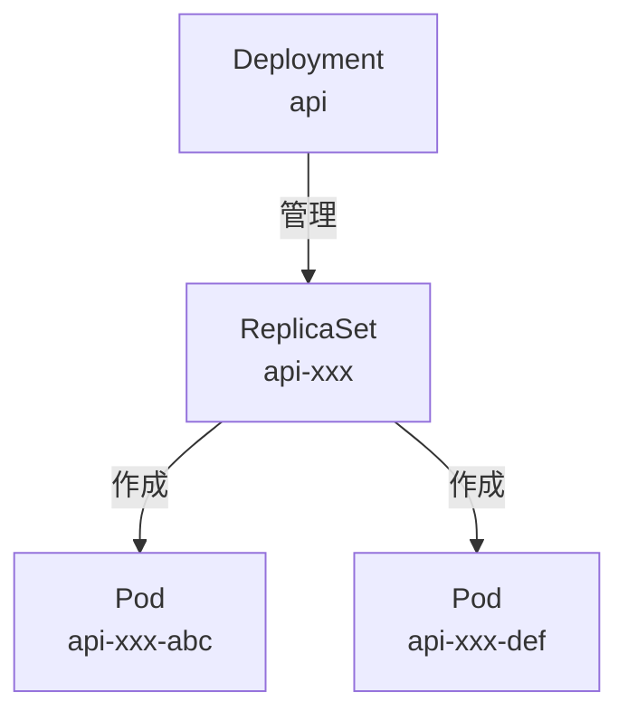

StatefulSetと違い、Podは特定の順序なく起動し、どのPodも同じ役割を果たします（ステートレス）。

### Deploymentのデプロイ

api-deployment.yaml:

（リポジトリへのリンクへ変更する）
```yaml
apiVersion: v1
kind: Service
metadata:
  name: api
  namespace: app
spec:
  selector:
    app: api
  ports:
    - protocol: TCP
      port: 80
      targetPort: 3000
  type: ClusterIP
---
apiVersion: apps/v1
kind: Deployment
metadata:
  name: api
  namespace: app
spec:
  replicas: 2
  selector:
    matchLabels:
      app: api
  template:
    metadata:
      labels:
        app: api
    spec:
      containers:
      - name: api
        image: docker.io/yourusername/todo-api:sha-e432059
        ports:
        - containerPort: 3000
        env:
        - name: NODE_ENV
          value: "production"
        - name: PORT
          value: "3000"
        - name: PGHOST
          value: "postgres.app.svc.cluster.local"
        - name: PGPORT
          value: "5432"
        - name: PGUSER
          valueFrom:
            secretKeyRef:
              name: postgres-secret
              key: POSTGRES_USER
        - name: PGPASSWORD
          valueFrom:
            secretKeyRef:
              name: postgres-secret
              key: POSTGRES_PASSWORD
        - name: PGDATABASE
          value: "todos"
        livenessProbe:
          httpGet:
            path: /healthz
            port: 3000
          initialDelaySeconds: 10
          periodSeconds: 10
        readinessProbe:
          httpGet:
            path: /healthz
            port: 3000
          initialDelaySeconds: 3
          periodSeconds: 5
```

ここで注目すべきポイント:

1. **replicas: 2**: APIサーバーを2つ起動（負荷分散）
2. **PGHOST: postgres.app.svc.cluster.local**: PostgreSQL Serviceへの接続（後述）
3. **livenessProbe/readinessProbe**: Podの健全性チェック

デプロイ実行:

まず、Dockerイメージをk3dクラスターにインポートします：

```bash
✗ k3d image import subaru88/home-kube:sha-e432059 -c todo-local
INFO[0000] Importing image(s) into cluster 'todo-local'
INFO[0003] Successfully imported 1 image(s) into 1 cluster(s)
```

<details>
<summary>📋 完全なインポートログを表示</summary>

```bash
✗ k3d image import subaru88/home-kube:sha-e432059 -c todo-local
INFO[0000] Importing image(s) into cluster 'todo-local'
INFO[0000] Starting new tools node...
INFO[0000] Starting node 'k3d-todo-local-tools'
INFO[0000] Saving 1 image(s) from runtime...
INFO[0001] Importing images into nodes...
INFO[0001] Importing images from tarball '/k3d/images/k3d-todo-local-images-20251109232326.tar' into node 'k3d-todo-local-agent-1'...
INFO[0001] Importing images from tarball '/k3d/images/k3d-todo-local-images-20251109232326.tar' into node 'k3d-todo-local-server-0'...
INFO[0001] Importing images from tarball '/k3d/images/k3d-todo-local-images-20251109232326.tar' into node 'k3d-todo-local-agent-0'...
INFO[0002] Removing the tarball(s) from image volume...
INFO[0003] Removing k3d-tools node...
INFO[0003] Successfully imported image(s)
INFO[0003] Successfully imported 1 image(s) into 1 cluster(s)
```

</details>

次にHelmでAPIをデプロイします：

```bash
✗ helm upgrade --install api ./deployment/charts/api \
  -n app \
  -f ./deployment/environments/local/api-values.yaml \
  --set image.tag=sha-e432059

Release "api" does not exist. Installing it now.
NAME: api
LAST DEPLOYED: Sun Nov  9 23:27:38 2025
NAMESPACE: app
STATUS: deployed
REVISION: 1
TEST SUITE: None
```

確認:

```bash
✗ kubectl -n app get deployments
NAME   READY   UP-TO-DATE   AVAILABLE   AGE
api    1/1     1            1           15s
```

```bash
✗ kubectl -n app get pods
NAME                   READY   STATUS    RESTARTS   AGE
api-56bbd6b8bb-5jkmx   1/1     Running   0          14s
postgres-0             1/1     Running   0          44s
```

APIのPodが起動しました。

---

## Pod間通信の仕組み

ここで重要な疑問が生まれます：**どうやってNode.js APIからPostgreSQLに接続できているのか？**

### Serviceの役割

YAMLファイルで`PGHOST: postgres.app.svc.cluster.local`と指定しましたが、これは**Service**というリソースを指しています。

参考: [Kubernetes Service](https://kubernetes.io/ja/docs/concepts/services-networking/service/)

**Service**は、Podへの安定したネットワークアクセスを提供します。Podは再起動時にIPアドレスが変わるため、Serviceを使って固定のエンドポイントを作成します。

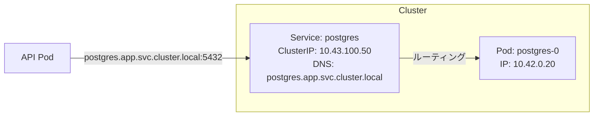

### DNS命名規則

KubernetesのServiceには、以下の形式で自動的にDNS名が割り当てられます：

```
<service-name>.<namespace>.svc.cluster.local
```

例:
- `postgres.app.svc.cluster.local` → PostgreSQL Service
- `api.app.svc.cluster.local` → API Service

### 実際の通信フロー

Node.js APIからPostgreSQLに接続する際の詳細なフローを見てみましょう。


ステップ詳細:

1. **DNS解決**:
   - Node.js Appが`PGHOST=postgres`で接続試行
   - **CoreDNS**（Kubernetes内部のDNSサーバー）が`postgres.app.svc.cluster.local` → `10.43.100.50`（Service ClusterIP）に解決

2. **Service経由のルーティング**:
   - Appが`10.43.100.50:5432`に接続
   - **kube-proxy**（各ノード上で動作するネットワークプロキシ）のiptablesルールが発火
   - バックエンドPod（`postgres-0`: `10.42.0.20`）に転送

3. **直接通信**:
   - TCPコネクション確立後は、PodのIPアドレスで直接通信
   - kube-proxyは新しい接続のルーティングのみを担当

重要ポイント:
- ServiceのIPアドレスは仮想的（どのPodにも割り当てられていない）
- kube-proxyが実際のPod IPに変換
- Podが再起動してIPが変わっても、ServiceのIPは変わらないため、アプリケーション側は再起動不要

### 現在の構成図

```mermaid
graph TB
    subgraph "Kubernetes Cluster"
        subgraph "Namespace: app"
            subgraph "Node.js API"
                D1[Deployment: api<br/>replicas: 2]
                P1[Pod: api-xxx-abc]
                P2[Pod: api-xxx-def]
                S1[Service: api<br/>ClusterIP<br/>DNS: api.app.svc.cluster.local]
            end

            subgraph "PostgreSQL"
                SS[StatefulSet: postgres<br/>replicas: 1]
                P3[Pod: postgres-0]
                S2[Service: postgres<br/>ClusterIP<br/>DNS: postgres.app.svc.cluster.local]
                PVC[PVC: postgres-data-0<br/>5Gi]
            end

            SEC[Secret: postgres-secret]
        end
    end

    D1 -->|作成| P1
    D1 -->|作成| P2
    S1 -->|ルーティング| P1
    S1 -->|ルーティング| P2

    SS -->|作成| P3
    S2 -->|ルーティング| P3
    P3 -->|マウント| PVC

    P1 -.->|環境変数| SEC
    P2 -.->|環境変数| SEC
    P3 -.->|環境変数| SEC

    P1 -->|DB接続| S2
    P2 -->|DB接続| S2
```

---

## 動作確認

### Port Forwardでアクセス

> **📝 環境による違い**
>
> **ローカル（k3d）**: `kubectl port-forward`を使用
> ```bash
> kubectl -n app port-forward svc/api 3000:3000 &
> ```
>
> **リモート（k3s直接）**: Cloudflare Tunnelや外部URLで直接アクセス
> ```bash
> # 例: https://api.octomblog.com にアクセス
> curl https://api.octomblog.com/healthz
> ```

ローカルマシンからAPIにアクセスするために、port-forwardを使用します：

```bash
✗ kubectl -n app port-forward svc/api 3000:3000 &
Forwarding from 127.0.0.1:3000 -> 3000
Forwarding from [::1]:3000 -> 3000
```

### ヘルスチェック

```bash
✗ curl http://localhost:3000/healthz
{"status":"healthy"}
```

```bash
✗ curl http://localhost:3000/dbcheck
{"status":"ok","db":"connected"}
```

APIとデータベース接続が正常です。

### Todo API機能テスト

#### Todo一覧取得（空のリスト）

```bash
✗ curl -s http://localhost:3000/api/todos
[]
```

#### Todo作成

```bash
✗ curl -s -X POST http://localhost:3000/api/todos \
  -H "Content-Type: application/json" \
  -d '{"title":"Test Todo","completed":false}'

{"title":"Test Todo","completed":false,"description":null,"id":1,"createdAt":"2025-11-09T14:30:11.046Z","updatedAt":"2025-11-09T14:30:11.046Z"}
```

Todo作成成功。

#### Todo一覧取得（作成後）

```bash
✗ curl -s http://localhost:3000/api/todos
[{"id":1,"title":"Test Todo","description":null,"completed":false,"createdAt":"2025-11-09T14:30:11.046Z","updatedAt":"2025-11-09T14:30:11.046Z"}]
```

データの永続化が確認できました。

#### Todo更新

```bash
curl -X PUT http://localhost:3000/api/todos/1 \
  -H "Content-Type: application/json" \
  -d '{
    "title": "k3dデプロイテスト",
    "description": "更新済み",
    "completed": true
  }'
```

Todo更新成功。

#### Todo削除

```bash
curl -X DELETE http://localhost:3000/api/todos/1
```

Todo削除成功。

---

## 参考資料

### Kubernetes公式ドキュメント

#### コア概念
- [Kubernetes概要](https://kubernetes.io/ja/docs/concepts/)
- [Kubernetesアーキテクチャ](https://kubernetes.io/ja/docs/concepts/architecture/)

#### ワークロード
- [Pod](https://kubernetes.io/ja/docs/concepts/workloads/pods/)
- [Deployment](https://kubernetes.io/ja/docs/concepts/workloads/controllers/deployment/)
- [StatefulSet](https://kubernetes.io/ja/docs/concepts/workloads/controllers/statefulset/)
- [ReplicaSet](https://kubernetes.io/ja/docs/concepts/workloads/controllers/replicaset/)

#### ネットワーキング
- [Service](https://kubernetes.io/ja/docs/concepts/services-networking/service/)
- [DNS for Services and Pods](https://kubernetes.io/ja/docs/concepts/services-networking/dns-pod-service/)

#### ストレージ
- [PersistentVolume](https://kubernetes.io/ja/docs/concepts/storage/persistent-volumes/)
- [Volume](https://kubernetes.io/ja/docs/concepts/storage/volumes/)
- [StorageClass](https://kubernetes.io/ja/docs/concepts/storage/storage-classes/)

#### 設定
- [Secret](https://kubernetes.io/ja/docs/concepts/configuration/secret/)
- [ConfigMap](https://kubernetes.io/ja/docs/concepts/configuration/configmap/)

#### 名前空間
- [Namespace](https://kubernetes.io/ja/docs/concepts/overview/working-with-objects/namespaces/)

### k3s/k3d

- [k3s公式サイト](https://k3s.io/)
- [k3s Documentation](https://docs.k3s.io/)
- [k3d公式サイト](https://k3d.io/)
- [k3dインストールガイド](https://k3d.io/stable/#installation)
- [k3dコマンドリファレンス](https://k3d.io/stable/usage/commands/)

### Helm

- [Helm公式サイト](https://helm.sh/)
- [Helmドキュメント](https://helm.sh/docs/)
- [Helmチャート開発ガイド](https://helm.sh/docs/chart_template_guide/)

### Docker

- [Docker公式ドキュメント](https://docs.docker.com/)
- [Dockerfileリファレンス](https://docs.docker.com/engine/reference/builder/)

