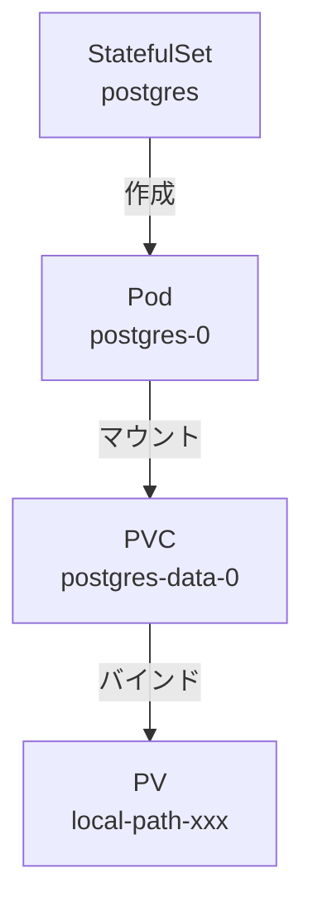
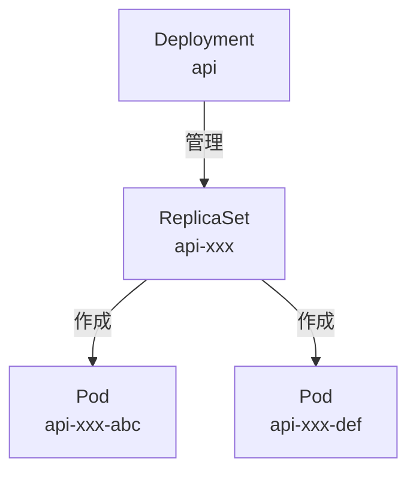
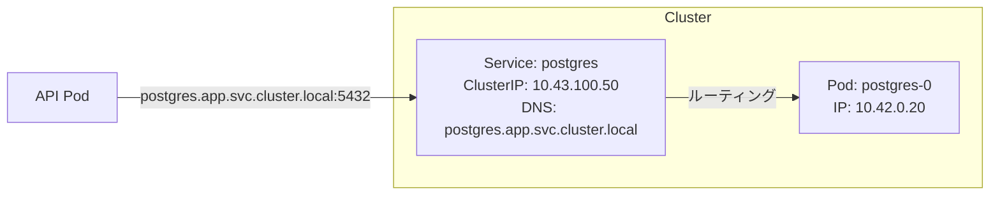
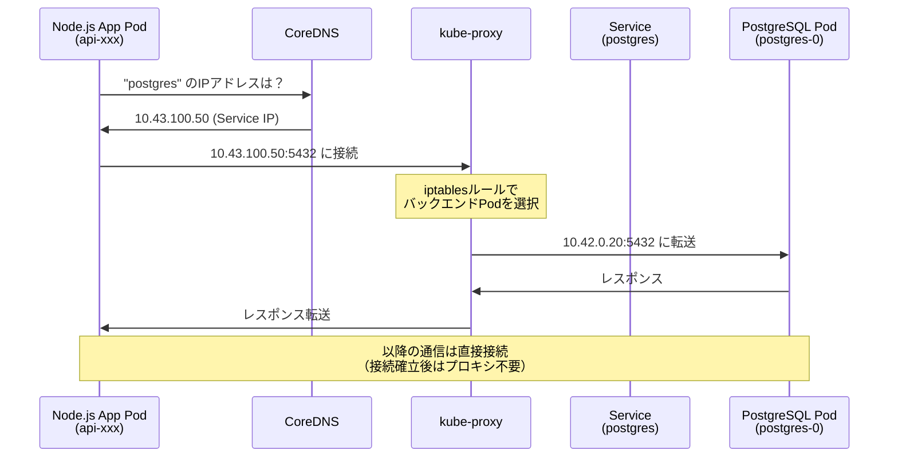
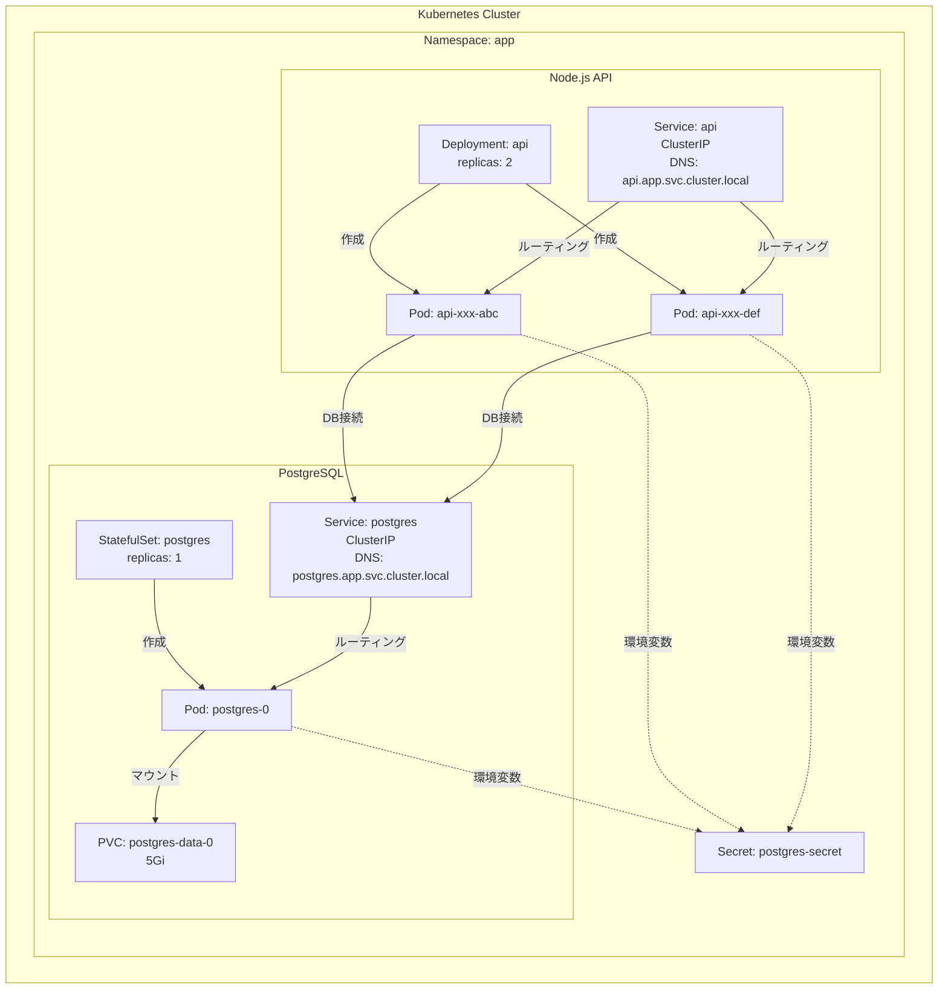
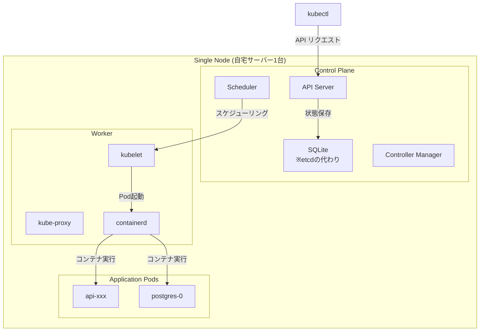
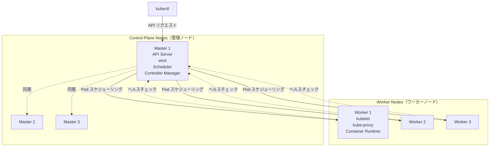

# なんちゃってお家kubernetes DB + API編

前回の環境構築編では、WindowsPCを購入してUbuntuOSをインストールするまでを行いました。

今回はお家サーバーにkubernetesのをホストし、worker nodeとcontroll planeを立てていきたいと思います。
worker nodeには２つのコンテナを用意し、１つのpodにDBを、もう片方にAPIサーバーを立てていこうと思います。
なんちゃってお家kubernetesの目的は、いっぱい作っていっぱい壊しながらいっぱい学ぶことだと個人的に考えています。
なので、まずはCRUD機能を持ったAPIを作成し、DBとの疎通を確認することをこの記事のゴールに置きます。

controller plane, ノード、pod、コンテナ、サーバーなど、kubernetesには色々な入れ物に名前がついていてイメージが湧きづらいです。
この記事を書き終えた頃には全ての入れ物に対するメンタルモデルが出来上がっていると嬉しいな。

今回やること：
- 自宅サーバー（またはローカル環境）にk3s（軽量Kubernetes）をセットアップ
- PostgreSQLをStatefulSetとしてデプロイ
- Node.js APIをDeploymentとしてデプロイ
- Pod間通信の仕組みを理解
- Todo APIの動作確認


### 環境準備

今回は、DBとAPIサーバーを立てていきます。お家サーバーは物理的に1つしか存在しないので、1ノードに１つのクラスターを作成し、そこにサービスを2つ用意していきます。

まずはローカル環境で動作確認をするため、**k3d**を使います。k3dは、Docker内でk3s（軽量Kubernetes）を実行できるツールです。k3sを直接インストールするとホストOSに影響を与えるため、Docker内で仮想的に動かすk3dを使用します。

https://k3d.io/stable/#releases

### k3dのインストール

```bash
✗ brew install k3d

==> Pouring k3d--5.8.3.arm64_sequoia.bottle.tar.gz
🍺  /opt/homebrew/Cellar/k3d/5.8.3: 10 files, 24.1MB
```

### Helmのインストール
今回KubernetesのパッケージマネージャーにはHelmを使うので、インストールしていきます。
```bash
✗ brew install helm
Warning: helm 3.19.0 is already installed and up-to-date.
To reinstall 3.19.0, run:
  brew reinstall helm
```

### k3dクラスタの作成

```bash
✗ k3d cluster create todo-local \
  --api-port 6443 \
  --port 8080:80@loadbalancer \
  --port 8443:443@loadbalancer

INFO[0000] Prep: Network
INFO[0000] Created network 'k3d-todo-local'
INFO[0000] Created image volume k3d-todo-local-images
INFO[0000] Creating node 'k3d-todo-local-server-0'
INFO[0009] Pulling image 'ghcr.io/k3d-io/k3d-tools:5.8.3'
INFO[0011] Pulling image 'docker.io/rancher/k3s:v1.31.5-k3s1'
INFO[0023] Starting Node 'k3d-todo-local-server-0'
INFO[0028] Creating LoadBalancer 'k3d-todo-local-serverlb'
INFO[0030] Cluster 'todo-local' created successfully!
```
このコマンドで、下記Dockerリソースが k3dコンテナの中にcluster内に作成されました。それぞれ何なのかはわかっていません。

- network
- image volume
- node
- load balancer
- cluster

> 調べてみた

- network
Docker内の仮想ネットワーク。k3sのServerノード、LoadBalancerノードなどの通信を行うための内部ネットワーク。
Dockerのリソースなので、以下のようなdockerコマンドで情報を取得できる。
```bash
 ✗ docker network ls
NETWORK ID     NAME                 DRIVER    SCOPE
0094f8670bc2   k3d-todo-local       bridge    local


```

```bash
✗ docker inspect k3d-todo-local
[
    {
        "Name": "k3d-todo-local",
        "Id": "0094f8670bc2997679ca68e15610331e29b4029f9bf6fb8dc864d2a06a30b06f",
        "Created": "2025-11-07T00:11:11.136557843Z",
        "Scope": "local",
        "Driver": "bridge",
        "EnableIPv4": true,
        "EnableIPv6": false,
        "IPAM": {
            "Driver": "default",
            "Options": null,
            "Config": [
                {
                    "Subnet": "172.20.0.0/16",
                    "Gateway": "172.20.0.1"
                }
            ]
        },
        "Internal": false,
        "Attachable": false,
        "Ingress": false,
        "ConfigFrom": {
            "Network": ""
        },
        "ConfigOnly": false,
        "Containers": {
            "217ac5e368b31049de35dd011c017ad053e4228d1bd8aebd2035d9ff50f85f9f": {
                "Name": "k3d-todo-local-serverlb",
                "EndpointID": "db23b09742d1faf1e5504e4aad34e4f3287fe839f06e0e7f580f2939d35891c8",
                "MacAddress": "e2:c6:2c:e4:40:e8",
                "IPv4Address": "172.20.0.4/16",
                "IPv6Address": ""
            },
            "d113dbc0f62968336d932ff279f7496e02454305e2f4f0a33ba6c3bd7a795734": {
                "Name": "k3d-todo-local-server-0",
                "EndpointID": "464da7481c3c8b3ea5013d1415681a7840610cd13c07cfdcc17a5fb7799d0367",
                "MacAddress": "62:63:db:12:12:a1",
                "IPv4Address": "172.20.0.3/16",
                "IPv6Address": ""
            }
        },
        "Options": {
            "com.docker.network.bridge.enable_ip_masquerade": "true",
            "com.docker.network.enable_ipv4": "true",
            "com.docker.network.enable_ipv6": "false"
        },
        "Labels": {
            "app": "k3d"
        }
    }
]
```

- image volume

クラスタ内のノードが共通して使うイメージキャッシュ領域

https://docs.docker.jp/storage/volumes.html

helm install や kubectl apply でイメージをpullするたびに、
ここにキャッシュされ、他ノードでも再利用可能。

```bash
✗ docker volume ls
DRIVER    VOLUME NAME
local     k3d-todo-local-images
```

- node

kubernetesのノード。中でk3sが動くコンテナのこと。
https://docs.docker.jp/engine/reference/commandline/node.html

ここでは server-0 として、control-plane（マスター）ノードを作っている。

追加すれば agent-0, agent-1 といった worker ノードも増やせる。

```bash
✗ docker ps
CONTAINER ID   IMAGE                                          COMMAND                   CREATED       STATUS                   PORTS
d113dbc0f629   rancher/k3s:v1.31.5-k3s1                       "/bin/k3d-entrypoint…"    2 days ago    Up 2 days                k3d-todo-local-server-0
```
- load balancer

ローカルマシンのポート（8080, 8443など）を、クラスタ内部のService（80, 443）へ転送するためのサービス。
外界とクラスタをつなぐ玄関口で、こんなふうなネットワークフローになっている。

```
(localhost:8080) → [k3d-serverlbコンテナ] → (k3d network) → [k3s APIやService]
```

- cluster

k3dが論理的にまとめた「k3sノード群」の集合。Dockerの中に作られたミニKubernetesクラスタ。
今まで出てきたnetwork, volume, nodes, loadbalancer をまとめた単位。
https://k3d.io/stable/usage/commands/k3d_cluster/

```bash
 k3d cluster list                                                                                      
NAME         SERVERS   AGENTS   LOADBALANCER
todo-local   1/1       0/0      true
```


### 環境確認
現在kubectlがアクセスしているcontextが先ほど作成したclusterのcontextをポイントしているのかを確認しておきます。
ポイント先が違う場合、期待するリソースを作成できなくなってしまうのでポイント先のcontext確認は重要です。

```bash
✗ kubectl config current-context
k3d-todo-local

``
先ほど作成したclusterを指すことができています。

nodeも確認します。

```bash
✗ kubectl get nodes
NAME                      STATUS   ROLES                  AGE    VERSION
k3d-todo-local-server-0   Ready    control-plane,master   1m   v1.31.5+k3s1
```

storage classも確認しておきます。
```bash
✗ kubectl get storageclass
NAME                   PROVISIONER             RECLAIMPOLICY   VOLUMEBINDINGMODE      ALLOWVOLUMEEXPANSION   AGE
local-path (default)   rancher.io/local-path   Delete          WaitForFirstConsumer   false                  1m
```

StorageClassが`local-path`になっています。これはk3sのデフォルトで、後ほどPostgreSQLのデータを永続化するときに使用します。

### Namespaceの作成

Kubernetesでは、リソースを論理的に分離するためにNamespaceを使います。今回はアプリケーションレイヤーのリソースという意味で`app`という名前のNamespaceを作成することにします。

```bash
✗ kubectl create namespace app
namespace/app created
```

```bash
# 確認
kubectl get namespaces
NAME              STATUS   AGE
app               Active   2d9h
default           Active   2d9h
kube-node-lease   Active   2d9h
kube-public       Active   2d9h
kube-system       Active   2d9h
```

これで、アプリケーションをホストするインフラを構築することができました。
kubeadmを使う場合と違い、

参考：https://qiita.com/dyoshiha/items/0e5a4e9ed7369e97f190

## 2. アプリケーションの準備
インフラは出来上がったので、kubernetes podにマウントするimageを作成していこうと思います。
自分の慣れている言語を使いたいので、言語はNode、imageにbuildしていきます。

TODOリストを作成・参照・更新・削除できるAPIです。入門で作成するような一般的な構成です。一般的なので、詳細の処理はここでは説明しませんが、リポジトリだけ置いておきます。
https://github.com/subaru-hello/todo-k3s/tree/main/packages/api


### Node.js APIの実装

まずはAPIサーバの構築始めます。TODOをCRUDできるサーバーを立てます。今回は**Hono**というフレームワークを使用します。ORMには**TypeORM**を使います。


詳細の実装はリポジトリを参照してください。

### Dockerfileのイメージビルド

では、実装したAPIからイメージをビルドしていきます。
```bash
✗ cd packages/api
✗ docker build -t docker.io/yourusername/todo-api:sha-e432059 --target production .

[+] Building 8.5s (15/15) FINISHED
 => [internal] load build definition from Dockerfile
 => [builder 1/6] FROM docker.io/library/node:24-alpine
 => [stage-2 1/3] FROM gcr.io/distroless/nodejs20-debian12
 => [builder 2/6] WORKDIR /app
 => [builder 3/6] RUN npm install -g pnpm
 => [builder 4/6] COPY package.json pnpm-lock.yaml ./
 => [builder 5/6] RUN pnpm install --frozen-lockfile
 => [builder 6/6] RUN pnpm build
 => [stage-2 2/3] COPY --from=builder /app/dist /app/dist
 => [stage-2 3/3] COPY --from=builder /app/node_modules /app/node_modules
 => exporting to image
 => => writing image sha256:...
 => => naming to docker.io/yourusername/todo-api:sha-e432059
```

### k3dクラスタへイメージインポート

ローカル開発では、private registryへのpushを省略し、直接k3dへインポートします。

```bash
✗ k3d image import docker.io/yourusername/todo-api:sha-e432059 -c todo-local

INFO[0000] Importing image(s) into cluster 'todo-local'
INFO[0004] Successfully imported 1 image(s) into 1 cluster(s)
```

イメージがk3dクラスタ内で使用可能になりました。

---

## 3. PostgreSQLのデプロイ

では、データベースからデプロイしていきます。

### なぜStatefulSetを使うのか？

KubernetesにはPodを管理する方法がいくつかありますが、データベースのような**ステートフルなアプリケーション**には**StatefulSet**を使います。

StatefulSetの特徴:
- **固定された識別子**: Podに永続的な名前が付く（例: postgres-0）
- **安定したストレージ**: Pod再作成時も同じストレージが割り当てられる
- **順序保証**: Podの起動・終了が順序通りに実行される



これに対して、後ほどデプロイするNode.js APIは**Deployment**を使います。Deploymentはステートレスなアプリケーション向けで、Podが再起動しても状態を保持する必要がありません。

### Secretの作成

データベースの認証情報をSecretとして保存します。Secretは、パスワードやAPIキーなどの機密情報を安全に保存するためのKubernetesリソースです。

```bash
kubectl -n app create secret generic postgres-secret \
  --from-literal=POSTGRES_USER=myuser \
  --from-literal=POSTGRES_PASSWORD=mypassword \
  --from-literal=POSTGRES_DB=todos
```

出力: `secret/postgres-secret created`

### StatefulSetのデプロイ

postgres-statefulset.yaml:

```yaml
apiVersion: v1
kind: Service
metadata:
  name: postgres
  namespace: app
spec:
  selector:
    app: postgres
  ports:
    - port: 5432
      targetPort: 5432
  clusterIP: None  # Headless Service
---
apiVersion: apps/v1
kind: StatefulSet
metadata:
  name: postgres
  namespace: app
spec:
  serviceName: postgres
  replicas: 1
  selector:
    matchLabels:
      app: postgres
  template:
    metadata:
      labels:
        app: postgres
    spec:
      containers:
      - name: postgres
        image: postgres:16-alpine
        ports:
        - containerPort: 5432
        env:
        - name: POSTGRES_USER
          valueFrom:
            secretKeyRef:
              name: postgres-secret
              key: POSTGRES_USER
        - name: POSTGRES_PASSWORD
          valueFrom:
            secretKeyRef:
              name: postgres-secret
              key: POSTGRES_PASSWORD
        - name: POSTGRES_DB
          valueFrom:
            secretKeyRef:
              name: postgres-secret
              key: POSTGRES_DB
        volumeMounts:
        - name: postgres-data
          mountPath: /var/lib/postgresql/data
  volumeClaimTemplates:
  - metadata:
      name: postgres-data
    spec:
      accessModes: [ "ReadWriteOnce" ]
      storageClassName: local-path
      resources:
        requests:
          storage: 5Gi
```

ここで注目すべきポイント:

1. **volumeClaimTemplates**: StatefulSet専用の機能で、Podごとに永続ボリューム（PVC）を自動作成します
2. **storageClassName: local-path**: 先ほど確認したStorageClassを指定
3. **env**: 環境変数にSecretの値を注入

デプロイ実行:

```bash
kubectl apply -f postgres-statefulset.yaml
```

出力:
```
service/postgres created
statefulset.apps/postgres created
```

確認:

```bash
kubectl -n app get statefulset
kubectl -n app get pods
kubectl -n app get pvc
```

Pod状態:
```
NAME         READY   STATUS    RESTARTS   AGE
postgres-0   1/1     Running   0          30s
```

PVC状態:
```
NAME                     STATUS   VOLUME                                     CAPACITY   STORAGECLASS
postgres-data-postgres-0 Bound    pvc-xxxxxxxx-xxxx-xxxx-xxxx-xxxxxxxxxxxx   5Gi        local-path
```

PostgreSQLが正常に起動し、PVCもBindされました。

### PVC（PersistentVolumeClaim）とは？

**PVC**は、永続的なストレージを要求するためのリソースです。


仕組み:
1. **PVC作成**: アプリケーションが「5Giのストレージが欲しい」と要求
2. **PVの自動作成**: StorageClassが自動的にPersistentVolume（PV）を作成
3. **バインド**: PVCとPVが紐付けられる
4. **マウント**: PodがPVCをマウントしてデータを保存

これにより、Podが再起動してもデータが失われません。

### 動作確認

```bash
# PostgreSQL Podのログ確認
kubectl -n app logs postgres-0
```

出力:
```
PostgreSQL Database directory appears to contain a database; Skipping initialization
...
LOG:  database system is ready to accept connections
```

```bash
# PostgreSQL接続テスト
kubectl -n app exec -it postgres-0 -- psql -U myuser -d todos -c "\dt"
```

出力: データベース接続成功

PostgreSQLが正常に動作しています。

---

## 4. Node.js APIのデプロイ

次に、APIサーバーをデプロイします。

### DeploymentとStatefulSetの違い

Node.js APIには**Deployment**を使います。Deploymentの特徴:

- **レプリカ管理**: 指定した数のPodを常に稼働させる
- **ローリングアップデート**: ダウンタイムなしでアプリケーションを更新
- **ロールバック**: 問題が発生した場合、以前のバージョンに戻す



StatefulSetと違い、Podは特定の順序なく起動し、どのPodも同じ役割を果たします（ステートレス）。

### Deploymentのデプロイ

api-deployment.yaml:

```yaml
apiVersion: v1
kind: Service
metadata:
  name: api
  namespace: app
spec:
  selector:
    app: api
  ports:
    - protocol: TCP
      port: 80
      targetPort: 3000
  type: ClusterIP
---
apiVersion: apps/v1
kind: Deployment
metadata:
  name: api
  namespace: app
spec:
  replicas: 2
  selector:
    matchLabels:
      app: api
  template:
    metadata:
      labels:
        app: api
    spec:
      containers:
      - name: api
        image: docker.io/yourusername/todo-api:sha-e432059
        ports:
        - containerPort: 3000
        env:
        - name: NODE_ENV
          value: "production"
        - name: PORT
          value: "3000"
        - name: PGHOST
          value: "postgres.app.svc.cluster.local"
        - name: PGPORT
          value: "5432"
        - name: PGUSER
          valueFrom:
            secretKeyRef:
              name: postgres-secret
              key: POSTGRES_USER
        - name: PGPASSWORD
          valueFrom:
            secretKeyRef:
              name: postgres-secret
              key: POSTGRES_PASSWORD
        - name: PGDATABASE
          value: "todos"
        livenessProbe:
          httpGet:
            path: /healthz
            port: 3000
          initialDelaySeconds: 10
          periodSeconds: 10
        readinessProbe:
          httpGet:
            path: /healthz
            port: 3000
          initialDelaySeconds: 3
          periodSeconds: 5
```

ここで注目すべきポイント:

1. **replicas: 2**: APIサーバーを2つ起動（負荷分散）
2. **PGHOST: postgres.app.svc.cluster.local**: PostgreSQL Serviceへの接続（後述）
3. **livenessProbe/readinessProbe**: Podの健全性チェック

デプロイ実行:

```bash
kubectl apply -f api-deployment.yaml
```

出力:
```
service/api created
deployment.apps/api created
```

確認:

```bash
kubectl -n app get deployments
kubectl -n app get pods
```

Pod状態:
```
NAME                   READY   STATUS    RESTARTS   AGE
api-586858cdb6-zkvkk   1/1     Running   0          39s
api-586858cdb6-abc123  1/1     Running   0          39s
postgres-0             1/1     Running   0          5m
```

APIのPodが2つ起動しています。

---

## 5. Pod間通信の仕組み

ここで重要な疑問が生まれます：**どうやってNode.js APIからPostgreSQLに接続できているのか？**

### Serviceの役割

YAMLファイルで`PGHOST: postgres.app.svc.cluster.local`と指定しましたが、これは**Service**というリソースを指しています。

**Service**は、Podへの安定したネットワークアクセスを提供します。Podは再起動時にIPアドレスが変わるため、Serviceを使って固定のエンドポイントを作成します。



### DNS命名規則

KubernetesのServiceには、以下の形式で自動的にDNS名が割り当てられます：

```
<service-name>.<namespace>.svc.cluster.local
```

例:
- `postgres.app.svc.cluster.local` → PostgreSQL Service
- `api.app.svc.cluster.local` → API Service

### 実際の通信フロー

Node.js APIからPostgreSQLに接続する際の詳細なフローを見てみましょう。



ステップ詳細:

1. **DNS解決**:
   - Node.js Appが`PGHOST=postgres`で接続試行
   - **CoreDNS**（Kubernetes内部のDNSサーバー）が`postgres.app.svc.cluster.local` → `10.43.100.50`（Service ClusterIP）に解決

2. **Service経由のルーティング**:
   - Appが`10.43.100.50:5432`に接続
   - **kube-proxy**（各ノード上で動作するネットワークプロキシ）のiptablesルールが発火
   - バックエンドPod（`postgres-0`: `10.42.0.20`）に転送

3. **直接通信**:
   - TCPコネクション確立後は、PodのIPアドレスで直接通信
   - kube-proxyは新しい接続のルーティングのみを担当

重要ポイント:
- ServiceのIPアドレスは仮想的（どのPodにも割り当てられていない）
- kube-proxyが実際のPod IPに変換
- Podが再起動してIPが変わっても、ServiceのIPは変わらないため、アプリケーション側は再起動不要

### 現在の構成図



---

## 6. 動作確認

### Port Forwardでアクセス

```bash
kubectl -n app port-forward svc/api 3000:80 &
```

### ヘルスチェック

```bash
curl http://localhost:3000/healthz
```

出力:
```json
{"status":"healthy"}
```

```bash
curl http://localhost:3000/dbcheck
```

出力:
```json
{"status":"ok","db":"connected"}
```

APIとデータベース接続が正常です。

### Todo API機能テスト

#### Todo一覧取得（空のリスト）

```bash
curl http://localhost:3000/api/todos
```

出力:
```json
[]
```

#### Todo作成

```bash
curl -X POST http://localhost:3000/api/todos \
  -H "Content-Type: application/json" \
  -d '{
    "title": "k3dデプロイテスト",
    "description": "ローカルk3d環境でのテスト",
    "completed": false
  }'
```

レスポンス:
```json
{
  "title": "k3dデプロイテスト",
  "description": "ローカルk3d環境でのテスト",
  "completed": false,
  "id": 1,
  "createdAt": "2025-11-07T04:31:50.277Z",
  "updatedAt": "2025-11-07T04:31:50.277Z"
}
```

Todo作成成功。

#### Todo一覧取得（作成後）

```bash
curl http://localhost:3000/api/todos
```

レスポンス:
```json
[{
  "id": 1,
  "title": "k3dデプロイテスト",
  "description": "ローカルk3d環境でのテスト",
  "completed": false,
  "createdAt": "2025-11-07T04:31:50.277Z",
  "updatedAt": "2025-11-07T04:31:50.277Z"
}]
```

データの永続化が確認できました。

#### Todo更新

```bash
curl -X PUT http://localhost:3000/api/todos/1 \
  -H "Content-Type: application/json" \
  -d '{
    "title": "k3dデプロイテスト",
    "description": "更新済み",
    "completed": true
  }'
```

Todo更新成功。

#### Todo削除

```bash
curl -X DELETE http://localhost:3000/api/todos/1
```

Todo削除成功。

---

## 7. トラブルシューティング

実際のデプロイでは、さまざまな問題が発生する可能性があります。よくある問題と解決方法を紹介します。

### Podが起動しない（ImagePullBackOff）

症状:
```bash
kubectl -n app get pods
```

出力:
```
NAME       READY   STATUS             RESTARTS   AGE
api-xxx    0/1     ImagePullBackOff   0          2m
```

原因: プライベートなDockerイメージにアクセスできない

解決方法:

```bash
# ImagePullSecretを作成
kubectl -n app create secret docker-registry dockerhub-secret \
  --docker-server=https://index.docker.io/v1/ \
  --docker-username=yourusername \
  --docker-password=yourpassword
```

出力: `secret/dockerhub-secret created`

```bash
# Deploymentに追加
kubectl -n app patch deployment api -p '
{
  "spec": {
    "template": {
      "spec": {
        "imagePullSecrets": [{"name": "dockerhub-secret"}]
      }
    }
  }
}'
```

出力: `deployment.apps/api patched`

ImagePullSecretを設定することで、プライベートイメージにアクセスできるようになります。

### Podがクラッシュする（CrashLoopBackOff）

症状:
```bash
kubectl -n app get pods
```

出力:
```
NAME       READY   STATUS             RESTARTS   AGE
api-xxx    0/1     CrashLoopBackOff   5          3m
```

原因: アプリケーションエラー（PostgreSQL接続失敗など）

調査方法:

```bash
# ログを確認
kubectl -n app logs api-xxx
```

出力例:
```
Error connecting to database: AggregateError [ECONNREFUSED]:
    at internalConnectMultiple (node:net:1122:18)
  code: 'ECONNREFUSED',
  address: '127.0.0.1',
  port: 5432
```

原因: 環境変数の設定ミス

環境変数の確認:

```bash
kubectl -n app describe pod api-xxx | grep -A 20 "Environment:"
```

問題のある環境変数例:
```
DB_HOST=postgres  # ❌ 新しいイメージはPGHOSTを使用
DB_PORT=5432      # ❌ 新しいイメージはPGPORTを使用
```

解決方法:

PostgreSQL標準環境変数（PG*）を使用するように修正します：

```bash
kubectl -n app patch deployment api -p '
{
  "spec": {
    "template": {
      "spec": {
        "containers": [{
          "name": "api",
          "env": [
            {"name": "PORT", "value": "3000"},
            {"name": "NODE_ENV", "value": "production"},
            {"name": "PGHOST", "value": "postgres"},
            {"name": "PGPORT", "value": "5432"},
            {"name": "PGUSER", "valueFrom": {"secretKeyRef": {"name": "postgres-secret", "key": "POSTGRES_USER"}}},
            {"name": "PGPASSWORD", "valueFrom": {"secretKeyRef": {"name": "postgres-secret", "key": "POSTGRES_PASSWORD"}}},
            {"name": "PGDATABASE", "value": "todos"}
          ]
        }]
      }
    }
  }
}'
```

デプロイ監視:

```bash
kubectl -n app rollout status deployment/api
```

出力:
```
Waiting for deployment "api" rollout to finish: 1 old replicas are pending termination...
deployment "api" successfully rolled out
```

正しい環境変数でデプロイ成功。

### データベース接続エラー

確認手順:

```bash
# 1. PostgreSQL Podが起動しているか
kubectl -n app get pods postgres-0
```

```bash
# 2. PostgreSQL Serviceが存在するか
kubectl -n app get svc postgres
```

```bash
# 3. DNS解決ができるか
kubectl -n app exec -it api-xxx -- nslookup postgres.app.svc.cluster.local
```

```bash
# 4. ポート接続確認
kubectl -n app exec -it api-xxx -- nc -zv postgres.app.svc.cluster.local 5432
```

```bash
# 5. PostgreSQLログ確認
kubectl -n app logs postgres-0
```

---

## 8. ローリングアップデートとスケーリング

### ローリングアップデート

新しいバージョンのアプリケーションをダウンタイムなしでデプロイします。

```bash
# イメージタグを更新
kubectl -n app set image deployment/api \
  api=docker.io/yourusername/todo-api:v1.1.0
```

出力: `deployment.apps/api image updated`

```bash
# ローリングアップデートの監視
kubectl -n app rollout status deployment/api
```

出力:
```
Waiting for deployment "api" rollout to finish: 1 out of 2 new replicas have been updated...
Waiting for deployment "api" rollout to finish: 1 old replicas are pending termination...
deployment "api" successfully rolled out
```

ローリングアップデート成功。古いPodから新しいPodへ段階的に切り替わりました。

ロールバック:

問題が発生した場合、前のバージョンに戻します。

```bash
# 前のバージョンにロールバック
kubectl -n app rollout undo deployment/api
```

出力: `deployment.apps/api rolled back`

```bash
# 特定のリビジョンにロールバック
kubectl -n app rollout history deployment/api
kubectl -n app rollout undo deployment/api --to-revision=2
```

### スケーリング

負荷に応じてPod数を増減させます。

```bash
# レプリカ数を5に増やす
kubectl -n app scale deployment api --replicas=5
```

出力: `deployment.apps/api scaled`

```bash
# 確認
kubectl -n app get pods
```

出力:
```
NAME                   READY   STATUS    RESTARTS   AGE
api-586858cdb6-zkvkk   1/1     Running   0          10m
api-586858cdb6-abc123  1/1     Running   0          10m
api-586858cdb6-def456  1/1     Running   0          10s
api-586858cdb6-ghi789  1/1     Running   0          10s
api-586858cdb6-jkl012  1/1     Running   0          10s
postgres-0             1/1     Running   0          15m
```

Podが5つに増えました。

```bash
# 元に戻す
kubectl -n app scale deployment api --replicas=2
```

出力: `deployment.apps/api scaled`

---

## 9. クラスター全体像の振り返り

ここまでで、PostgreSQLとNode.js APIのデプロイが完了しました。最後に、Kubernetesクラスター全体の構成を振り返りましょう。

### 自宅Kubernetesのアーキテクチャ

今回構築した環境は、1台のマシンでControl PlaneとWorker Nodeの両方を稼働させています。



k3sの特徴:
- **軽量**: メモリ使用量が少ない（512MB～）
- **シンプル**: 単一バイナリで配布
- **etcd不要**: デフォルトでSQLiteを使用
- **組み込みLoadBalancer**: ServiceLB（Klipper）が標準搭載

### 標準的なKubernetesクラスター（参考）

本番環境では、役割に応じて複数のノードで構成されることが一般的です。



Control Plane（コントロールプレーン）: クラスター全体を管理する「頭脳」部分
Worker Node（ワーカーノード）: 実際にアプリケーション（Pod）が動作するノード

今回学んだ内容は、本番環境の標準的なKubernetesでもそのまま適用できます。

---

## まとめ

この記事では、実際にPostgreSQLとNode.js APIをデプロイしながら、Kubernetesの基本的な仕組みを学びました。

### 学んだこと

**Kubernetesのリソース**:
- **StatefulSet**: ステートフルなアプリケーション（データベース）向け
- **Deployment**: ステートレスなアプリケーション（Web API）向け
- **Service**: Podへの安定したネットワークアクセスを提供
- **PVC**: 永続的なストレージ
- **Secret**: 機密情報の管理

**Pod間通信の仕組み**:
- **CoreDNS**: ServiceのDNS名前解決
- **kube-proxy**: トラフィックルーティング
- **通信フロー**: DNS → Service → kube-proxy → Pod

**実践スキル**:
- PostgreSQLのStatefulSetデプロイ
- Node.js APIのDeploymentデプロイ
- トラブルシューティング手法
- ローリングアップデートとロールバック
- スケーリング

### 成功のポイント

1. **ローカル環境での検証**: k3dでローカルテストを行い、問題を事前に発見
2. **環境変数の正確な設定**: PostgreSQL標準環境変数（PG*）の使用
3. **段階的デプロイ**: ロールバック可能なデプロイ戦略
4. **適切なリソース管理**: StatefulSet（DB）とDeployment（API）の使い分け

### 次のステップ

1. **高可用性構成**: 複数ノードでクラスターを構築
2. **Ingress**: 外部からのHTTP/HTTPSアクセスを管理
3. **ConfigMap**: アプリケーション設定の外部化
4. **Horizontal Pod Autoscaler**: CPU/メモリ使用率に応じた自動スケーリング
5. **Monitoring**: Prometheus + Grafanaで監視
6. **CI/CD**: GitHub ActionsからKubernetesへ自動デプロイ

### 参考資料

- [Kubernetes公式ドキュメント](https://kubernetes.io/docs/)
- [k3s公式サイト](https://k3s.io/)
- [Helm公式ドキュメント](https://helm.sh/docs/)

---

## 付録: 便利なkubectlコマンド

### リソース確認

```bash
# すべてのリソースを表示
kubectl -n app get all

# Podの詳細情報
kubectl -n app describe pod <pod-name>

# ログ表示
kubectl -n app logs <pod-name>
kubectl -n app logs -f <pod-name>  # リアルタイム表示

# 前回のクラッシュログ
kubectl -n app logs <pod-name> --previous

# イベント一覧
kubectl -n app get events --sort-by='.lastTimestamp'
```

### デバッグ

```bash
# Pod内でコマンド実行
kubectl -n app exec -it <pod-name> -- sh

# 一時的なデバッグPod
kubectl run debug --image=busybox -it --rm --restart=Never -n app -- sh

# ポートフォワード
kubectl -n app port-forward <pod-name> 8080:3000
kubectl -n app port-forward svc/<service-name> 8080:80
```

### リソース操作

```bash
# 再起動
kubectl -n app rollout restart deployment/<deployment-name>

# スケーリング
kubectl -n app scale deployment/<deployment-name> --replicas=3

# 削除
kubectl -n app delete pod <pod-name>
kubectl -n app delete deployment <deployment-name>
```

これでKubernetesでの実践的なデプロイ方法を習得できました。自宅や開発環境でぜひ試してみてください！
