# KubernetesでPostgreSQLとNode.js APIをホスティングする

## はじめに

このブログでは、Kubernetesを使ってPostgreSQLデータベースとNode.js APIアプリケーションをデプロイする方法を解説します。

Kubernetesは本番環境で広く使われているコンテナオーケストレーションプラットフォームですが、学習や開発目的で自宅環境にも導入できます。今回は、軽量なKubernetesディストリビューションである**k3s**を使って、実際に動作する環境を構築しながら、Kubernetesの基本概念を学んでいきます。

### この記事で学べること

- Kubernetesの基本コンポーネント（Pod、Deployment、Service、StatefulSetなど）
- Kubernetes内部のネットワーキング（DNS、プロキシ、Pod間通信）
- クラスターアーキテクチャ（コントロールプレーンとワーカーノード）
- 実践的なデプロイ方法（PostgreSQL + Node.js API）
- トラブルシューティング

### 対象読者

- Dockerの基本を理解している方
- Kubernetesを初めて触る、または基礎を固めたい方
- 自宅や開発環境でKubernetesを試してみたい方

---

## 第1部: Kubernetes基礎知識

この部では、Kubernetesの基本的なコンポーネントとアーキテクチャについて解説します。

### 1.1 Kubernetesの基本コンポーネント

#### Pod（ポッド）

**Pod**は、Kubernetesにおける最小のデプロイ単位です。1つまたは複数のコンテナをまとめたグループで、同じPod内のコンテナは以下を共有します：

- ネットワーク（同じIPアドレス）
- ストレージボリューム
- 設定情報

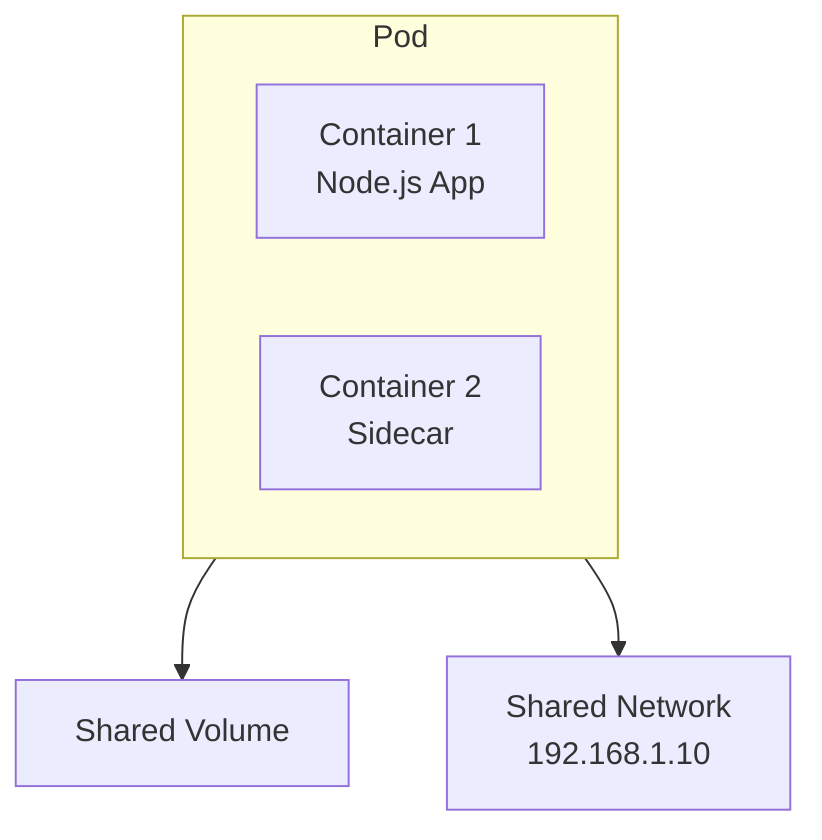

**特徴**:
- Podは一時的（ephemeral）で、再起動時にIPアドレスが変わる
- 通常、1 Pod = 1コンテナで運用することが多い
- PodはNode（物理/仮想サーバー）上で実行される

#### Deployment（デプロイメント）

**Deployment**は、Podのライフサイクルを管理するコントローラーです。以下の機能を提供します：

- **レプリカ管理**: 指定した数のPodを常に稼働させる
- **ローリングアップデート**: ダウンタイムなしでアプリケーションを更新
- **ロールバック**: 問題が発生した場合、以前のバージョンに戻す

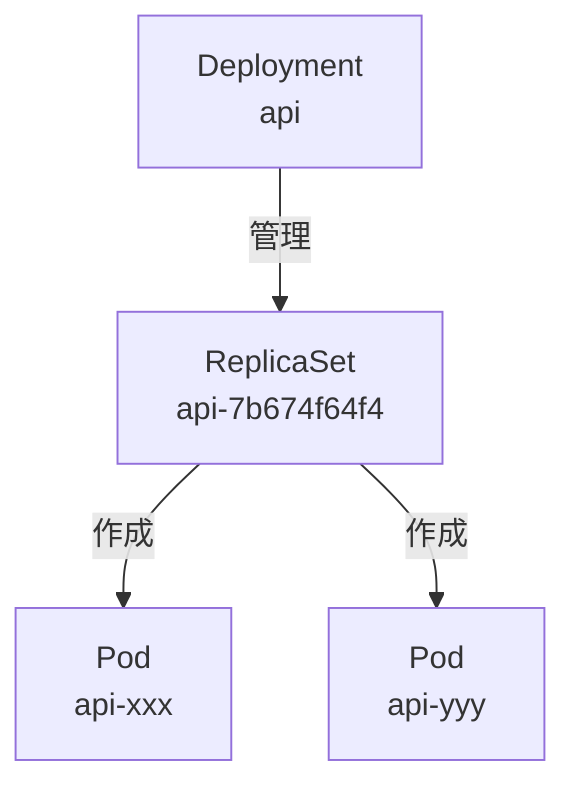

**使用例**:
- ステートレスなアプリケーション（Web API、マイクロサービスなど）
- 水平スケーリングが必要なサービス

#### ReplicaSet（レプリカセット）

**ReplicaSet**は、指定した数のPodレプリカが常に稼働していることを保証します。

- Deploymentが自動的にReplicaSetを作成・管理
- 通常、ユーザーが直接操作することは少ない
- Podの数を監視し、不足していれば自動的に補充

**Deploymentとの関係**:
```
Deployment (設定) → ReplicaSet (実行) → Pod (実体)
```

#### StatefulSet（ステートフルセット）

**StatefulSet**は、ステートフルなアプリケーション向けのコントローラーです。Deploymentと異なり、以下の特徴があります：

- **固定された識別子**: Podに永続的な名前が付く（例: postgres-0, postgres-1）
- **順序保証**: Podの起動・終了が順序通りに実行される
- **安定したストレージ**: Pod再作成時も同じストレージが割り当てられる

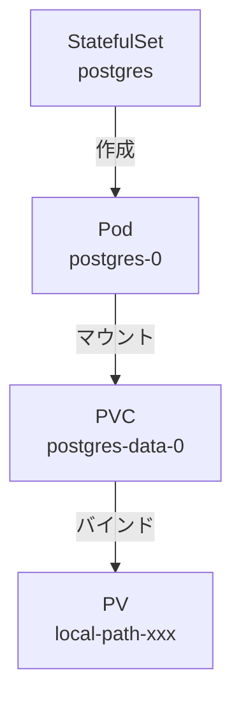

**使用例**:
- データベース（PostgreSQL、MySQL、MongoDB）
- 分散システム（ZooKeeper、etcd、Kafka）
- キャッシュサーバー（Redis、Memcached）

**今回のPostgreSQLデプロイ**:

本記事では、PostgreSQLをStatefulSetとしてデプロイします。データベースはデータの永続化が必須なため、StatefulSetを使用することで：

- Podが再起動してもデータが失われない
- 同じストレージに確実に再接続できる
- データベースの一貫性を保証できる

#### Service（サービス）

**Service**は、Podへの安定したネットワークアクセスを提供します。Podは再起動時にIPアドレスが変わるため、Serviceを使って固定のエンドポイントを作成します。

##### Serviceのタイプ

**ClusterIP（クラスター内部アクセス）**:

- クラスター内部からのみアクセス可能
- 最も一般的なServiceタイプ
- 固定のIPアドレスとDNS名が割り当てられる

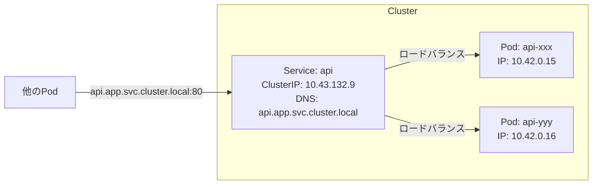

**使用例**:
- データベースサービス（PostgreSQL、MySQL）
- 内部API（マイクロサービス間通信）

**NodePort（ノード外部アクセス）**:

- クラスターの各ノードの特定ポートで公開
- `<NodeIP>:<NodePort>`でアクセス可能
- ポート範囲: 30000-32767

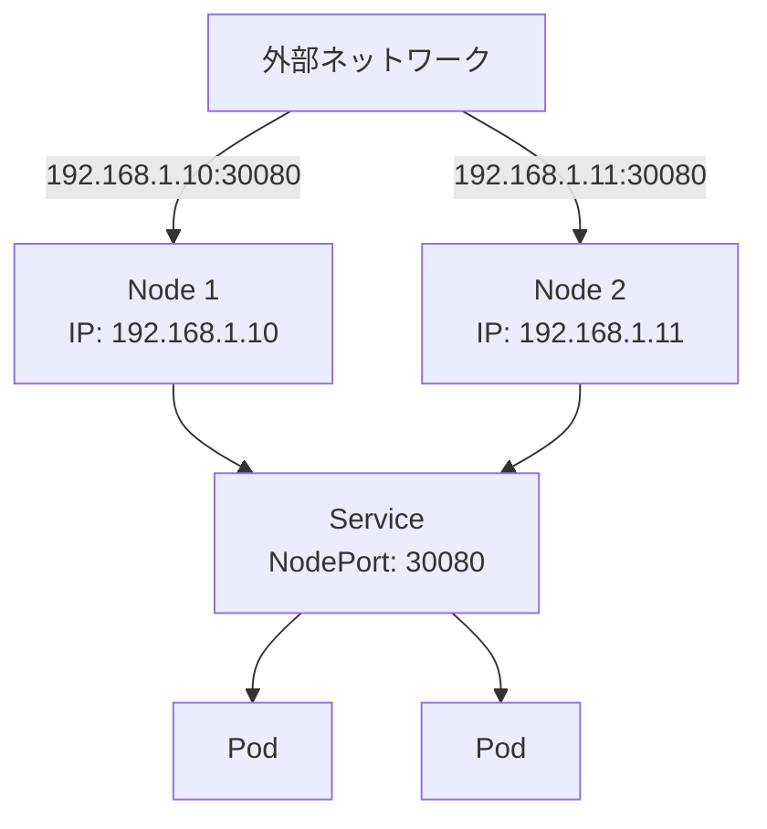

**使用例**:
- 開発環境でのテストアクセス
- 小規模な外部公開

**LoadBalancer（クラウドロードバランサー）**:

- クラウドプロバイダーのロードバランサーを自動作成
- 外部IPアドレスが割り当てられる
- AWS、GCP、Azureなどでサポート

**使用例**:
- 本番環境での外部公開
- スケーラブルなWebサービス

#### PersistentVolumeClaim（PVC）

**PVC（PersistentVolumeClaim）**は、永続的なストレージを要求するためのリソースです。

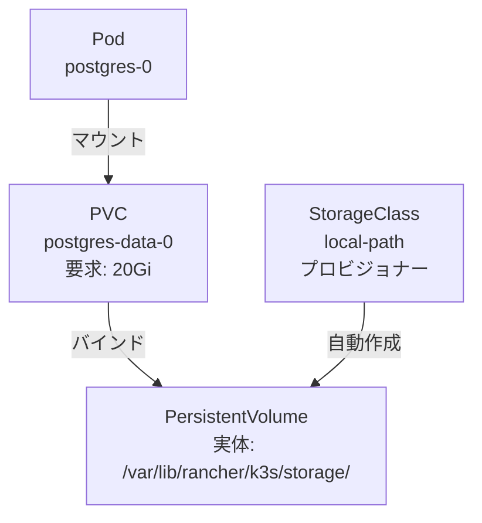

**仕組み**:

1. **PVC作成**: アプリケーションが「20Giのストレージが欲しい」と要求
2. **PVの検索または作成**: StorageClassが自動的にPersistentVolume（PV）を作成
3. **バインド**: PVCとPVが紐付けられる
4. **マウント**: PodがPVCをマウントしてデータを保存

**StorageClassの種類**:

- `local-path`: ローカルディスク（k3sのデフォルト）
- `standard`: クラウドプロバイダーのデフォルト
- `fast-ssd`: SSDベースのストレージ
- `nfs`: ネットワークファイルシステム

#### Secret（シークレット）

**Secret**は、パスワードやAPIキーなどの機密情報を安全に保存するためのリソースです。

```yaml
# Secretの例
apiVersion: v1
kind: Secret
metadata:
  name: postgres-secret
  namespace: app
type: Opaque
data:
  POSTGRES_USER: bXl1c2Vy       # base64エンコード
  POSTGRES_PASSWORD: bXlwYXNzd29yZA==
```

**特徴**:
- Base64エンコードされて保存（暗号化ではない）
- Podの環境変数やファイルとしてマウント可能
- RBACで厳密なアクセス制御が可能

**使用例**:
```yaml
# Pod内で環境変数として使用
env:
  - name: PGUSER
    valueFrom:
      secretKeyRef:
        name: postgres-secret
        key: POSTGRES_USER
```

### 1.2 コンポーネントの関係図

以下は、今回デプロイするアプリケーションの全体像です。

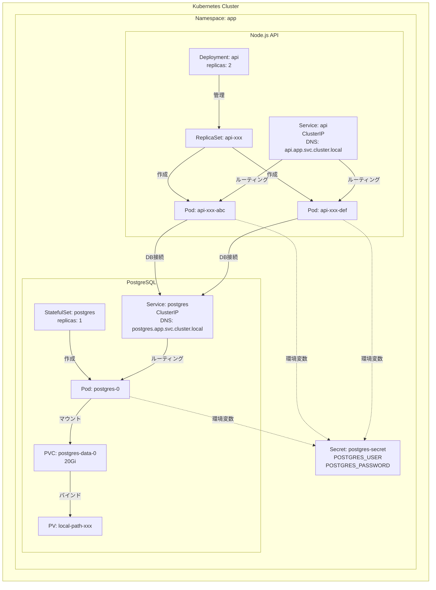

### 1.3 Kubernetesのネットワーキング

Kubernetes内部では、Podが他のPodやServiceと通信するために、いくつかのコンポーネントが連携しています。

#### CoreDNS（DNS解決）

**CoreDNS**は、Kubernetes内部のDNSサーバーです。Serviceに対して自動的にDNS名を割り当て、名前解決を行います。

**DNS命名規則**:
```
<service-name>.<namespace>.svc.cluster.local
```

**例**:
- `postgres.app.svc.cluster.local` → PostgreSQL Service
- `api.app.svc.cluster.local` → API Service

**仕組み**:
1. Pod内のアプリケーションが`postgres`というホスト名にアクセス
2. CoreDNSが`postgres.app.svc.cluster.local`を解決
3. ServiceのClusterIP（例: 10.43.100.50）を返す
4. アプリケーションはそのIPに接続

#### kube-proxy（ネットワークプロキシ）

**kube-proxy**は、各ノード上で動作するネットワークプロキシです。ServiceへのトラフィックをバックエンドのPodに転送します。

**動作モード**:
- **iptables**: iptablesルールでトラフィックをルーティング（最も一般的）
- **IPVS**: IP Virtual Serverを使用した高性能ルーティング
- **userspace**: ユーザースペースプロキシ（レガシー）

**仕組み**:
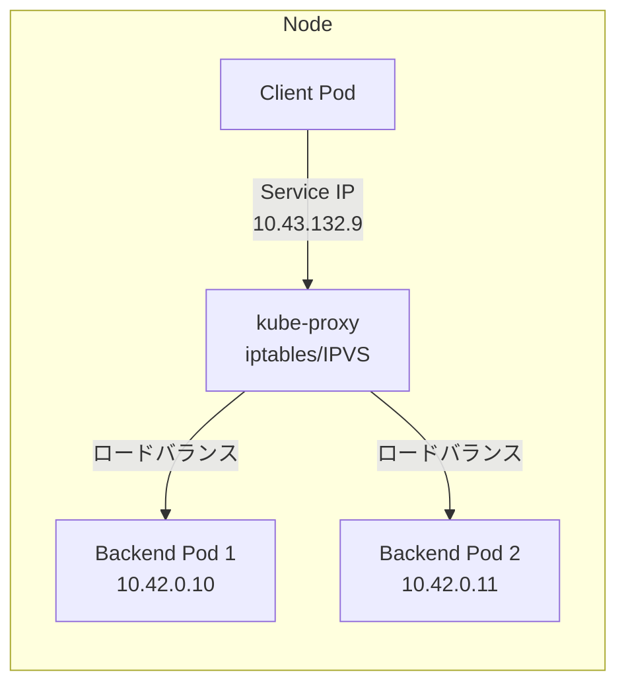

#### Pod-to-Pod通信フロー

実際に、Node.js APIからPostgreSQLに接続する際のネットワークフローを見てみましょう。

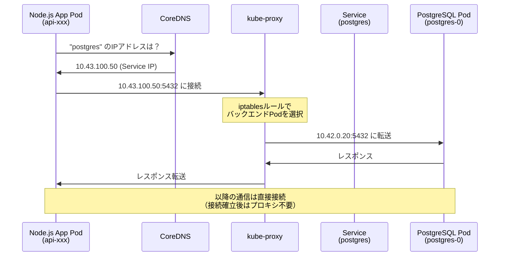

**ステップ詳細**:

1. **DNS解決**:
   - Node.js Appが`PGHOST=postgres`で接続試行
   - CoreDNSが`postgres.app.svc.cluster.local` → `10.43.100.50`（Service ClusterIP）に解決

2. **Service経由のルーティング**:
   - Appが`10.43.100.50:5432`に接続
   - kube-proxyのiptablesルールが発火
   - バックエンドPod（`postgres-0`: `10.42.0.20`）に転送

3. **直接通信**:
   - TCPコネクション確立後は、PodのIPアドレスで直接通信
   - kube-proxyは新しい接続のルーティングのみを担当

**重要ポイント**:
- ServiceのIPアドレスは仮想的（どのPodにも割り当てられていない）
- kube-proxyが実際のPod IPに変換
- Podが再起動してIPが変わっても、ServiceのIPは変わらないため、アプリケーション側は再起動不要

### 1.4 Kubernetesクラスターアーキテクチャ

#### 標準的なKubernetesクラスター（本番環境）

本番環境のKubernetesは、役割に応じて複数のノードで構成されます。

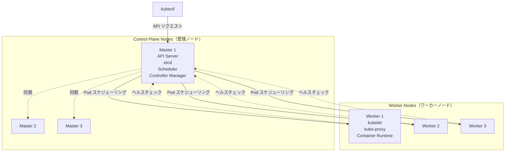

**Control Plane（コントロールプレーン）**:

クラスター全体を管理する「頭脳」部分で、以下のコンポーネントが動作します：

- **API Server**: すべてのKubernetes操作のエントリーポイント
- **etcd**: クラスター状態を保存する分散KVS
- **Scheduler**: PodをどのNodeで実行するか決定
- **Controller Manager**: Deployment、ReplicaSetなどのコントローラーを管理

**Worker Node（ワーカーノード）**:

実際にアプリケーション（Pod）が動作するノードで、以下のコンポーネントが動作します：

- **kubelet**: Podの起動・監視を担当
- **kube-proxy**: Serviceのネットワークルーティング
- **Container Runtime**: コンテナの実行エンジン（Docker、containerdなど）

**高可用性の特徴**:
- Control Planeを3台構成で冗長化
- Worker Nodeは必要に応じて増減可能
- ノード障害時も他のノードでPodを再起動

#### 自宅Kubernetes（k3s）のアーキテクチャ

自宅環境や開発環境では、1台のマシンでControl PlaneとWorker Nodeの両方を稼働させることができます。

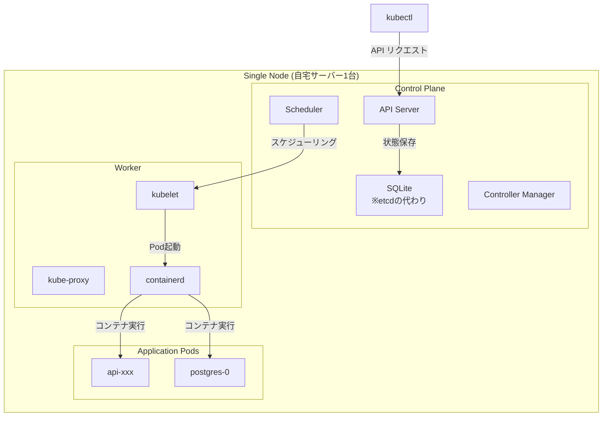

**k3sの特徴**:

- **軽量**: メモリ使用量が少ない（512MB～）
- **シンプル**: 単一バイナリで配布
- **etcd不要**: デフォルトでSQLiteを使用（etcdも選択可能）
- **組み込みLoadBalancer**: ServiceLB（Klipper）が標準搭載
- **ARM対応**: Raspberry Piなどの小型デバイスでも動作

**k3s特有のコンポーネント**:

| コンポーネント | 標準k8s | k3s |
|--------------|---------|-----|
| etcd | etcd | **SQLite**（デフォルト） |
| LoadBalancer | クラウドプロバイダー | **ServiceLB**（組み込み） |
| Ingress Controller | 別途インストール | **Traefik**（プリインストール） |
| ストレージ | 別途設定 | **local-path**（プリインストール） |

**注意点**:

本記事で解説する内容は、**Kubernetes全般に適用できる知識**です。k3sはKubernetesの完全な実装であり、学んだ内容はそのまま以下の環境でも使えます：

- GKE（Google Kubernetes Engine）
- EKS（Amazon Elastic Kubernetes Service）
- AKS（Azure Kubernetes Service）
- 標準的なKubernetes（kubeadm）

k3sは「Kubernetesの学習・実験・軽量本番環境」に最適な選択肢です。

---

## 第2部: 実践編 - PostgreSQL + Node.js APIのデプロイ

この部では、実際にKubernetes（k3s）環境を構築し、PostgreSQLとNode.js APIをデプロイします。

### 2.1 環境準備

#### k3sのインストール

**リモートサーバーの場合**:

```bash
# k3sインストール（1コマンド）
curl -sfL https://get.k3s.io | sh -

# インストール確認
sudo systemctl status k3s

# kubectlの設定
sudo cp /etc/rancher/k3s/k3s.yaml ~/.kube/config
sudo chown $USER:$USER ~/.kube/config
```

**ローカル（macOS/Windows）の場合**:

k3dを使うと、Docker内でk3sを実行できます。

```bash
# k3dのインストール（macOS）
brew install k3d

# クラスタ作成
k3d cluster create todo-local --api-port 6443

# クラスタ確認
kubectl cluster-info
kubectl get nodes
```

#### Helmのインストール

Helmは、Kubernetesのパッケージマネージャーです。複雑なアプリケーションを簡単にデプロイできます。

```bash
# macOS
brew install helm

# Linux
curl https://raw.githubusercontent.com/helm/helm/main/scripts/get-helm-3 | bash

# バージョン確認
helm version
```

### 2.2 Namespaceの作成

Namespaceは、Kubernetesクラスター内でリソースを論理的に分離するためのグループです。

```bash
# app namespaceを作成
kubectl create namespace app

# 確認
kubectl get namespaces
```

### 2.3 PostgreSQLのデプロイ

#### ステップ1: Secretの作成

データベースの認証情報をSecretとして保存します。

```bash
kubectl -n app create secret generic postgres-secret \
  --from-literal=POSTGRES_USER=myuser \
  --from-literal=POSTGRES_PASSWORD=mypassword \
  --from-literal=POSTGRES_DB=todos
```

#### ステップ2: StatefulSetのデプロイ

PostgreSQLをStatefulSetとしてデプロイします。

**postgres-statefulset.yaml**:

```yaml
apiVersion: v1
kind: Service
metadata:
  name: postgres
  namespace: app
spec:
  selector:
    app: postgres
  ports:
    - port: 5432
      targetPort: 5432
  clusterIP: None  # Headless Service
---
apiVersion: apps/v1
kind: StatefulSet
metadata:
  name: postgres
  namespace: app
spec:
  serviceName: postgres
  replicas: 1
  selector:
    matchLabels:
      app: postgres
  template:
    metadata:
      labels:
        app: postgres
    spec:
      containers:
      - name: postgres
        image: postgres:16-alpine
        ports:
        - containerPort: 5432
        env:
        - name: POSTGRES_USER
          valueFrom:
            secretKeyRef:
              name: postgres-secret
              key: POSTGRES_USER
        - name: POSTGRES_PASSWORD
          valueFrom:
            secretKeyRef:
              name: postgres-secret
              key: POSTGRES_PASSWORD
        - name: POSTGRES_DB
          valueFrom:
            secretKeyRef:
              name: postgres-secret
              key: POSTGRES_DB
        volumeMounts:
        - name: postgres-data
          mountPath: /var/lib/postgresql/data
  volumeClaimTemplates:
  - metadata:
      name: postgres-data
    spec:
      accessModes: [ "ReadWriteOnce" ]
      storageClassName: local-path
      resources:
        requests:
          storage: 20Gi
```

```bash
# デプロイ
kubectl apply -f postgres-statefulset.yaml

# 確認
kubectl -n app get statefulset
kubectl -n app get pods
kubectl -n app get pvc
```

#### ステップ3: 動作確認

```bash
# PostgreSQL Podのログ確認
kubectl -n app logs postgres-0

# PostgreSQL接続テスト
kubectl -n app exec -it postgres-0 -- psql -U myuser -d todos -c "\dt"
```

### 2.4 Node.js APIのデプロイ

#### ステップ1: Dockerイメージの準備

**ローカルビルドの場合**:

```bash
cd packages/api

# 本番用イメージをビルド
docker build -t docker.io/yourusername/todo-api:v1.0.0 --target production .

# k3dクラスタにインポート（ローカルの場合）
k3d image import docker.io/yourusername/todo-api:v1.0.0 -c todo-local
```

**Docker Hubにプッシュする場合**:

```bash
# ログイン
docker login

# プッシュ
docker push docker.io/yourusername/todo-api:v1.0.0
```

#### ステップ2: Deploymentのデプロイ

**api-deployment.yaml**:

```yaml
apiVersion: v1
kind: Service
metadata:
  name: api
  namespace: app
spec:
  selector:
    app: api
  ports:
    - protocol: TCP
      port: 80
      targetPort: 3000
  type: ClusterIP
---
apiVersion: apps/v1
kind: Deployment
metadata:
  name: api
  namespace: app
spec:
  replicas: 2
  selector:
    matchLabels:
      app: api
  template:
    metadata:
      labels:
        app: api
    spec:
      containers:
      - name: api
        image: docker.io/yourusername/todo-api:v1.0.0
        ports:
        - containerPort: 3000
        env:
        - name: NODE_ENV
          value: "production"
        - name: PORT
          value: "3000"
        - name: PGHOST
          value: "postgres.app.svc.cluster.local"
        - name: PGPORT
          value: "5432"
        - name: PGUSER
          valueFrom:
            secretKeyRef:
              name: postgres-secret
              key: POSTGRES_USER
        - name: PGPASSWORD
          valueFrom:
            secretKeyRef:
              name: postgres-secret
              key: POSTGRES_PASSWORD
        - name: PGDATABASE
          value: "todos"
        livenessProbe:
          httpGet:
            path: /healthz
            port: 3000
          initialDelaySeconds: 10
          periodSeconds: 10
        readinessProbe:
          httpGet:
            path: /healthz
            port: 3000
          initialDelaySeconds: 3
          periodSeconds: 5
```

```bash
# デプロイ
kubectl apply -f api-deployment.yaml

# 確認
kubectl -n app get deployments
kubectl -n app get pods
kubectl -n app get services
```

#### ステップ3: 動作確認

**Port Forward経由でアクセス**:

```bash
# APIへポートフォワード
kubectl -n app port-forward svc/api 3000:80

# 別ターミナルでテスト
curl http://localhost:3000/healthz
# 出力: {"status":"healthy"}

curl http://localhost:3000/dbcheck
# 出力: {"status":"ok","db":"connected"}
```

**Pod内からテスト**:

```bash
# 一時的なcurlコンテナを起動してテスト
kubectl run curl-test --image=curlimages/curl --rm -it --restart=Never -n app -- \
  curl http://api.app.svc.cluster.local/healthz
```

### 2.5 Todo API機能テスト

#### Todo作成

```bash
curl -X POST http://localhost:3000/api/todos \
  -H "Content-Type: application/json" \
  -d '{
    "title": "Kubernetesでデプロイ",
    "description": "PostgreSQL + Node.js API",
    "completed": false
  }'
```

**レスポンス**:
```json
{
  "id": 1,
  "title": "Kubernetesでデプロイ",
  "description": "PostgreSQL + Node.js API",
  "completed": false,
  "createdAt": "2025-11-07T10:00:00.000Z",
  "updatedAt": "2025-11-07T10:00:00.000Z"
}
```

#### Todo一覧取得

```bash
curl http://localhost:3000/api/todos
```

**レスポンス**:
```json
[
  {
    "id": 1,
    "title": "Kubernetesでデプロイ",
    "description": "PostgreSQL + Node.js API",
    "completed": false,
    "createdAt": "2025-11-07T10:00:00.000Z",
    "updatedAt": "2025-11-07T10:00:00.000Z"
  }
]
```

### 2.6 トラブルシューティング

#### Podが起動しない（ImagePullBackOff）

**症状**:
```bash
kubectl -n app get pods
# NAME       READY   STATUS             RESTARTS   AGE
# api-xxx    0/1     ImagePullBackOff   0          2m
```

**原因**: プライベートなDockerイメージにアクセスできない

**解決方法**:

```bash
# ImagePullSecretを作成
kubectl -n app create secret docker-registry dockerhub-secret \
  --docker-server=https://index.docker.io/v1/ \
  --docker-username=yourusername \
  --docker-password=yourpassword

# Deploymentに追加
kubectl -n app patch deployment api -p '
{
  "spec": {
    "template": {
      "spec": {
        "imagePullSecrets": [{"name": "dockerhub-secret"}]
      }
    }
  }
}'
```

#### Pod がクラッシュする（CrashLoopBackOff）

**症状**:
```bash
kubectl -n app get pods
# NAME       READY   STATUS             RESTARTS   AGE
# api-xxx    0/1     CrashLoopBackOff   5          3m
```

**原因調査**:

```bash
# ログを確認
kubectl -n app logs api-xxx

# 前回のクラッシュログ
kubectl -n app logs api-xxx --previous

# Pod詳細情報
kubectl -n app describe pod api-xxx
```

**よくある原因**:

1. **PostgreSQL接続失敗**:
   - 環境変数の確認: `kubectl -n app describe pod api-xxx | grep -A 20 "Environment:"`
   - PostgreSQL起動確認: `kubectl -n app get pods postgres-0`
   - DNS確認: `kubectl -n app exec -it api-xxx -- nslookup postgres`

2. **環境変数の設定ミス**:
   - PostgreSQL標準変数を使用: `PGHOST`, `PGPORT`, `PGUSER`, `PGPASSWORD`, `PGDATABASE`
   - Secret確認: `kubectl -n app get secret postgres-secret -o yaml`

#### データベース接続エラー

**症状**: `/dbcheck`が失敗する

**確認手順**:

```bash
# 1. PostgreSQL Podが起動しているか
kubectl -n app get pods postgres-0

# 2. PostgreSQL Serviceが存在するか
kubectl -n app get svc postgres

# 3. DNS解決ができるか
kubectl -n app exec -it api-xxx -- nslookup postgres.app.svc.cluster.local

# 4. ポート接続確認（netcatを使用）
kubectl -n app exec -it api-xxx -- nc -zv postgres.app.svc.cluster.local 5432

# 5. PostgreSQLログ確認
kubectl -n app logs postgres-0
```

### 2.7 ローリングアップデート

新しいバージョンのアプリケーションをダウンタイムなしでデプロイします。

```bash
# イメージタグを更新
kubectl -n app set image deployment/api \
  api=docker.io/yourusername/todo-api:v1.1.0

# ローリングアップデートの監視
kubectl -n app rollout status deployment/api

# 出力:
# Waiting for deployment "api" rollout to finish: 1 out of 2 new replicas have been updated...
# Waiting for deployment "api" rollout to finish: 1 old replicas are pending termination...
# deployment "api" successfully rolled out
```

**ロールバック**:

問題が発生した場合、前のバージョンに戻します。

```bash
# 前のバージョンにロールバック
kubectl -n app rollout undo deployment/api

# 特定のリビジョンにロールバック
kubectl -n app rollout history deployment/api
kubectl -n app rollout undo deployment/api --to-revision=2
```

### 2.8 スケーリング

負荷に応じてPod数を増減させます。

```bash
# レプリカ数を5に増やす
kubectl -n app scale deployment api --replicas=5

# 確認
kubectl -n app get pods

# 元に戻す
kubectl -n app scale deployment api --replicas=2
```

---

## まとめ

この記事では、Kubernetesの基本概念から実践的なデプロイ方法まで学びました。

### 学んだこと

**基本コンポーネント**:
- Pod: 最小のデプロイ単位
- Deployment: ステートレスアプリケーションの管理
- StatefulSet: ステートフルアプリケーションの管理
- Service: 安定したネットワークエンドポイント
- PVC: 永続的なストレージ
- Secret: 機密情報の管理

**ネットワーキング**:
- CoreDNS: DNS名前解決
- kube-proxy: トラフィックルーティング
- Pod-to-Pod通信: DNS → Service → kube-proxy → Pod

**クラスターアーキテクチャ**:
- Control Plane: クラスター管理
- Worker Node: アプリケーション実行
- k3s: 軽量Kubernetes実装

**実践スキル**:
- PostgreSQLのStatefulSetデプロイ
- Node.js APIのDeploymentデプロイ
- トラブルシューティング手法
- ローリングアップデートとロールバック

### 次のステップ

1. **高可用性構成**: 複数ノードでクラスターを構築
2. **Ingress**: 外部からのHTTP/HTTPSアクセスを管理
3. **ConfigMap**: アプリケーション設定の外部化
4. **Horizontal Pod Autoscaler**: CPU/メモリ使用率に応じた自動スケーリング
5. **Monitoring**: Prometheus + Grafanaで監視
6. **CI/CD**: GitHub ActionsからKubernetesへ自動デプロイ

### 参考資料

- [Kubernetes公式ドキュメント](https://kubernetes.io/docs/)
- [k3s公式サイト](https://k3s.io/)
- [Helm公式ドキュメント](https://helm.sh/docs/)

---

## 付録: 便利なkubectlコマンド

### リソース確認

```bash
# すべてのリソースを表示
kubectl -n app get all

# Podの詳細情報
kubectl -n app describe pod <pod-name>

# ログ表示
kubectl -n app logs <pod-name>
kubectl -n app logs -f <pod-name>  # リアルタイム表示

# 前回のクラッシュログ
kubectl -n app logs <pod-name> --previous

# イベント一覧
kubectl -n app get events --sort-by='.lastTimestamp'
```

### デバッグ

```bash
# Pod内でコマンド実行
kubectl -n app exec -it <pod-name> -- sh

# 一時的なデバッグPod
kubectl run debug --image=busybox -it --rm --restart=Never -n app -- sh

# ポートフォワード
kubectl -n app port-forward <pod-name> 8080:3000
kubectl -n app port-forward svc/<service-name> 8080:80
```

### リソース操作

```bash
# 再起動
kubectl -n app rollout restart deployment/<deployment-name>

# スケーリング
kubectl -n app scale deployment/<deployment-name> --replicas=3

# 削除
kubectl -n app delete pod <pod-name>
kubectl -n app delete deployment <deployment-name>
```

これでKubernetesの基礎と実践的なデプロイ方法を習得できました。自宅や開発環境でぜひ試してみてください！
